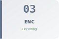
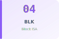
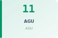
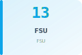
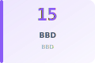
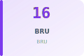
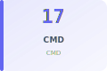
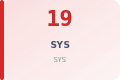
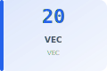

# LinxISA Documentation

<!-- Hero Banner -->

## Welcome to LinxISA

**Linx** is a modern, GPU-like instruction set architecture designed for rendering and compute workloads. This is the canonical reference documentation site, built from the [linx-isa](https://github.com/LinxISA/linx-isa) superproject.

### Architecture at a Glance

| | |
|---|---|
| **Total Instruction Forms** | 740 |
| **Instruction Groups** | 66 |
| **Formats** | 16-bit Compressed · 32-bit Base · 48-bit HL · 64-bit Vector |
| **ISA Specification** | [Architecture Contract →](architecture/v0.56-architecture-contract.md) |
| **Release Notes** | [v0.56.2 →](releases/v0.56.2.md) |

---

## Quick Navigation

[:fontawesome-solid-microchip: **ISA Reference** — Instruction Reference](isa/index.md) {.quick-link-card}
: The complete, searchable reference for all 740 instruction forms. Browse by chapter, group, or alphabetically.

[:fontawesome-solid-book: **Full ISA Manual** — AsciiDoc/PDF](architecture/isa-manual/README.md) {.quick-link-card}
: The authoritative human-readable manual with narrative chapters, examples, and design rationale.

[:fontawesome-solid-diagram-project: **Architecture Framework** — Concepts & Contracts](architecture/README.md) {.quick-link-card}
: Understand the AVS contracts, workload engine model, rendering kernel authoring, and PTO guarantees.

[:fontawesome-solid-layer-group: **LinxCore RTL** — Hardware Implementation](architecture/linxcore/overview.md) {.quick-link-card}
: LinxCore microarchitecture, module catalog, pipeline stages, and verification matrix.

[:fontawesome-solid-rocket: **Getting Started** — Bring-up Guide](bringup/GETTING_STARTED.md) {.quick-link-card}
: Set up your development environment, run the QEMU emulator, and compile your first program.

[:fontawesome-solid-code: **Assembly Guide** — Authoring Kernels](reference/linxisa-assembly-agent-guide.md) {.quick-link-card}
: Learn the assembly syntax, calling conventions, block-structured control flow, and call/ret ABI contract.

[:fontawesome-solid-shield-halved: **Call/Ret Contract** — ABI Guarantees](reference/linxisa-call-ret-contract.md) {.quick-link-card}
: The formal ABI contract for cross-stack calls: callee-saved registers, stack alignment, and return sequence.

[:fontawesome-solid-chart-line: **Bring-up Progress** — Status & Gates](bringup/PROGRESS.md) {.quick-link-card}
: Current gate status, integration checklist, ecosystem maturity roadmap, and validation matrix.

---

## Browse Instructions by Chapter

[{: style="width:120px;height:80px"} **Ch 03 — Encoding Formats**{.chapter-card style="--ch03-color:#64748b"}
: Bit numbering, instruction lengths, decode tags, field colour key

[{: style="width:120px;height:80px"} **Ch 04 — Block ISA**{.chapter-card style="--ch04-color:#8b5cf6"}
: BSTART, BSTOP, B.ARG, B.DIM, tile/SIMT control flow

[{: style="width:120px;height:80px"} **Ch 11 — AGU**{.chapter-card style="--ch11-color:#059669"}
: Loads, stores, prefetch, all addressing modes

[{: style="width:120px;height:80px"} **Ch 12 — ALU**{.chapter-card style="--ch12-color:#0891b2"}
: ADD, SUB, MUL, DIV, shifts, bit manip, LUI, CSEL

[{: style="width:120px;height:80px"} **Ch 13 — FSU**{.chapter-card style="--ch13-color:#0ea5e9"}
: Floating-point arithmetic, FMA, format conversion

[{: style="width:120px;height:80px"} **Ch 14 — AMO**{.chapter-card style="--ch14-color:#e11d48"}
: LR/SC, atomic fetch-op, CAS

[{: style="width:120px;height:80px"} **Ch 15 — BBD**{.chapter-card style="--ch15-color:#8b5cf6"}
: C.BSTART, C.BSTOP, block delimiters

[{: style="width:120px;height:80px"} **Ch 16 — BRU**{.chapter-card style="--ch16-color:#7c3aed"}
: Branches, CMP, SETC, SETRET, ADDTPC

[{: style="width:120px;height:80px"} **Ch 17 — CMD**{.chapter-card style="--ch17-color:#6366f1"}
: B.CATR, B.DATR, B.HINT, block attributes

[{: style="width:120px;height:80px"} **Ch 18 — RSV**{.chapter-card style="--ch18-color:#a16207"}
: HL.BFI, HL.MIADD, HL.MISUB

[{: style="width:120px;height:80px"} **Ch 19 — SYS**{.chapter-card style="--ch19-color:#dc2626"}
: FENCE, barriers, EBREAK, ACR\*, cache/TLB maintenance

[{: style="width:120px;height:80px"} **Ch 20 — VEC**{.chapter-card style="--ch20-color:#2563eb"}
: V.\* vector forms, shuffles, reductions, division

---

## Key Documentation

| | |
|---|---|
| **Source** | [github.com/LinxISA/linx-isa](https://github.com/LinxISA/linx-isa) |
| **ISA Specification** | [Architecture Contract](architecture/v0.56-architecture-contract.md) · [Hardening Policy](architecture/v0.56-hardening-policy.md) |
| **ISA Manual Source** | [docs/architecture/isa-manual/src](https://github.com/LinxISA/linx-isa/tree/main/docs/architecture/isa-manual/src) (AsciiDoc) |
| **QEMU Emulator** | [avs/qemu](https://github.com/LinxISA/linx-isa/tree/main/avs/qemu) |
| **LLVM Backend** | [compiler/llvm](https://github.com/LinxISA/linx-isa/tree/main/compiler/llvm) |
| **glibc Port** | [lib/glibc](https://github.com/LinxISA/linx-isa/tree/main/lib/glibc) |
| **musl Port** | [lib/musl](https://github.com/LinxISA/linx-isa/tree/main/lib/musl) |

> **Note:** This site is generated from `isa/v0.56/linxisa-v0.56.json`. To edit the ISA specification, update the JSON source; pages regenerate automatically.
