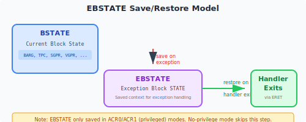
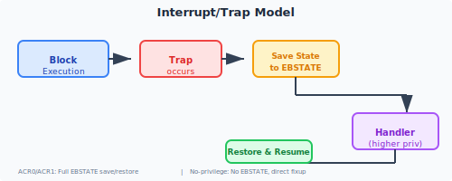

# interrupt and exception

The execution sequence defined by the LinxISA instruction can be changed by interrupt or exception.

In this definition, interrupt (Interrupt) is defined as an asynchronous event that occurs outside the instruction pipeline. The Linx logic core (LxLC) captures this event in certain steps of the execution pipeline and changes the execution sequence of instructions so that software objects that can respond to the event handle this event.

exception (Exception) is defined as a synchronization event encountered by the instruction pipeline itself. The Linx logic core (LxLC) detects this event in certain steps of the execution pipeline. By aborting the execution of this instruction in advance, the Linx logic core (LxLC) switches to a new execution position to allow the software object that responds to the event to process the event. As a synchronization event, exception can usually accurately define the behavior of the instruction that has been completed when exception is generated.

The process of changing the instruction execution sequence of interrupt and exception is often accompanied by changes to [ACR](./acr.md) and other registers. This change can be defined by the configuration of the Linx logic core (LxLC) and enters different execution paths. This configured execution path selects routes called interrupt and exception.

The detection and routing logic of interrupt and exception are defined in detail in the two chapters [interrupt](../exception/interrupt.md) and [exception](../exception/exception.md) respectively.

## Block status

The execution results of a block instruction are divided into two types:

- **block instruction is submitted normally (Block Commit Success)**: The microinstructions in the block are executed normally, exception does not appear and interrupt does not appear, and the status in the block is submitted successfully.
- **block instructionexception terminated (Block Exception Terminate)**: The microinstruction in the block failed to execute normally, and the status BSTATE in the block points to the microinstruction terminated by exception and the context of the microinstruction.

When exception appears in the block, the state BSTATE in the block will be saved to the **EBSTATE** space.

!!! check "block instructionexception terminated"

    block instructionexception termination refers to:

    - **block instructionexception**: e.g. block instruction initialization/commit failure exception, header decoding exception etc., active exception e.g. ECALL and ERET.
	- **Intra-block microinstructions exception**: For example, page table error, access beyond the specified range, instruction decoding error, floating point, division by 0, etc. exception.
	- **interrupt**: For example, the clock is interrupt by an external device.

## EBSTATE

**EBSTATE (Exception Block State)** is the storage space used by LinxISA to save and restore exceptionblock instruction state. The implementation of this space may be different depending on the block type.

### **STD, SYS, FP block**For block instruction of STD, SYS, and FP types, which are used for scalar operation or system-level control, the status within the block is relatively simple. Its EBSTATE is implemented by system register together with memory.

When exception or interrupt is triggered, the hardware needs to save the relevant contents of BSTATE to system register, specifically:

- Write BARG.BPC to **SSR:EBPC**;
- Write BARG.BPCN to **SSR:EBPCN**;
- Write the remaining fields of BARG to **SSR:EBARG**;
- Write TPC to **SSR:ETPC**.

When exception recovers, the hardware needs to load the above system register content back to the corresponding internal block register to ensure that block instruction continues execution correctly from the exception trigger point.

Whether other T/U and other scalar registers in BSTATE are saved to memory and restored is decided by the operating system.

### **VPAR, VSEQ, MPAR, MSEQ blocks**

For VPAR, VSEQ, MPAR, MSEQ and other types of block instruction, the state within the block is relatively complex and requires a very large space to save EBSTATE. Its EBSTATE is implemented by system register and Tile register.

When exception or interrupt is triggered, the hardware needs to save the relevant contents of BSTATE to system register, specifically:

- Write BARG.BPC to **SSR:EBPC**;
- Write BARG.BPCN to **SSR:EBPCN**;
- Write the remaining fields of BARG to **SSR:EBARG**;
- Record the ID of the Group that triggered exception in **SSR:EBARG**.

When exception recovers, the hardware needs to load the above system register content back to the corresponding internal block register to ensure that block instruction continues execution correctly from the exception trigger point.

Whether the status of other registers in BSTATE is saved to the Tile register or memory and restored is determined by the operating system. These include:

- You can save all or a certain type of Tile registers to memory by calling the TSTORE instruction;
- You can save the Group's TPC and LPR to the Tile register by calling ESAVE template block;
- The contents of the Tile register output by ESAVE can be saved to memory by calling the TSTORE instruction.

## exception and trap

In some scenarios, after exception appears, subsequent instructions still need to be executed. This kind of exception is solved in a conventional way. The currently executed block state is saved in **EBSTATE**, and the state executed by the block processor is transferred to the higher privilege level ZXTE. Executing in RMZH32QXZ, higher privilege level programs can process, schedule and modify the status of low privilege level exception by accessing **EBSTATE** that was previously interruptblock instruction. The operating system and debugging software are debugged through this interface.

Conventional exception needs to switch privilege levels to process exception, so it takes a long time to respond to exception.

## Self-healing block

[Self-healing block] (./fixup.md) can take over the processing of exception as expected by some programs. In this case, the default interrupt routing protocol will be replaced by the self-healing block definition.