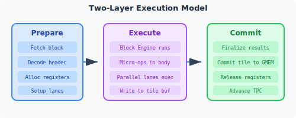

# block instructionexecution model

The processor implemented based on Linx Instruction Set Architecture executes the program in units of block instruction. The sequential execution processor needs to execute block instruction one by one in the order of program semantics. As for the out-of-order processor, block instruction can be executed out-of-order but must be submitted in order.

The execution process of block instruction includes three steps:

1. **Prepare**: The first-level scheduler fetches and allocates the first-level register to the second-level execution unit as its data input/output.
2. **Execute**: The second-layer execution unit executes the body instruction of this block.
3. **Commit**: The second-level execution unit submits the results to the first-level scheduler to support the execution of post-sequence blocks.

The schematic diagram of block instructionexecution model is as follows:

{ width="500" }

## block instruction initialization

Before block instruction is executed, the internal state of block instruction needs to be initialized, including:

### Save block parameters

Before executing block instruction, the processor needs to save the BPC and branch parameter of the current block to the private register [BARG] (../register/common/barg.md) so that it can correctly jump to the next block instruction after the block is executed. These include:

* Set the block type of this block to the **BlockType** field of the BARG register for allocation to the corresponding block engine execution and exception processing.
* For processors that support out-of-order execution, the BPC of this block instruction should be recorded in the **BPC** field of the BARG register.
* Save the address of the next block to the **BPCN** field of the BARG register according to branch parameter in header. For processors that implement branch prediction, this field can be set based on the information recorded by the branch prediction unit.
* Set the **TYPE** field of the BARG register according to branch parameter in header.
* Record the barrier attribute of this block to the **AQ,RL** field of the BARG register.
* If it is a detached block, record the local return address within the block to the **LRA** field of the BARG register.

```c
    BlockType     -> BARG.BlockType;  // 记录本块的ZXTERMZH33QXZ
    CurrentBPC    -> BARG.BPC;        // 保存本块BPC
    NextBPC       -> BARG.BPCN;       // 记录下一个块的BPC
    BranchType    -> BARG.TYPE;       // 记录本块跳转方式
    aq,rl         -> BARG.AQ, RL;     // 记录本块的屏障属性
    TPC(B.TEXT)+4 -> BARG.LRA;        // 记录本地返回地址（分离块）
```

NextBPC is calculated differently under different jump types:

* **FALL**: NextBPC is the BPC of the extended block.
* **DIRECT, CALL and COND**: `NextBPC = BPC + BNextOffset`. where BNextOffset represents the jump offset indicated in header.
* **IND, ICALL and RET**: NextBPC is obtained through prediction by the branch prediction unit.

### Global register status backup

The block processor identifies the input/output register set according to the register declaration given in body or header during the block initialization phase, and performs renaming or backup of the corresponding general-purpose global register (GGPR). Renaming is used for dedependency and correct writeback during commit period; backup is used for stable access through private parameter registers within the block.

**One block (header and body continuous storage)**:

- Parse the register operands of the body instruction, identify the input/output GGPR, and perform renaming of these registers during block initialization.
- Example: The following is a block instruction with three inputs and two outputs. During the initialization phase, the block processor performs a rename to `a0、a3、sp、ra`.

```asm
    BSTART.STD [.foo.start, .foo.stop], [a0, a3, sp], [sp, ra]
```

**Separate blocks (header and body are stored separately)**:- Back up and record GGPR according to the register information indicated by header instruction [B.IOR](../header/B.IOR.md):
    - Back up the current content of the input GGPR to the input formal parameter registers **RI0~RI11** in the block.
    - Back up the current contents of the output GGPR to the output parameter registers **RO0~RO3** in the block.
- Write the output register number to **RegDst0~RegDst3** of [BARG](../register/common/barg.md) for use during block submission.
- If it is a data (Tile) block, it is also necessary to establish a Tile shape according to header instruction [B.IOT](../header/B.IOT.md) to participate in the mapping of the actual Tile register:
    - Map input Tile formal parameters (such as TA, TB, etc.) to the input Tile register specified by B.IOT;
    - Map the output Tile formal parameters (such as TO, etc.) to the output Tile register specified by B.IOT;

Pseudocode example:
```c
    // 拷贝输入GGPR内容，RegSrc[0~11]为B.IOR中输入GGPR的编号
    RI0 = RegSrc0;
    RI1 = RegSrc1;
    ...
    RI11 = RegSrc11;
    // 拷贝输出GGPR内容，RegDst[0~3]为B.IOR中输出GGPR的编号
    RO0 = RegDst0;
    RO1 = RegDst1;
    ...
    RO3 = RegDst3;
    // 记录输出GGPR编号至BARG
    RegDst0 -> BARG.RegDst0;
    RegDst1 -> BARG.RegDst1;
    ...
    RegDst3 -> BARG.RegDst3;
    // 建立ZXTERMZH22QXZTile映射关系
    SrcTile0 -> TA;
    SrcTile1 -> TB;
    ...
    SrcTile7 -> TH;

    DstTile0 -> TO;
    DstTile1 -> TO1;
    DstTile2 -> TO2;
    DstTile3 -> TO3;
```

If the formal parameter register in the block is not initialized, the result when accessed in body is undefined, and the architecture does not guarantee the correctness of the execution result.

**template block (only header description, no body)**:

- Perform renaming and dedependency based on the register information expressed by header instruction B.IOR/B.IOT to ensure register consistency during template instantiation or subsequent splicing.
- Since template block does not have the body instruction, there is no need to back up the register contents to the block-private register (private backup such as RI/RO is not used).

## block instruction execution

block instruction is the basic organizational unit of LinxISA, and its execution process is different according to the execution modes of block type and body. Moreover, block instruction defined in the form of integrated block and separate block has different execution mechanism in terms of control flow, register access and instruction scheduling. For details, see [block instructionexecution mechanism](./executemachine.md).

The specific execution mode of body is divided into scalar mode, serial mode and parallel mode. For details, see [body execution mode] (./executemode.md). In block engines that support out-of-order execution, the instructions in body can be scheduled and executed out of order, but the instructions must be submitted in order to ensure the correctness of the execution results.

### Command input/output

1. The body instruction in one block can directly use the global register (GGPR) as input/output, and the writing is effective immediately, and the value read is the updated value of the previous body instruction.
2. The body instruction in one block allows repeated writing operations to the same global register.
3. The body instruction in the separated block does not support direct reading and writing of global registers, and can only read and write the formal parameter registers RI and RO in the block.
4. The body instruction in the separated block is not allowed to write the same global register repeatedly, otherwise it will trigger **repeatedly setting the global register exception**.

For example, the following integrated block instruction:
```asm
block (a0, a3, sp) -> (sp, a1):
    I1 : subi sp, 32,  ->sp
    I2 : add a0, a3,   ->t
    I3 : ld [sp, t#1], ->a1
```

When the first instruction I1 is executed, the update to the `sp` register takes effect immediately, without waiting for the entire block to be committed. The sp value used by the subsequent I3 instruction is the sp value output by the I1 instruction.

### Access system status

The system status can be accessed through the following commands in body:- **Load/Store** instruction: used to access shared memory and Tile register space.
- [C.SSRGET](../inst/misa_c/C.SSRGET.md), [SSRGET](../inst/misa_g/SSRGET.md), [SSRSET](../inst/misa_g/SSRSET.md), [HL.SSRGET](../inst/misa_h/HL.SSRGET.md), [HL.SSRSET](../inst/misa_h/HL.SSRSET.md) and other instructions are used to access the system register of the first layer architecture.

The memory access and access to system register are effective immediately and will not wait for block instruction to be submitted.

The instruction block defined by LinxISA is a weakened instruction block. block instruction only defines the application and release of registers, and does not impose strong atomicity constraints on memory access.

Unless additional atomic attributes are defined for block instruction, the block memory access system sees independent Load and Store requests, and **memory access requests no longer have the concept of a block**. For block instruction with atomic attributes, there are additional restrictions on memory access within the block. For details, please see the definition of atomic attributes in [B.CATR](../header/B.CATR.md).

### branch parameter settings

For indirect jump type **IND**, **ICALL** and **RET** blocks, the address of the jump target block needs to be calculated through the body instruction and set to the **BPCN** field of the BARG register.
```c
    setc.tgt SrcL  # SrcL的内容设置到 BARG.BPCN字段
```

For the **COND** block of the conditional jump type, the block dynamically determines whether the jump condition is met and sets it to the **TAKEN** field of the BARG register.
```c
    setc.cond SrcL, SrcR # 比较结果设置到 BARG.TAKEN
```

For call type **CALL** and **ICALL** blocks, the BPC of its extension block needs to be saved to the Ra register within the block so that it can correctly jump to the next block instruction when the call returns.
```c
    setret <label>, ->ra
```

### exception and interrupt

During the execution of block instruction, interrupt and exception are allowed to be triggered. For processing methods, please see the introduction of [interrupt and exception] (./exception.md).

## block instructionSubmit

When block instruction is submitted, the instructions in this block will be submitted based on the contents of the [BARG] (../register/common/barg.md) register. These include:

- For separate blocks, block instruction updates the contents of the formal parameter registers **RO0~RO3** in the block to the corresponding global registers according to the **RegDst0~RegDst3** information recorded in the BARG register.
- block instruction updates the BPC according to the **BPCN** and **Taken** fields of the BARG register and jumps.
- After block instruction is submitted, the contents of the BARG register will be cleared so that it can be reinitialized the next time block instruction is executed.

Special attention should be paid to the fact that when block instruction is submitted, block-private register resources are not allowed to be released and will be inherited by the next block instruction executing in the same block engine.
```asm
block_a:
    BSTART.STD FALL
    inst0 xx, xx, ->t
    inst1 xx,     ->u
    inst2 xx, xx, ->Rx
    inst3 xx, xx, ->t
# block_a执行结束后保留T和U寄存器，继承给后序ZXTERMZH32QXZ
block_b:
    BSTART.STD DIRECT
    inst4 t#2, 10, ->t     ; 输入t#2索引指令inst0的结果
    inst5 u#1, xx, ->Rx    ; 输入u#1索引指令inst1的结果
    ...
```

Based on this inheritance mechanism, when a block instruction triggers a exception and jumps to the exception handler, the software can save the state of the exception block through a new block for flexible state migration and scheduling.