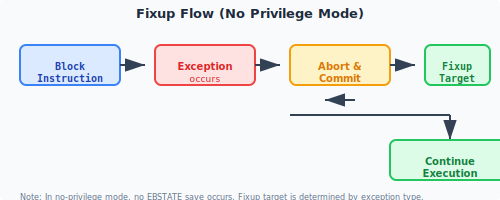

# Active repair mechanism

The active repair (Fixup) attribute gives block instruction the ability to handle exception by itself. This ability to process exception by itself can be understood as if a fixup is triggered in a block, then the block will **stop execution** on the exception instruction and **jump to the target block specified by fixup** to continue execution, without falling into a higher privilege level for exception processing. Through this processing method, the software can flexibly design the program and arrange its own processing code for some specific exception, avoiding the overhead caused by context saving and restoration and privilege level switching when exception occurs.

Under the current version, exception that can be actively repaired through Fixup includes:

* **Memory access exception**: For example: unaccess scenario in the kernel; address misalignment found during memory reading and writing, etc.
* **Assertion failure**: Triggered by the microinstruction [assert] (../inst/misa_s/ASSERT.md) in the system block.

The active repair block shows the predictability of the code to exception, and the unified exception processing code is specified in advance for some exception that may appear in the program.

## Fixup execution

When the corresponding exception is triggered during the execution of a block, whether the fixup process is allowed to be executed is controlled by system register[FUTO_ACRn](../register/ssr/FUTO.md). If the FUTO_ACRn register does not define the active repair takeover class exception, then the normal execution of the fixup process is allowed. Otherwise, perform the normal exception processing flow.

The fixup execution diagram is as follows:



1. block instruction **aborts execution** on the instruction where exception occurs and submits immediately;
2. Jump to the target block indicated by fixup to continue execution.

However, if the privilege level of the active repair block wants to proxy this exception, you can still take over the exception through system register[FUTO_ACRn](../register/ssr/FUTO.md). In this case, the target block indicated by fixup will not be executed. When exception occurs, it will be taken over by the exception processing process at the current privilege level.

## Assembly example

Active repair blocks are mainly used to simplify the cost of parameter checking. Examples are as follows:

```asm
    # 假定本块的入口参数如下：
    # a0 - 数组地址; a1 - 数组下标
    BSTART.STD FALL, .bar          # .bar
    cmp.lti a1, ARRAY_SIZE, ->t    # 检查a1的范围
    assert t#1                     # 如果assert失败，则跳转到.bar位置
    ld [a0, a1<<3],         ->t    # 直接开始使用数组
    ...

    BSTART.STD RET
    add zero, 0,           ->a0    # 返回成功
    setc.tgt ra

.bar:
    BSTART.STD RET
    add zero, 1,           ->a0    # 返回错误
    setc.tgt ra
    ...
    BSTOP
```

In this example, the code originally needs to check whether the address of a0 is valid, and also needs to check whether the range of a1 is out of bounds. However, by defining the active repair attribute of the block, there is no need to check the validity of the address in the block. For the range of the data, there is no need to create additional processing branches. `比较指令` and `assert` are directly used for range checking. In most normal processes, code can be executed sequentially. Only in special processes, the exception process will be triggered, and the exception process (i.e. .bar in the example) will be triggered for special processing.