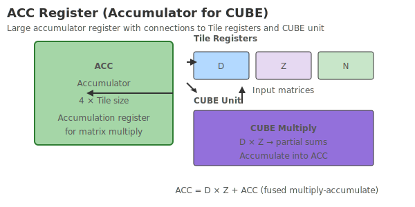
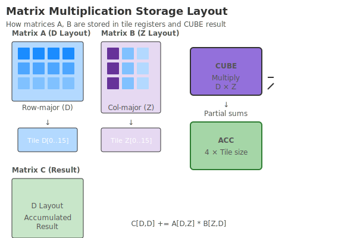
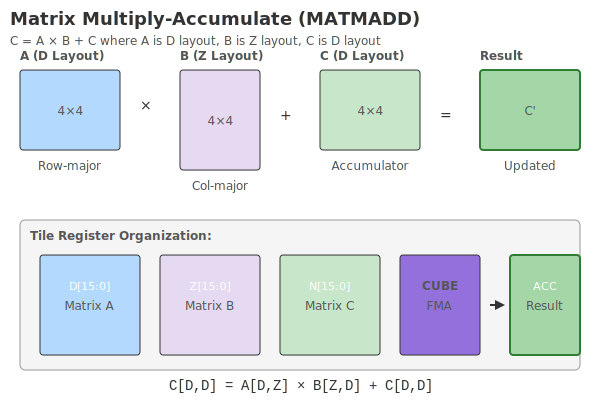

# Matrix data block

Matrix data block instruction is a dedicated matrix operation interface provided for hardware, which is used to drive the underlying CUBE computing unit to perform efficient and parallel tensor/matrix operations. This type of instruction takes fractal as the basic granularity and divides the matrix stored in the Tile register into multiple fractal structures for data calculation, thereby supporting high-dimensional, large-scale parallel matrix operation processing.

The matrix data block belongs to the instruction type that only has header but not body. It cannot be programmed or disassembled internally. The software only needs to specify the Tile register where the input matrix is ​​located and its row and column information and other parameters through the matrix data header instruction. After parsing these parameters, the hardware sends the instructions to the CUBE operation unit, which completes the corresponding matrix operation.

## block type Features

- Matrix data block **Only supports Fall jump mode**
- The matrix data block allows access to the global register GGPR and Tile registers, but does not allow access to memory and system registerSSR**.
- A matrix data block allows up to 8 Tile registers to be read and 4 tile registers to be written in one block.
- The matrix operation result is only allowed to be output to the ACC register and written to the general Tile register through a specific instruction ACCCVT.
- There is no body in the matrix data block, **B.TEXT instruction is not allowed**

## Command list

| TileOp | Description |
|---------|----------------|
| [TMATMUL](../../header/tileblock/TMATMUL.md) | Matrix multiplication instruction, A matrix multiplies B matrix, and the result is written to the ACC register |
| [TMATMUL.BIAS](../../header/tileblock/TMATMUL.BIAS.md) | Matrix multiplication and addition instructions, A matrix multiplies B matrix, plus C matrix, the result is written to the ACC register |
| [TMATMUL.ACC](../../header/tileblock/TMATMUL.ACC.md) | Matrix multiply and accumulate instructions, A matrix multiplies B matrix, the result is accumulated to the ACC register |
| [TMATMULMX](../../header/tileblock/TMATMULMX.md) | Scaling matrix multiplication, the result is written to the ACC register |
| [TMATMULMX.BIAS](../../header/tileblock/TMATMULMX.BIAS.md) | Scale matrix multiplication, add bias matrix, write the result to ACC register |
| [TMATMULMX.ACC](../../header/tileblock/TMATMULMX.ACC.md) | Scaling matrix multiplication, the result matrix is accumulated into the ACC register |
| [ACCCVT](../../header/tileblock/ACCCVT.md) | Move the data in the ACC register to the general Tile register |
| [TGEMV](../../header/tileblock/TGEMV.md) | General matrix-vector multiplication, the result is written to the ACC register |
| [TGEMV.BIAS](../../header/tileblock/TGEMV.BIAS.md) | General matrix-vector multiplication, addition with offset, the result is written to the ACC register |
| [TGEMV.ACC](../../header/tileblock/TGEMV.ACC.md) | General matrix-vector multiplication, the result is accumulated to the ACC register |
| [TGEMVMX](../../header/tileblock/TGEMVMX.md) | Universal scaling matrix-vector multiplication, the result is written to the ACC register |
| [TGEMVMX.BIAS](../../header/tileblock/TGEMVMX.BIAS.md) | Universal scaling matrix-vector multiplication, addition with offset, the result is written to the ACC register |
| [TGEMVMX.ACC](../../header/tileblock/TGEMVMX.ACC.md) | Universal scaling matrix-vector multiplication, the result is accumulated to the ACC register |We provide a special [Tile register] (../../register/common/tilereg.md) - **ACC**, which is mainly used to reduce the data read and write bandwidth of the multiply-accumulate operation in the CUBE unit. This register is a private storage area within the CUBE unit and can only be accessed through matrix operation instructions and ACCCVT instructions.

{ width="600" }

Example:
```asm
    TMATMUL <M:64, N:32, K:64, FP32> T#4, T#3, ->ACC<16KB>
    TMATMUL.ACC <M:64, N:32, K:64, FP32> T#1, T#2, ACC, ->ACC<8KB>
    ACCCVT NORM <Row:64, Col:64, FP32> ACC, ->T<16KB>
```

In the above example, the `TMATMUL` instruction is written to the ACC register, which is then read by the subsequent `TMATMUL.ACC` instruction and used for the multiply-accumulate operation. Finally, the result is moved to the T-type Tile register through the `ACCCVT` instruction.

## Input requirements

It should be noted that since the CUBE computing unit performs matrix operations based on a solidified systolic array structure, the input matrix must be organized according to the specified storage layout, otherwise the hardware cannot ensure the correctness of the operation.

In the matrix multiplication operation, the multiple input matrices (here represented by Matrix A, Matrix B and Matrix C respectively) must be stored in the following layout.

Matrix multiplication operation:



Matrix multiplication and accumulation operations:



Among them, matrix A and matrix C must be stored in the `大N小z` layout, and matrix B must be stored in the `大Z小n` layout. For layout introduction, please see [Storage Layout](../../register/common/tilereg.md).

Assume that S0 and K0 are the number of bytes and the number of elements of the K-dimensional fractal size respectively. Depending on the hardware implementation, the size of S0 can be different. Then:

- The fractal matrix size of matrix A is `16 x K0`.
- The fractal matrix size of matrix B is `K0 x 16`.
- The fractal matrix size of matrix C is `16 x 16`.

K0 can be calculated by the following formula:
```c
    K0 = S0 / sizeof(DataType);   # DataType表示元素ZXTERMZH20QXZ
```

If there are no special requirements, the hardware implemented based on this instruction set is recommended to be implemented according to the following standards:

- The size of a fractal of matrix A and matrix B is **512Byte**, and the corresponding size of S0 is **32Byte**.
- The size of a fractal of a C matrix varies with the bit width of the internal elements. If the elements in the matrix are 4byte wide, then the fractal size is **1024Byte** (16x16x4 byte); if the elements are 2byte wide, then the fractal size is **512Byte**.

In addition, before matrix operations, the hardware is required to convert all elements into FP32 or INT32 format before performing operations. For floating-point input, it is uniformly converted to FP32 format for calculation. If it is an integer input, it is uniformly converted to INT32 format for calculation.

## Output requirements

In LinxISA, after matrix operations, a series of accompanying processing needs to be continued through the ACCCVT instruction, such as activation, quantization, element-level operations, etc. If the data is uniformly obtained from the ACC register for further processing, the hardware implementation can be greatly simplified. Therefore, it is required that the matrix operation result **only be output to the ACC register**.

On the other hand, according to the format requirements of the input matrix, the result matrix must be stored in the layout of `大N小z`. And because the operation is performed in FP32 or INT32 format, the size of each fractal is fixed to **1024Byte** (16x16x4 byte).

The output requirements for matrix operations are summarized as follows:

| Type | Requirements |
|------|-----------|
| Destination register | Only output to ACC register allowed |
| Output layout | Big N small z format |
| Fractal size | 1024Byte |