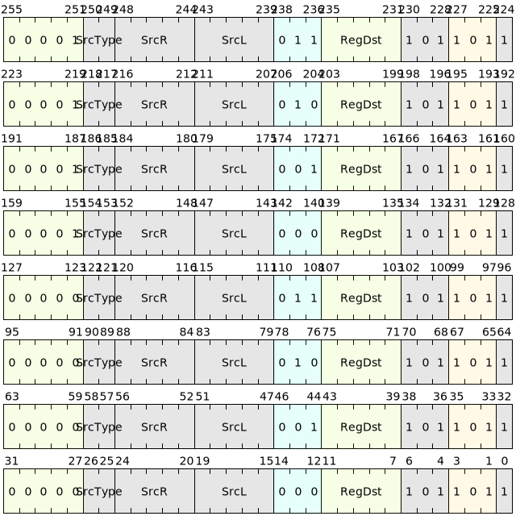

# Floating point comparison class

Each opcode of the floating point comparison instruction represents a different comparison condition. The comparison conditions include: equality comparison, inequality comparison, greater than or equal comparison and less than comparison.

Floating point comparison instructions are divided into **Quiet Compare** and **Signaling Compare** from the perspective of triggering floating point exceptions:

- **Silent comparison**: If any operand is SNaN, invalid operand floating point exception is triggered.
- **Sending Comparison**: If any operand is NaN, invalid operand floating point exception is triggered.

The floating point comparison instruction compares two inputs based on the conditions defined by this instruction and outputs 0 or 1. **If any operand is NaN, the output result is 0**.

## Command list

| Microinstruction | Assembly format | Description | Whether QNaN triggers exception |
|--------------|------------------|------------------------------------------|--------------------------------|
| FEQ | feq.{T} SrcL, SrcR, ->{t,u,Rd} | Floating point equality silent comparison | No |
| FNE | fne.{T} SrcL, SrcR, ->{t,u,Rd} | Floating point inequality silent comparison | No |
| FLT | flt.{T} SrcL, SrcR, ->{t,u,Rd} | Floating point less than silent comparison | No |
| FGE | fge.{T} SrcL, SrcR, ->{t,u,Rd} | Floating point greater than or equal to silent comparison | No |
| FEQS | feqs.{T} SrcL, SrcR, ->{t,u,Rd} | Floating point equality signaling comparison | Yes |
| FNES | fnes.{T} SrcL, SrcR, ->{t,u,Rd} | Floating point unequal sending comparison | Yes |
| FLTS | flts.{T} SrcL, SrcR, ->{t,u,Rd} | Floating point is less than sending comparison | Yes |
| FGES | fges.{T} SrcL, SrcR, ->{t,u,Rd} | Floating point greater than or equal to sending comparison | Yes |

