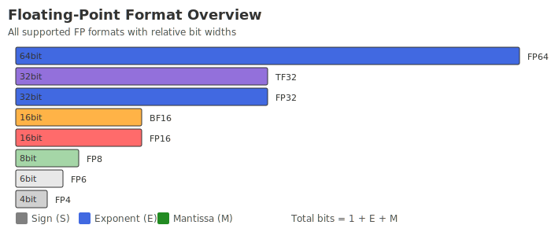

# Microinstruction list

In the current version, the list of microinstructions provided in the floating point block body is as follows:

## Public instructions

All public instructions are supported in the floating point scalar block. For details, please see [Public Instruction List] (../std_block/instlist.md#puclicinsts).

## Special instructions

The unique 32bit instructions within the floating point scalar block are as follows:

| Category | Instruction List |
|-------|-------------|
| **Floating point operations** | [FADD](../../inst/misa_f/FADD.md), [FSUB](../../inst/misa_f/FSUB.md), [FMUL](../../inst/misa_f/FMUL.md), [FDIV](../../inst/misa_f/FDIV.md), [FMADD](../../inst/misa_f/FMADD.md), [FMSUB](../../inst/misa_f/FMSUB.md), [FNMADD](../../inst/misa_f/FNMADD.md), [FNMSUB](../../inst/misa_f/FNMSUB.md) |
| **Floating point comparison** | [FEQ](../../inst/misa_f/FEQ.md), [FNE](../../inst/misa_f/FNE.md), [FLT](../../inst/misa_f/FLT.md), [FGE](../../inst/misa_f/FGE.md), [FEQS](../../inst/misa_f/FEQS.md), [FNES](../../inst/misa_f/FNES.md), [FLTS](../../inst/misa_f/FLTS.md), [FGES](../../inst/misa_f/FGES.md) |
| **Maximum and minimum values** | [MAX](../../inst/misa_f/MAX.md), [MIN](../../inst/misa_f/MIN.md), [MAXU](../../inst/misa_f/MAXU.md), [MINU](../../inst/misa_f/MINU.md), [FMAX](../../inst/misa_f/FMAX.md), [FMIN](../../inst/misa_f/FMIN.md) |
| **Data format conversion** | [FCVT](../../inst/misa_f/FCVT.md), [SCVTF](../../inst/misa_f/SCVTF.md), [UCVTF](../../inst/misa_f/UCVTF.md), [FCVTA](../../inst/misa_f/FCVTA.md), [FCVTM](../../inst/misa_f/FCVTM.md), [FCVTN](../../inst/misa_f/FCVTN.md), [FCVTP](../../inst/misa_f/FCVTP.md), [FCVTZ](../../inst/misa_f/FCVTZ.md) |
| **Floating point special operations** | [FABS](../../inst/misa_f/FABS.md), [FSQRT](../../inst/misa_f/FSQRT.md), [FRECIP](../../inst/misa_f/FRECIP.md) |

## Floating point data type

The floating-point instructions in the floating-point scalar block support the calculation and operation of floating-point data in four formats, including double-precision floating-point numbers, single-precision floating-point numbers, half-precision floating-point numbers and low-precision floating-point numbers, and all follow the definitions of the IEEE 754-2008 standard specification.

Floating point data type is defined in the following table:| Floating point format | Assembly symbols | Number of sign bits | Number of exponent digits | Number of mantissa digits | Explanation |
|-----------|------------|-----------|----------|---------------|------------|
| FP8 | FB | 1 | 4 | 3 | Represents 8-bit low precision floating point number |
| FP16 | FH | 1 | 5 | 10 | Represents 16bit half precision floating point number |
| FP32 | FS | 1 | 8 | 23 | Represents a 32-bit single precision floating point number |
| FP64 | FD | 1 | 11 | 52 | Represents 64bit double precision floating point number |

The schematic diagram of each floating point data type is as follows:

## Remarks

Very long instructions are not currently supported within the floating point block.