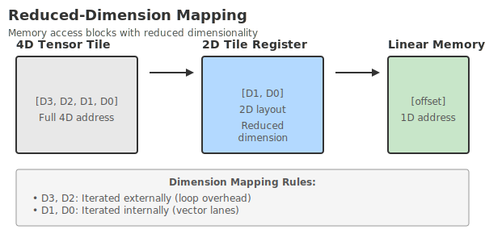
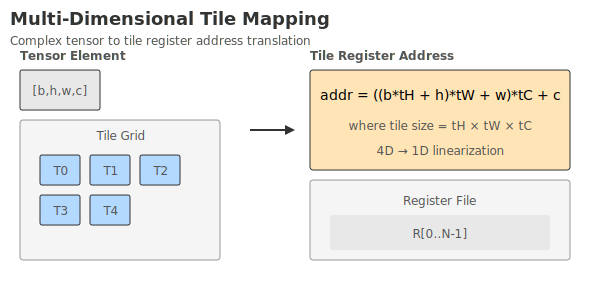
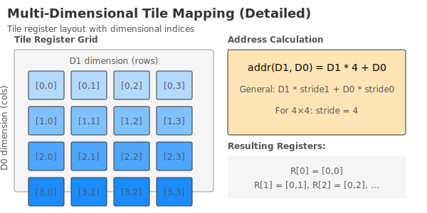

# Group mode

In the current version, Tile body adopts a three-level nested iteration structure: `lc2 → lc1 → lc0`, and the corresponding total iteration is `lb2 × lb1 × lb0`. The execution unit uses Group as the scheduling granularity, and the laneNum of each Group is fixed at 64. Based on the above design, there are multiple options for the grouping method of block instructionbody; the current version supports two grouping modes: **dimensionality reduction mode** and **multidimensional mode**.

## Dimensionality reduction mode

**Dimensionality reduction mode (Reduce Dimension, RD)** is to linearize and flatten the three-layer iterations (lc2, lc1, lc0) into a one-dimensional sequence, which is packaged and assigned to the Group for execution in sequence every 64 iterations (corresponding to the laneNum of a Group) until completed.

Features:

- Maximize paving for even distribution and throughput.
- Does not preserve the boundaries or adjacencies of the original three-dimensional structure.

The diagram is as follows:

{ width="1200" }

## Multidimensional mode

**Multi Dimension (MD)** is a grouping mode that uses the innermost lc0 as the grouping granularity, and the same Group must not contain different lc0 values; it expands the outer dimensions under a fixed lc0.

Features:

- Retain the boundaries and isolation of the inner dimension (lc0), which is suitable for scenarios where data/resources require strict domain division or dependency in the lc0 dimension.
- Relative to RD, more emphasis is placed on dimensional structural consistency.

In multi-dimensional mode, if the upper limit of the innermost loop lb0 is less than Group.lanenum, then each innermost loop can be assigned to the same Group for execution. The diagram is as follows:

{ width="1200" }

If the upper limit of the innermost loop lb0 is greater than Group.lanenum, then each innermost loop needs to be allocated to different Groups in order for execution. The diagram is as follows:

{ width="1200" }

Under the multidimensional model, it must be ensured:

- The value of LC0 in the same Group must be continuously increasing;
- The value of LC1 within the same Group must remain unchanged;
- The value of LC2 within the same Group must remain unchanged;

Under this model, the calculation formula for the number of Groups split from a Tile block is:
```c++
if (LB0 % 64 > 0)
    innerNum = LB0 / 64 +1;
else
    innerNum = LB0 / 64;
GroupNumber = LB2 * LB1 * innerNum;
```

Multidimensional mode is more suitable for usage scenarios where addresses are continuously loaded/stored, ensuring that lc0 is continuously incremented within a Group.

## Notes

If block instructionheader does not clearly specify whether to use "dimensionality reduction mode" or "multidimensional mode", then **multidimensional mode is used by default**.

## Summary

Software or programmers can choose between two grouping modes based on the actual scenario: if you pursue maximum throughput and uniform distribution, use the dimensionality reduction mode; if you need to retain the edge and dependency consistency of the lc0 dimension, use the multidimensional mode (such as the use of load/store instructions with consecutive addresses within the Group).