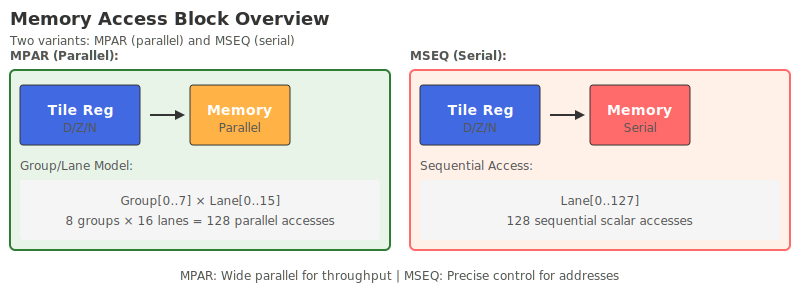

# Access data block

## Overview

Access data blocks are used to provide data movement capabilities between **shared memory** and **Tile register**. The developer describes body with the scalar instruction. The hardware automatically vector during execution and expands according to the Group/Lane level to realize shared memory to ZXTERMZH43Q. High-throughput loading, storage, movement and regulation of XZ registers (VT/VU/VM/VN) and Tile registers; scalarLane is responsible for control flow, mask management and state migration within the block, decoupling data movement and control paths.

## Execution mode

The memory access data block adopts **Lane-Group** two-level execution level to achieve an organic combination of fine-grained parallelism and coarse-grained scheduling.

The processor will split a memory access data block into several Groups, each Group containing multiple vectorLane and one scalarLane. The degree of parallelism of a block is determined by the number of executions of body and the number of Lanes per Group; when data dependencies can be eliminated or memory access delays need to be hidden, parallel Group execution (BSTART.MPAR) is often used to improve bandwidth utilization. and throughput; when there are strict sequence/dependency requirements between body (such as multi-step pipeline or cross-Group data sequence constraints), serial Group execution (BSTART.MSEQ) is used to ensure consistency and predictability. Hardware automatic vector will broadcast the scalar command stream to the active Lane, and the P register will provide a dynamic mask, allowing conditional masking of Lane within body to achieve irregular access, boundary processing and segmented calculations.

Please refer to [Execution Mode] (../../arch/executemode.md) for parallel execution or serial execution between groups. When parallel execution is allowed between groups, it needs to be defined as **parallel access block** through the [BSTART.MPAR](./header.md) instruction. When serialization between groups is required, it needs to be defined as **serial access block** through the [BSTART.MSEQ](./header.md) instruction.

| Hierarchy | Status |
|------|--------|
| **Block Level** | 1.[LB register](../../register/common/loop.md#LB) is responsible for controlling the total number of body expanded within the block |
| | 2. The RI and RO registers serve as backups for the input and output global registers before entering the block, respectively. |
| **Group level** | 1. Contains multiple vectorLane and 1 scalarLane; |
| | 2.scalarLane is responsible for Group jump, mask management and status migration.  |
| | 3. [P register] (../../register/common/pred.md) dynamically controls the effectiveness of Lane and supports instruction-level parallel optimization. |
| **Lane Level** | 1.scalarLane: Use T/U register to store scalar data. |
| | 2.vectorLane: independently owns VT/VU/VM/VNvector registers and supports Shuffle instructions for inter-Lane communication. |
| | 3.[LC register](../../register/common/loop.md#LC) is responsible for recording the ID of each vectorlane. |

The number of vectorlane in each Group can be queried through the LaneNum field of the [SSR:LCFR](../../register/ssr/LCFR.md) register.

{ width="800" }

## Block status BSTATE

The BSTATE of the access data block contains the following three parts:- **[BARG](../../register/common/barg.md) register**: Control parameter register within the block, used for conditional jumps or saving and processing of execution parameters.
- **[TPC](../../register/common/tpc.md) register**: Each Group has an independent TPC, which records the instructions currently being executed by the Group.
- **LPR-Private Register Group** contains the following:
    - **[SGPR](../../register/common/sgpr.md) register**: general scalar register, used to ensure scalar data flow delivery within the block.
    - **[RI/RO](../../register/common/lgpr.md) register**: general parameter register, backup of global registers read and written in the storage block.
    - **[PRED](../../register/common/pred.md) register**: used for mask control of parallel lanes.
    - **[LB/LC](../../register/common/loop.md) register**: used for body expansion control.
    - **[VGPR](../../register/common/vgpr.md) register**: General vector register, used as a carrier for a large number of parallel vector operations within the block.
    - **[LTAR](../../register/common/ltar.md) register**: Tile formal parameter register.
    - **Output Tile**: The output Tile register has been partially updated in the block but has not been submitted to the first-level state.

In general, BARG is used to manage block-level memory access control (base address, step size, transaction attributes, order), each Group's independent TPC is used to promote the execution of memory access micro-instructions, and 8 SGPRs are used to carry pointers and mode parameters; PRED and LB/LC are combined to perform parallel transaction screening and batch expansion, and transaction queues and Tile buffers are used to complete gathering and consistent submission, forming a memory-oriented data scheduling and execution closed loop.

## block type Features

Access data blocks have the following characteristics:| Level | Characteristics | Description |
|------|-------|-------|
| **Execution Control** | Hardware automatic vector | The scalar instruction stream written by the developer is automatically expanded and broadcast to all active vectorLane executions at the hardware level, greatly simplifying the programming model. |
| | Thread-level branch support | Through **scalarLane execution conditional jump**, different Groups are allowed to enter different execution paths independently according to conditions, and flexible flow control is supported. |
| | Dynamic execution mask | Through the 64-bit P register (1 valid/0 invalid), any vectorLane in the Group can be dynamically masked to achieve conditional execution and flexible data processing. |
| **Data Path** | Memory and Registers | **Access to memory space is allowed**, data operations can be completed between Tile register, vector register (VGPR) and scalar register (SGPR) and memory to ensure perfect data path. |
| | Hierarchical register architecture | scalarLane uses T/U (SGPR) registers; vectorLane uses VT/VU/VM/VN (VGPR) registers; efficient data exchange between Lanes is achieved through shuffle instructions. |
| | Restricted GGPR writing | **Only Reduce class instructions are allowed to write back to the global register (GGPR), and the output GGPR cannot be used as input to this block**, forcing the clarity of the data specification model and avoiding read and write dependency conflicts. |
| **Programming Constraints** | Separate block structure | Must **use the format** to separate header and body. Only the Fall-through jump mode is supported, which simplifies the control flow and facilitates hardware scheduling and optimization. |
| | Resource access isolation | Allows reading and writing of global registers, system register and Tile registers, but completely isolates the external memory system to form a self-contained computing unit. |

Since the access data block adopts the structure of separate blocks, it needs to comply with the definition rules of [separate blocks] (../../arch/executemachine.md#DecoupledBlock).

## Command constraints

**1. Register and global status access and read and write restrictions**

- Accessing the data block allows access to global registers GGPR, system registerSSR and memory, as well as global states such as Tile registers.
- Accessing a data block allows up to 8 Tile registers to be read and 4 Tile registers to be written.
- A maximum of 12 GGPRs are allowed for reading and 4 GGPRs are allowed to be written when accessing a data block. This is a constraint imposed by the separate block form.
- Only the Reduce instruction in the memory access data block allows writing to the global register GGPR.
- The global register output by the Reduce instruction in the memory access data block is not allowed to be used as the input of this parallel block instruction, otherwise an illegal instruction exception will be reported.

**2.Tile register access constraints and order preservation**- The address of the load local instruction in the data block cannot exceed the range of the input/outputtile register in this block, otherwise an illegal out-of-bounds exception report will be reported.
- The store local instruction in the data block cannot access the address range of the input Tile register, but can only access the address range of the output Tile register. Otherwise, an illegal out-of-bounds exception report will be reported.
- **Memory access parallel block constraints**:
    - The load/store local between different groups in the memory access parallel block does not allow address overlap. If overlap occurs, the hardware does not guarantee the correctness of execution.
    - The load/store local in the same group in the parallel block is based on address preservation order, and the addresses of different groups are not order preservation.
- **Fetch serial block constraints**:
    - The load/store local between different groups in the serial block allows the addresses to overlap, but they need to be modified in order according to the order of the group id.
    - The load/store local in the same group in the serial block is based on address preservation order, and the load/store local in different groups is in global order preservation according to the address order.

**3. Memory access and atomic, order-preserving, and coincidence**

- The load/store global between different groups in the memory data block is not allowed to overlap with the load/store address of the scalar block. If there is overlap, the hardware does not guarantee the correctness of execution.
- **Memory access parallel block constraints**:
    - The load/store global between different groups in the memory access parallel block does not allow address overlap. If overlap occurs, the hardware does not guarantee the correctness of execution.
    - The load/store global in the same group in the parallel block is based on address preservation order, and the addresses of different groups are not order preservation.
    - The load/store global instructions for accessing parallel blocks can access address spaces such as non-cacheable and device IO, and the access sequence between groups is not guaranteed.
    - The load/store global atomic instructions for accessing parallel blocks allow atomic access to memory and do not guarantee the order of atomic accesses between groups.
- **Fetch serial block constraints**:
    - The load/store global between different groups in the serial block allows the address to overlap, but it needs to be modified in order according to the order of the group id.
    - Load/store globals in the same group in the serial block are based on address ordering, and load/store globals in different groups are in global ordering based on address order.
    - The load/store global instructions for accessing serial blocks can access non-cacheable and device IO and other address spaces. Access between different groups is based on address order preservation.
    - The load/store global atomic instructions for accessing serial blocks allow atomic access to memory. Atomic access between different groups is based on address order preservation.

**4. Synchronization and submission**

- There are no synchronization operations such as DMB/DSB in the memory access data block. If synchronization requires forced cutting into blocks, synchronization is performed through system blocks.
- Submissions within the memory access parallel block need to wait for all groups to submit. The submission of each group is defined as the submission of the last instruction in the group.
- Only multiple groups are allowed to be submitted in ascending order of group ids according to program order in the memory access serial block. After the last group is submitted, block instruction is submitted as a whole.

## Summary

The memory access data block is the hardware mechanism used in Linx Instruction Set Architecture to implement efficient data movement between shared memory and Tile registers. Its design follows the separation of block structure, by decomposing block instruction into multiple Groups that can be executed in parallel or serially, and performing vector-based data handling within the Group to optimize memory bandwidth utilization and data locality.