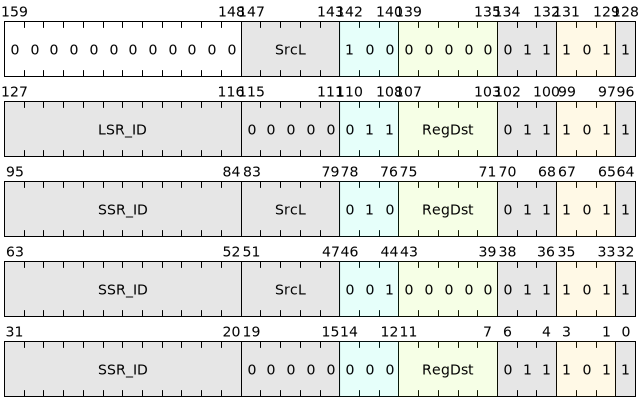

# system register read and write instructions

This type of instruction is used to perform read and write operations on system register to realize the interaction between the state within the block and the system state.

These system register access instructions only support access to system register with SSR_ID[15:12] equal to 0, otherwise you need to use the l.ssrget/l.ssrset instructions in the system block.

| Microinstructions | Assembly format | Description |
|---------------|---------------|----------------------------------------|
| SSRGET | ssrget SSR_ID, ->{t, u, Rd} | Read the system register value corresponding to SSR_ID into the destination register |
| SSRSET | ssrset SrcL, SSR_ID | Write the value in the source register to system register corresponding to SSR_ID |
| SSRSWAP | ssrswap SrcL, SSR_ID, ->Rd | Atomic execution writes the value of system register specified by SSR_ID into the destination register, and writes the value of the input register back to the system register |
| LSRGET | lsrget LSR_ID, ->{t, u, Rd} | Read the value of the status register or one of its fields in the block specified by LSR_ID to the destination register |
| SETC.TGT | setc.tgt SrcL | Write the value in the source register to the status register in the block corresponding to LSR_ID |

