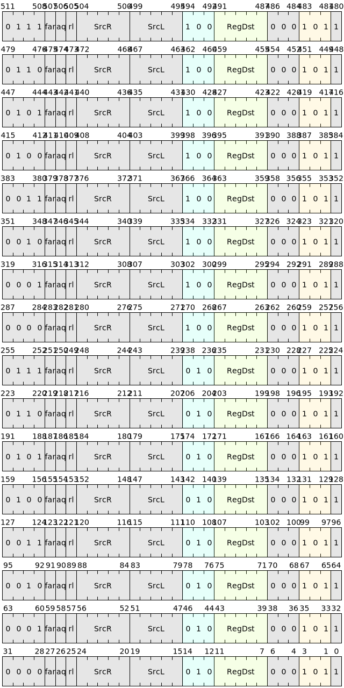
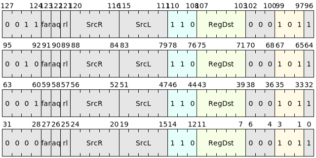

# Atomic instructions

Atomic instructions, also known as atomic operations or atomic instructions, refer to operations that will not be executed by interrupt when executed in a multi-processor system or multi-threaded environment, that is, the operation is either completely executed or not executed at all. Because in these environments there may be multiple processors or threads accessing shared resources simultaneously. Atomic instructions ensure that these operations are not interrupted or partially executed, thus avoiding data inconsistencies and unpredictable results. An atomic instruction often contains a set of operations, which can improve the efficiency of the instruction set, simplify the programming model, reduce the overhead of the instruction pipeline, and improve the throughput of the processor.

The atomic instructions in the system block currently mainly include the following types:

## LOAD.OP class instructions

LOAD.OP class instructions read a 32- or 64-bit value from the memory location specified by the left source register SrcL and write it into the destination register. Then perform corresponding operations (such as addition, bitwise AND, etc.) between this read value and the value of the right source register SrcR. The calculation results are stored in the memory specified by the SrcL register, and these steps are guaranteed to be atomic.| Microinstructions | Assembly format | Description |
|--------------|-------------------------------------------------|----------------|
| LW.ADD | lw.add<{.aq,.rl,.aqrl}> [SrcL], SrcR, ->{t, u, Rd} | **Add** memory words are written back and the original memory words are output |
| LW.AND | lw.and<{.aq,.rl,.aqrl}> [SrcL], SrcR, ->{t, u, Rd} | ** and ** memory words are written back and the original memory words are output |
| LW.OR | lw.or<{.aq,.rl,.aqrl}> [SrcL], SrcR, ->{t, u, Rd} | ** or ** memory words are written back and the original memory words are output |
| LW.
| LW.SMAX | lw.smax<{.aq,.rl,.aqrl}> [SrcL], SrcR, ->{t, u, Rd} | Memory word comparison **signed maximum** write back, output the original memory word |
| LW.UMAX | lw.umax<{.aq,.rl,.aqrl}> [SrcL], SrcR, ->{t, u, Rd} | Memory word comparison **unsigned maximum** write back, output the original memory word |
| LW.SMIN | lw.smin<{.aq,.rl,.aqrl}> [SrcL], SrcR, ->{t, u, Rd} | Memory word comparison **Signed Minimum** Write back, output the original memory word |
| LW.UMIN | lw.umin<{.aq,.rl,.aqrl}> [SrcL], SrcR, ->{t, u, Rd} | Memory word comparison** unsigned minimum value** written back, output the original memory word |
| LD.ADD | ld.add<{.aq,.rl,.aqrl}> [SrcL], SrcR, ->{t, u, Rd} | **Add** memory double word write back, output the original memory double word |
| LD.AND | ld.and<{.aq,.rl,.aqrl}> [SrcL], SrcR, ->{t, u, Rd} | ** and ** memory double words are written back and the original memory double words are output |
| LD.OR | ld.or<{.aq,.rl,.aqrl}> [SrcL], SrcR, ->{t, u, Rd} | ** or ** memory double word write back, output the original memory double word |
| LD.
| LD.SMAX | ld.smax<{.aq,.rl,.aqrl}> [SrcL], SrcR, ->{t, u, Rd} | Memory double word comparison** signed maximum value** write back, output the original memory double word |
| LD.UMAX | ld.umax<{.aq,.rl,.aqrl}> [SrcL], SrcR, ->{t, u, Rd} | Memory double word comparison** unsigned maximum value** write back, output the original memory double word || LD.SMIN | ld.smin<{.aq,.rl,.aqrl}> [SrcL], SrcR, ->{t, u, Rd} | Memory double word comparison** signed minimum value** write back, output the original memory double word |
| LD.UMIN | ld.umin<{.aq,.rl,.aqrl}> [SrcL], SrcR, ->{t, u, Rd} | Memory double word comparison** unsigned minimum value** write back, output the original memory double word |

LOAD.OP class atomic instructions can add additional memory access sequence restrictions through the two suffixes "aq" and "rl" to ensure the consistency of memory access. Please see "Memory Access Restriction Parameter Table" for specific definitions.

## STORE.OP class instructions

The STORE.OP class instructions have the same basic functions as the LOAD.OP class instructions, except that there is no destination register and the unmodified value at the specified memory location will not be returned.| Microinstructions | Assembly format | Description |
|--------------|-------------------------------------------------|----------------|
| SW.ADD | sw.add<{.rl}> [SrcL], SrcR | **Add** memory word write back |
| SW.AND | sw.and<{.rl}> [SrcL], SrcR | ** and ** memory word write back |
| SW.OR | sw.or<{.rl}> [SrcL], SrcR | ** or ** memory word write back |
| SW.XOR | sw.xor<{.rl}> [SrcL], SrcR | **XOR** memory word write back |
| SW.SMAX | sw.smax<{.rl}> [SrcL], SrcR | Memory word comparison **Signed Maximum** Writeback |
| SW.UMAX | sw.umax<{.rl}> [SrcL], SrcR | Memory word comparison **unsigned maximum** writeback |
| SW.SMIN | sw.smin<{.rl}> [SrcL], SrcR | Memory word comparison **Signed Minimum** Writeback |
| SW.UMIN | sw.umin<{.rl}> [SrcL], SrcR | Memory word comparison ** unsigned minimum ** write back |
| SD.ADD | sd.add<{.rl}> [SrcL], SrcR | **Add** memory double word write back |
| SD.AND | sd.and<{.rl}> [SrcL], SrcR | ** and ** memory double word write back |
| SD.OR | sd.or<{.rl}> [SrcL], SrcR | ** or ** memory double word write back |
| SD.XOR | sd.xor<{.rl}> [SrcL], SrcR | **XOR** Memory double word write back |
| SD.SMAX | sd.smax<{.rl}> [SrcL], SrcR | Memory double word comparison** signed maximum** write back |
| SD.UMAX | sd.umax<{.rl}> [SrcL], SrcR | Memory double word comparison ** unsigned maximum ** write back |
| SD.SMIN | sd.smin<{.rl}> [SrcL], SrcR | Memory double word comparison ** signed minimum ** write back |
| SD.UMIN | sd.umin<{.rl}> [SrcL], SrcR | Memory double word comparison ** unsigned minimum ** write back |

STORE.OP class atomic instructions need to add additional memory access sequence restrictions through the "rl" suffix to ensure the consistency of memory access. Please see "Memory Access Restriction Parameter Table" for detailed definitions.

## Atomic swap instructions

The atomic swap instruction reads the value of `8,16,32或64位` from the memory location specified by register SrcL and writes it to the destination register. Then store the 8, 16, 32 or 64-bit value in register SrcR into the memory specified by register SrcL, and ensure that these steps are atomic.| Microinstructions | Assembly format | Description |
|--------------|-------------------------------------------------|----------------|
| SWAPB | swapb<{.aq,.rl,.aqrl}> [SrcL], SrcR, ->{t, u, Rd} | Memory and register swap **byte** |
| SWAPH | swaph<{.aq,.rl,.aqrl}> [SrcL], SrcR, ->{t, u, Rd} | Memory and register swap **halfword** |
| SWAPW | swapw<{.aq,.rl,.aqrl}> [SrcL], SrcR, ->{t, u, Rd} | Memory and register swap **word** |
| SWAPD | swapd<{.aq,.rl,.aqrl}> [SrcL], SrcR, ->{t, u, Rd} | Memory and register swap **double** |

The atomic swap operation instruction can add additional memory access sequence restrictions through the "aq" and "rl" suffixes to ensure the consistency of memory access. Please see "Memory Access Restriction Parameter Table" for specific definitions.

<!-- 
## 原子比较交换指令

原子比较交换指令从寄存器SrcL指定的内存位置读取`8,16,32或64位`的值，然后再用这个读出的值和寄存器SrcR比较，如果它们相同的话，就把寄存器SrcD中`8,16,32或64位`的值存入寄存器SrcL指定的内存中。最后不管前面比较的结果相不相同，都把从内存读取的原始值写入目的寄存器中，并且**保证这些步骤都是原子的**。

|     微指令    |         汇编格式                          |     描述       |
|--------------|-------------------------------------------|----------------|
|  CASB   | casb<{.aq,.rl,.aqrl}> [SrcL], SrcR, SrcD, ->{t, u, Rd}   |  内存与寄存器比较交换**字节**   |
|  CASH   | cash<{.aq,.rl,.aqrl}> [SrcL], SrcR, SrcD, ->{t, u, Rd}   |  内存与寄存器比较交换**半字**   |
|  CASW   | casw<{.aq,.rl,.aqrl}> [SrcL], SrcR, SrcD, ->{t, u, Rd}   |  内存与寄存器比较交换**字**     |
|  CASD   | casd<{.aq,.rl,.aqrl}> [SrcL], SrcR, SrcD, ->{t, u, Rd}   |  内存与寄存器比较交换**双字**   |

原子比较交换指令可以通过"aq"和"rl"两个后缀来添加额外的内存访问顺序限制，以保证内存访问的一致性。具体定义请见“内存访问限制参数表”。
 -->

## Memory access restriction parameter table

| aq | rl | meaning |
|-------|--------|----------------------------------------|
| 0 | 0 | No order restrictions |
| 0 | 1 | Indicates that the results of all memory access instructions preceding this instruction must be observed before this instruction is executed |
| 1 | 0 | Indicates that all instructions that access memory after this instruction must wait until the instruction is completed before starting to execute |
| 1 | 1 | means that the results of all instructions that access memory before this instruction must be observed before the instruction is executed, and that all instructions that access memory after this instruction must wait until the execution of this instruction is completed before starting to execute |