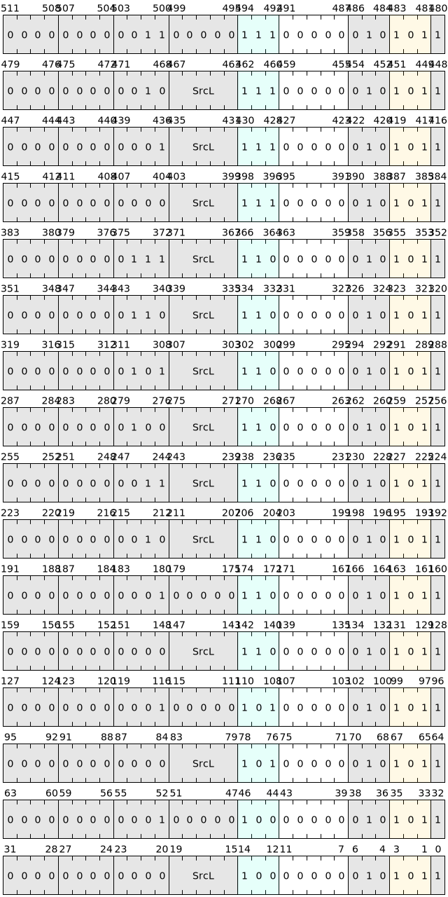

# Cache management instructions

Cache management instructions are instructions used to control and optimize cache behavior in computer systems. Cache is an efficient storage layer used in computer systems to store data, which can significantly increase the speed of data access.

### Cache management instruction classification

Cache management instructions mainly include data invalidation instructions, cache clearing instructions, cache loading/storage instructions, cache enable/disable instructions, cache clearing instructions, etc. Among them, data invalidation instructions, cache clearing instructions and cache clearing instructions are mainly used to ensure the consistency and integrity of data, but they also have their own specific purposes.

### List of cache management instructions

| Microinstructions | Assembly format | Description |
|--------|---------------|------------------------------------------------|
| BC.IVA | bc.iva SrcL | Invalidate the specified cache line in the block instruction cache |
| BC.IALL | bc.iall | Invalidate all cache lines in the block instruction cache |
| IC.IVA | ic.iva SrcL | Invalidate the specified cache line in the microinstruction cache |
| IC.IALL | ic.iall | Invalidate all cache lines in the microinstruction cache |
| DC.IVA | dc.iva SrcL | Invalidate the specified cache line in the data cache |
| DC.IALL | dc.iall | Invalidate all cache lines in the data cache |
| DC.CVA | dc.cva SrcL | Writes the specified cache line in the data cache back to the next level cache or the main processor |
| DC.CIVA | dc.civa SrcL | Writes the specified cache line in the data cache back to the next level cache or the main processor and marks it as invalid |
| DC.ISW | dc.isw SrcL | Invalidate the cache line corresponding to the specified group/way in the data cache |
| DC.CSW | dc.csw SrcL | Write the cache line corresponding to the specified group/way in the data cache back to the next level cache or the main processor |
| DC.CISW | dc.cisw SrcL | Write the cache line corresponding to the specified group/way in the data cache back to the next level cache or the main processor, and mark it as invalid |
| DC.ZVA | dc.zva SrcL | Zero out the specified cache line in the data cache and write it back to the next level cache or the main processor |

The instructions are encoded as follows:

### Constraints
- Cache management instructions may cause a decrease in cache hit rate, thus affecting system performance. Avoid frequent cache management operations.