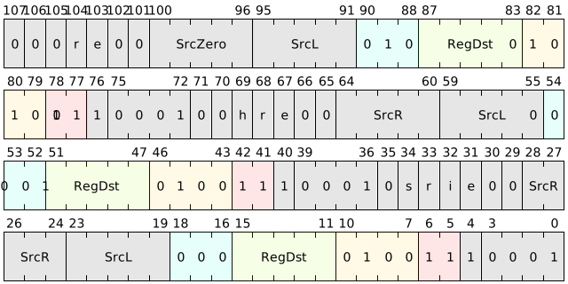

# General queue management instructions

GQM (General Queue Manager) is an inter-core shared hardware queuing mechanism used for system-wide asynchronous data transmission, task distribution and cross-core communication. It provides cross-core atomic operation queue management capabilities, which can effectively reduce lock and memory synchronization overhead in high concurrent access scenarios.

The goal of GQM design is to implement a low-latency, scalable cross-functional module communication mechanism and improve the communication performance of the system through an optimized queue read and write protocol.

---

## Implementation principle of GQM

The design of GQM relies on the following core principles to support communication and data exchange between its multi-cores:

1. **Shared memory addressing mechanism**: GQM allocates a physical memory area as a shared memory pool for message storage. All cores and modules that require communication can specify this memory area through instructions for read and write operations.

2. **Independent addressing protocol**: Different from the traditional communication mechanism based on memory reading and writing, GQM adopts an independent addressing protocol, that is, each core pushes data into or pops out the queue through GQM instructions. This avoids the synchronization lock problem of multi-core reading and writing shared memory, and ensures the order and consistency of queue operations through the atomicity of the GQM instruction set and protocol management.

3. **Hardware-controlled atomic operations**: GQM instructions are managed by hardware and support atomic push and pop operations. When the instruction operation is completed, the updated status of the queue has been written into the memory. No additional lock protection mechanism or synchronization instructions are required, which reduces the lock overhead and deadlock risk in traditional queue management.

4. **Protocol Optimization**: The GQM protocol has been optimized in terms of memory access performance and queue operations, so that it can still remain efficient in multi-core scenarios where the memory consistency protocol is not suitable. GQM can limit the number of simultaneous accesses to a queue, so that even if the number of functions accessed by the queue increases, it will not cause a sharp drop in performance.

5. **Caching mechanism support**: In order to further improve the performance of GQM, GQM can perform small-scale latching of cached message fragments in memory to achieve cache management. Reduce the overhead of frequent memory writing through batch data operations, further reducing system communication delays.

---

## GQM instruction set

GQM's hardware instruction set contains three core instructions for initializing and managing queues. The supported data transmission operations include enqueuing (QPUSH), dequeuing (QPOP) and queue maintenance (QMT), making the communication process more standardized and efficient. Here is a detailed description of the directive:

| Microinstructions | Assembly format | Description |
|-------------|----------------------------------------|----------------------------------------|
| QMT | qmt{.i,.b,.ib,.s,.r,} SrcL, SrcR, ->{t, u} | Perform queue maintenance on the GQM queue specified by SrcL, such as queue initialization and status query, etc. |
| QPUSH | qpush{.h,.b,.r,} SrcL, SrcR, ->{t, u} | Write the data in SrcR to the GQM queue specified by SrcL |
| QPOP | qpop{.b,.r,.br,} SrcL, ->{tx2, ux2} | Read data from the GQM queue specified by SrcL and return the execution result |

The instructions are encoded as follows:

### Application scenarios

GQM has important application scenarios in highly concurrent inter-core communication, task distribution, and multi-module collaboration of heterogeneous software and hardware systems:

1. **Cross-core asynchronous task distribution**: In a multi-core system, multiple cores can quickly distribute tasks through GQM queues, which is suitable for applications that require frequent task scheduling and real-time response. For example, the operating system can use GQM queues to distribute tasks to idle cores for processing, reducing the time overhead of task allocation.2. **Multi-module data stream transmission**: GQM can realize lock-free transmission of data streams between different modules. It is suitable for signal processing and large data volume processing scenarios where data blocks or processing results need to be transferred between modules. For example, in audio and video processing systems, each processing stage can use GQM queues to seamlessly pass the data stream to the next processing stage, avoiding the complexity and delay of caching.

3. **Communication between hardware accelerator and main core**: In applications that require acceleration, GQM allows the main core and hardware accelerator to complete efficient data transfer through shared memory areas. The hardware accelerator automatically reads the data written by the main core through GQM instructions, thereby avoiding frequent main core control operations.

4. **Multi-threaded data sharing**: In scenarios where fast data sharing between threads is required, GQM can efficiently manage shared memory without relying on additional lock mechanisms. It is suitable for cross-thread query result caching in database systems, multi-thread processing of log systems, etc.

5. **Event messaging for low-power devices**: In low-power devices that need to implement asynchronous message delivery, the GQM queue mechanism can replace the traditional event interrupt and reduce the interrupt wake-up time of the system. At the same time, it is also suitable for network protocol stacks to realize event queue transfer between multiple network modules and improve the power consumption efficiency of network equipment.

---

## Advantages of GQM

GQM brings the following advantages in asynchronous communication between multiple cores:

- **Low latency**: GQM avoids delays caused by lock protection and synchronization mechanisms, and is suitable for high-frequency, low-latency scenarios.
- **High scalability**: GQM instructions based on hardware control can maintain high performance even when a large number of functional modules access the queue at the same time, and are suitable for expansion scenarios in complex systems.
- **Atomic guarantee**: The hardware level ensures the atomicity of enqueueing and dequeuing, avoiding data consistency issues in concurrent operations.
- **Strong flexibility**: GQM instructions allow dynamic adjustment of the address and queue size of the shared memory area to easily adapt to the needs of different tasks.

GQM has significant application prospects in realizing efficient inter-core communication and improving module collaboration efficiency. It is especially suitable for scenarios that require efficient data exchange under multi-core processor architecture.

## Constraints

- Load/Store instructions cannot access GQM queue memory
- The maximum space of GQM queue is 2^10 bytes