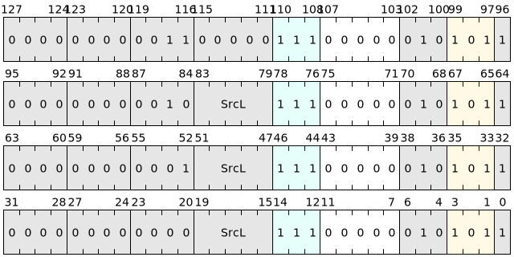

# TLB maintenance instructions

TLB (Translation Lookaside Buffer) is a hardware cache used to accelerate the translation of virtual addresses to physical addresses. When a program accesses virtual memory, the processor will first look up the address mapping in the TLB to avoid the delays caused by frequent page table lookups. To ensure that the cache entries in the TLB are consistent with the actual page table data, the Linx logic core architecture provides a set of TLB maintenance instructions to manage these cache entries.

TLB maintenance instructions are microinstructions within the system block. Regardless of whether the virtual memory management architecture (VMMA) uses the TLB, the TLB maintenance instructions of the Linx logic core can be used and the TLB data is maintained when the TLB exists. These instructions enable the Linx logic core architecture to efficiently manage TLB entries and memory mapping, ensuring mapping accuracy during task switching, virtual address updates and privilege translation.

ASID (Address Space Identifier, Address Space Identifier) ​​is a mark that distinguishes different virtual address spaces and is used to manage TLB data of different processes in task switching or multi-tasking operating systems. With the help of ASID, different processes can have unique ASID values, so that TLB data of different processes can coexist and avoid frequent clearing of TLB. By assigning independent ASIDs, the processor can identify and load the correct virtual address mapping in a multi-process environment, effectively reducing switching overhead and improving overall system performance.

### TLB maintenance instruction list

| Microinstructions | Assembly format | Description |
|--------|---------------|------------------------------------------------|
| TLB.IALL | tlb.iall | Clear all TLB data of the current Linx logical core |
| TLB.IA | tlb.ia SrcL | Clear TLB data related to the ASID specified by SrcL |
| TLB.IV | tlb.iv SrcL | Clear the TLB data in the virtual address range specified by SrcL under the current ACR (Access Control Ring) corresponding translation level and the current ASID |
| TLB.IAV | tlb.iav SrcL| Clear the TLB data of the ASID and virtual address range specified by SrcL under the current ACR translation level |

The instructions are encoded as follows:

All TLB maintenance instructions are system block microinstructions of the Linx logic core and have the following characteristics:

- **Permission Management**: Each TLB maintenance instruction has different permission requirements to ensure security under multi-level permission management.
- **BANNED FOR ATOMIC BLOCKS**: Since TLB maintenance instructions affect global memory visibility, their use in atomic blocks is prohibited to prevent breaking data consistency.

---

### Usage and execution logic of TLB maintenance instructions

#### 1. The relationship between program order and memory behavior

During the execution of the Linx logical core, the memory behavior prior to the TLB is visible to the memory behavior after the TLB maintenance instruction, including the PTW (Page Walk, page table traversal) memory behavior of the memory instruction. Then the memory behavior after the TLB maintenance instruction will be affected by the TLB maintenance instruction.

**Instruction fetch behavior** (i.e., instruction prefetching) is not part of the memory sequence. Therefore, the instructions after the TLB maintenance instruction of program order may occur before the TLB maintenance instruction occurs (for example, the integrated block has completed all instruction fetching before the microinstruction is executed). The instruction prefetching of the Linx logic core may also obtain the instructions before the TLB maintenance instruction in advance. In order to ensure that the instruction after the TLB maintenance instruction is re-fetched and the memory status is updated, the Linx logic core provides the **isb** instruction. `isb` can ensure that after the TLB maintenance instruction, subsequent instructions are re-fetched according to the program order column, thereby ensuring the correctness of memory and instruction access.

#### 2. Usage scenarios

TLB maintenance instructions are mainly used in the following scenarios:- **Task Switching**: When task switching, the current ASID or all TLB data can be cleared through the `tc.ia` or `tc.iall` instruction to ensure that the memory access of the new task will not be interfered by the old task cache entries.

- **Virtual address space update**: When the system updates the page table mapping of the virtual address space, clear the TLB data in the specified virtual address range through `tc.iv` or `tc.iav` so that it can reload the correct mapping relationship on the next access.

- **Privilege Level Conversion**: During ACR privilege level conversion or cross-domain access, `tc.iav` is used to ensure that the TLB data accessed between different permission levels is consistent to avoid inconsistency problems caused by cache conflicts.

---

### Summary

The TLB maintenance instruction provides a powerful cache management method for the virtual address management of the Linx logical core, and is suitable for various scenarios such as task switching, virtual address space update, and privilege conversion. The synchronization of memory and instructions is ensured through the isb instruction, and the TLB maintenance instruction can further ensure the cache consistency and execution correctness of the system, thus improving the reliability of the Linx logic core in high-performance computing and complex memory management environments.