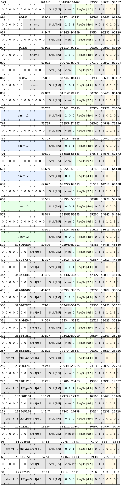

# Integer operation instructions

The vector integer operation instruction can implement arithmetic operations and logical operation operations on integer data of `64位`, `32位`, `16位` or `8位` in each execution channel (Lane). The data bit width is identified by the suffix `d,w,h,b` of the operand, etc.

## Command list

The instruction list for two register operands is as follows:

| Command | Assembly Format | Description |
|---------------|--------------|-------------------------------------|
| V.ADD | `v.add SrcL.{T}, SrcR.{T}<<<shamt>, ->Dst.{W}` | Addition |
| V.SUB | `v.sub SrcL.{T}, SrcR.{T}<<<shamt>, ->Dst.{W}` | Subtraction |
| V.AND | `v.and SrcL.{T}, SrcR.{T}<<<shamt>, ->Dst.{W}` | Logical AND |
| V.OR | `v.or SrcL.{T}, SrcR.{T}<<<shamt>, ->Dst.{W}` | Logical OR |
| V.XOR | `v.xor SrcL.{T}, SrcR.{T}<<<shamt>, ->Dst.{W}` | Logical XOR |
| V.SRL | `v.srl SrcL.{T}, SrcR.{T}, ->Dst.{W}` | Logical right shift |
| V.SRA | `v.sra SrcL.{T}, SrcR.{T}, ->Dst.{W}` | Arithmetic right shift |
| V.SLL | `v.sll SrcL.{T}, SrcR.{T}, ->Dst.{W}` | Logical shift left |

The instruction list of adding a register operand to an immediate operand is as follows:

| Command | Assembly Format | Description |
|---------------|---------------|----------------------------------------|
| V.ADDI | `v.addi SrcL.{T}, uimm, ->Dst.{W}` | Unsigned immediate addition |
| V.SUBI | `v.subi SrcL.{T}, uimm, ->Dst.{W}` | Unsigned immediate subtraction |
| V.ANDI | `v.andi SrcL.{T}, simm, ->Dst.{W}` | Signed immediate logical AND |
| V.ORI | `v.ori SrcL.{T}, simm, ->Dst.{W}` | Signed immediate logical OR |
| V.XORI | `v.xori SrcL.{T}, simm, ->Dst.{W}` | Signed immediate logical XOR |
| V.SRLI | `v.srli SrcL.{T}, shamt, ->Dst.{W}` | Unsigned immediate logical right shift |
| V.SRAI | `v.srai SrcL.{T}, shamt, ->Dst.{W}` | Unsigned immediate arithmetic right shift |
| V.SLLI | `v.slli SrcL.{T}, shamt, ->Dst.{W}` | Unsigned immediate logical left shift |

## Command encoding

