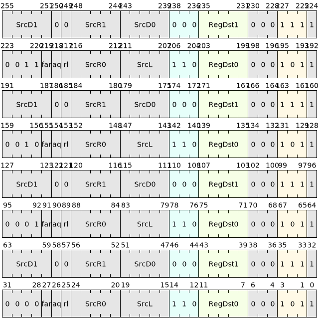

# Atomic instructions

Atomic instructions, also known as atomic operations or atomic instructions, refer to operations that will not be executed by interrupt when executed in a multi-processor system or multi-threaded environment, that is, the operation is either completely executed or not executed at all. Because in these environments there may be multiple processors or threads accessing shared resources simultaneously. Atomic instructions ensure that these operations are not interrupted or partially executed, thus avoiding data inconsistencies and unpredictable results. An atomic instruction often contains a set of operations, which can improve the efficiency of the instruction set, simplify the programming model, reduce the overhead of the instruction pipeline, and improve the throughput of the processor.

vector atomic instructions currently mainly include two types of instructions: Load.op and Store.op.

## Command list

1.The list of atomic instructions of the Load.op class is as follows:

| Microinstructions | Assembly format | Description |
|--------------|-------------------------------------------------|----------------|
| V.LW.ADD | `v.lw.add<.{aq,rl,f,aqrl,aqf,rlf,aqrlf}> [SrcL.ud], SrcR.{T}, ->Dst.{W}` | Atomic execution of memory load word·add |
| V.LW.AND | `v.lw.and<.{aq,rl,f,aqrl,aqf,rlf,aqrlf}> [SrcL.ud], SrcR.{T}, ->Dst.{W}` | Atomic execution of memory load word·phase AND |
| V.LW.OR | `v.lw.or<.{aq,rl,f,aqrl,aqf,rlf,aqrlf}> [SrcL.ud], SrcR.{T}, ->Dst.{W}` | Atomic execution of memory load word·OR |
| V.LW.XOR | `v.lw.xor<.{aq,rl,f,aqrl,aqf,rlf,aqrlf}> [SrcL.ud], SrcR.{T}, ->Dst.{W}` | Atomic execution of memory load word·XOR |
| V.LW.MAX | `v.lw.max<.{aq,rl,f,aqrl,aqf,rlf,aqrlf}> [SrcL.ud], SrcR.{T}, ->Dst.{W}` | Atomic execution of memory load words·Get the maximum value |
| V.LW.MIN | `v.lw.min<.{aq,rl,f,aqrl,aqf,rlf,aqrlf}> [SrcL.ud], SrcR.{T}, ->Dst.{W}` | Atomic execution of memory load words·take the minimum value |
| V.LD.ADD | `v.ld.add<.{aq,rl,f,aqrl,aqf,rlf,aqrlf}> [SrcL.ud], SrcR.{T}, ->Dst.{W}` | Atomic execution of memory load double word·add |
| V.LD.AND | `v.ld.and<.{aq,rl,f,aqrl,aqf,rlf,aqrlf}> [SrcL.ud], SrcR.{T}, ->Dst.{W}` | Atomic execution of memory load double word·AND |
| V.LD.OR | `v.ld.or<.{aq,rl,f,aqrl,aqf,rlf,aqrlf}> [SrcL.ud], SrcR.{T}, ->Dst.{W}` | Atomic execution of memory load double word·OR |
| V.LD.XOR | `v.ld.xor<.{aq,rl,f,aqrl,aqf,rlf,aqrlf}> [SrcL.ud], SrcR.{T}, ->Dst.{W}` | Atomic execution of memory load double word·XOR |
| V.LD.MAX | `v.ld.max<.{aq,rl,f,aqrl,aqf,rlf,aqrlf}> [SrcL.ud], SrcR.{T}, ->Dst.{W}` | Atomic execution of memory load double word·Get the maximum value |
| V.LD.MIN | `v.ld.min<.{aq,rl,f,aqrl,aqf,rlf,aqrlf}> [SrcL.ud], SrcR.{T}, ->Dst.{W}` | Atomic execution of memory load double word·take the minimum value |

<!-- 
 
-->

2. The list of atomic instructions of the Store.op class is as follows:| Microinstructions | Assembly format | Description |
|--------------|-------------------------------------------------|----------------|
| V.SW.ADD | `v.sw.add<.{rl,f,rd,rlf,rdf,rlrd,rlrdf}> [SrcL.ud], SrcR.{T}` | Atomic execution of stored words·add |
| V.SW.AND | `v.sw.and<.{rl,f,rd,rlf,rdf,rlrd,rlrdf}> [SrcL.ud], SrcR.{T}` | Atomic execution of stored words·AND |
| V.SW.OR | `v.sw.or<.{rl,f,rd,rlf,rdf,rlrd,rlrdf}> [SrcL.ud], SrcR.{T}` | Atomic execution of stored words·OR |
| V.SW.XOR | `v.sw.xor<.{rl,f,rd,rlf,rdf,rlrd,rlrdf}> [SrcL.ud], SrcR.{T}` | Atomic execution of stored words·XOR |
| V.SW.MAX | `v.sw.max<.{rl,f,rd,rlf,rdf,rlrd,rlrdf}> [SrcL.ud], SrcR.{T}` | Atomic execution of stored words·Get the maximum value |
| V.SW.MIN | `v.sw.min<.{rl,f,rd,rlf,rdf,rlrd,rlrdf}> [SrcL.ud], SrcR.{T}` | Atomic execution storage word·take the minimum value |
| V.SD.ADD | `v.sd.add<.{rl,f,rd,rlf,rdf,rlrd,rlrdf}> [SrcL.ud], SrcR.{T}` | Atomic execution of stored double words·add |
| V.SD.AND | `v.sd.and<.{rl,f,rd,rlf,rdf,rlrd,rlrdf}> [SrcL.ud], SrcR.{T}` | Atomic execution of stored double words·AND |
| V.SD.OR | `v.sd.or<.{rl,f,rd,rlf,rdf,rlrd,rlrdf}> [SrcL.ud], SrcR.{T}` | Atomic execution of stored double words·OR |
| V.SD.XOR | `v.sd.xor<.{rl,f,rd,rlf,rdf,rlrd,rlrdf}> [SrcL.ud], SrcR.{T}` | Atomic execution of stored double words·XOR |
| V.SD.MAX | `v.sd.max<.{rl,f,rd,rlf,rdf,rlrd,rlrdf}> [SrcL.ud], SrcR.{T}` | Atomic execution of stored double words·Get the maximum value |
| V.SD.MIN | `v.sd.min<.{rl,f,rd,rlf,rdf,rlrd,rlrdf}> [SrcL.ud], SrcR.{T}` | Atomic execution of stored double words·take the minimum value |

## Attribute parameters

Atomic instructions can add additional memory access sequence restrictions through the two suffixes ".aq" and ".rl" to ensure the consistency of memory access. aq represents acquire semantics, and rl represents release semantics. The specific definition is as follows:

| aq | rl | meaning |
|-------|--------|----------------------------------------|
| 0 | 0 | No order restrictions |
| 0 | 1 | The results of all memory access instructions preceding this instruction must be observed before this instruction is executed |
| 1 | 0 | All instructions that access memory after this instruction must wait until the execution of this instruction is completed before starting to execute |
| 1 | 1 |The results of all instructions that access memory before this instruction must be observed before the instruction is executed, and all instructions that access memory after it must wait until the execution of this instruction is completed before starting to execute |

Atomic instructions can also use the optional attribute ".rd" to indicate that the memory access address of the instruction is the same in all lanes of the current Group and perform store reduce operations. And use the ".f" flag to indicate that the memory access for atomic operations occurs in the remote cache.

The specific definition is as follows:

| rd | f | meaning |
|-------|------|--------------|
| 0 | 0 | No special attributes |
| 0 | 1 | Indicates that the atomic memory access occurs in the remote cache |
| 1 | 0 | The address in SrcL in all lanes is the same, and the store reduce operation is performed |
| 1 | 1 | The address in SrcL is the same in all lanes, the store reduce operation is performed, and the memory access representing the atomic operation occurs in the remote Cache |

## Command encoding

