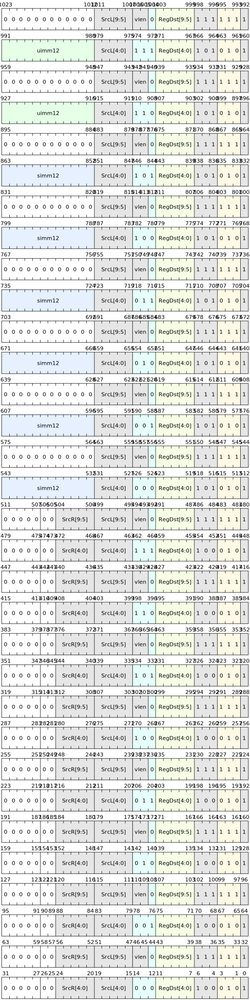

# Comparison instructions

vector comparison and set instructions provide unified equality/inequality, logical AND/OR, and signed and unsigned size comparison in each execution lane (lane), covering two types of operand forms: register-register and register-immediate data. The instruction independently compares 8/16/32/64-bit elements and writes the comparison results to Dst according to the destination bit width, which is used to generate masks, conditional selections, branch decisions and other scenarios.

## Command list

Register to register comparison:

| Microinstructions | Assembly format | Description |
|---------------|---------------------------|----------------------------------------------|
| V.CMP.EQ | `v.cmp.eq SrcL.{T}, SrcR.{T}, ->Dst.{W}` | Equal Comparison |
| V.CMP.NE | `v.cmp.ne SrcL.{T}, SrcR.{T}, ->Dst.{W}` | Not equal to comparison |
| V.CMP.AND | `v.cmp.and SrcL.{T}, SrcR.{T}, ->Dst.{W}` | Bitwise AND comparison |
| V.CMP.OR | `v.cmp.or SrcL.{T}, SrcR.{T}, ->Dst.{W}` | Bitwise OR comparison |
| V.CMP.LT | `v.cmp.lt SrcL.{T}, SrcR.{T}, ->Dst.{W}` | Signed less than comparison |
| V.CMP.GE | `v.cmp.ge SrcL.{T}, SrcR.{T}, ->Dst.{W}` | Signed greater than or equal comparison |
| V.CMP.LTU | `v.cmp.ltu SrcL.{T}, SrcR.{T}, ->Dst.{W}` | Unsigned less than comparison |
| V.CMP.GEU | `v.cmp.geu SrcL.{T}, SrcR.{T}, ->Dst.{W}` | Unsigned greater than or equal comparison |

Register and immediate comparison:

| Microinstructions | Assembly format | Description |
|---------------|---------------------------|----------------------------------------------|
| V.CMP.EQI | `v.cmp.eqi SrcL.{T}, simm, ->Dst.{W}` | Register and signed immediate equals comparison |
| V.CMP.NEI | `v.cmp.nei SrcL.{T}, simm, ->Dst.{W}` | Register and signed immediate value are not equal to comparison |
| V.CMP.ANDI | `v.cmp.andi SrcL.{T}, simm, ->Dst.{W}` | Register and signed immediate bitwise AND comparison |
| V.CMP.ORI | `v.cmp.ori SrcL.{T}, simm, ->Dst.{W}` | Bitwise OR comparison of register and signed immediate value |
| V.CMP.LTI | `v.cmp.lti SrcL.{T}, simm, ->Dst.{W}` | Register and signed immediate less than comparison |
| V.CMP.GEI | `v.cmp.gei SrcL.{T}, simm, ->Dst.{W}` | Register and signed immediate value greater than or equal to comparison |
| V.CMP.LTUI | `v.cmp.ltui SrcL.{T}, uimm, ->Dst.{W}` | Register and unsigned immediate less than comparison |
| V.CMP.GEUI | `v.cmp.geui SrcL.{T}, uimm, ->Dst.{W}` | Register and unsigned immediate value greater than or equal to comparison |

Summary of key points:

- Operand form: supports register comparison between SrcL.{T} and SrcR.{T}, and immediate comparison between SrcL.{T} and simm/uimm; T ∈ {8,16,32,64}, the result is written to Dst.{W}.
- Symbolic semantics: Provides explicit signed and unsigned size comparison instructions; immediate variants distinguish between signed simm and unsigned uimm.
- Logical comparison: supports bit-based AND/OR comparison for bitwise relationship detection and mask construction.
- Behavioral boundaries: Comparisons are performed independently on each channel; no global flags or cross-channel side effects are generated; result encoding and truncation/expansion follow the bit width specification of Dst.{W}.

## Command encoding

