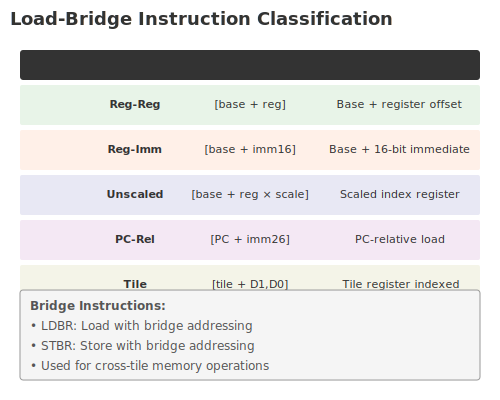
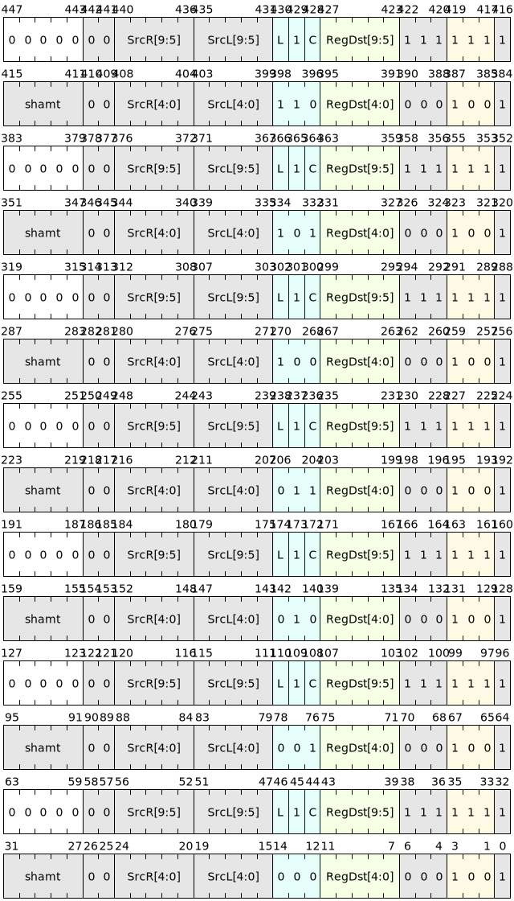

# bridged memory access instruction

In order to reduce register usage overhead, improve register utilization, etc., a set of **bridged memory access instructions** (recorded as **Load bridge** and **Store Bridge**) are introduced in LinxISA.

The memory access bit width and address calculation method of the bridged memory access instruction are the same as the ordinary Load and Store instructions. The difference is:

- The destination register of the Load bridge no longer stores the loaded data, but instead stores an entry index of the **bridge table**.
- The first source register of the Store bridge no longer obtains data, but obtains the table entry index written by the corresponding Load.

**Bridge table** is an information table used in hardware to establish a bridge mapping relationship between load and store. Each entry includes a set of global memory addresses, a set of tile register addresses, and status bits. The elements in the two sets of addresses are paired to establish a correspondence between the source address of the Load and the destination address of the Store. When moving data, the data can be quickly moved from the initial location to the destination without stopping or buffering in the moving unit.

The schematic diagram is as follows:

{ width="500" }

## Usage scenarios

1. Data loaded from global memory can be directly stored into Tile register without any processing (the source and destination can also be reversed);
2. After a piece of data is produced by the Load instruction, there is only one consumer, the Store instruction;

For example:
```asm
    v.ldi [vt#1.ud, 32], ->t.d
    add t#1, a0, ->t
    v.sdi t#1.ud, [to, 32]
```
In the above example, the data generated by load is read by two subsequent instructions, so it does not meet the bridged memory access instruction usage requirements.

## <span id="constrain">Instruction constraints</span>

In order to ensure the reasonable use of this type of instructions, we add the following constraints to the Load/Store bridge instructions:

1. The Load bridge and Store bridge instructions must **appear in pairs**, otherwise the hardware will report exception.
2. The output register of the Load bridge instruction can only be read by the subsequent Store bridge instruction, otherwise the hardware reports exception.

The so-called Load bridge and Store bridge must appear in pairs, which means that: (1) there is a Load bridge instruction in the pre-order, and there must be one and only one store bridge instruction with the same memory access bit width in the post-order; (2) When there is no Load bridge instruction in the pre-order, a single Store bridge instruction is not allowed to appear**.

Examples are as follows:
```asm
.body:
    ...
    v.ldi.brg [a0.ud, 32], ->t.d
    v.add a0.sw, vu#1.sw, ->vt.w
    v.sdi.brg t#1.ud, [to, 32]          # 合法的一对load bridge, store bridge指令
    ...
    v.ldi.brg [a0.ud, 32], ->t.d
    v.add t#1.ud, vu#1.ud, ->vt.d       # 非法读取了前序load bridge指令的输出，硬件报ZXTERMZH41QXZ。
    v.sdi.brg t#1.ud, [to, 32]
    ...
    v.ldi.brg [a0.ud, 32], ->t.d
    v.sdi.brg t#1.ud, [to, 16]
    v.sdi.brg t#2.ud, [to, 32]          # 存在多个store bridge指令与前序load bridge匹配，硬件报ZXTERMZH41QXZ。
    ...
    v.ldi.brg [a0.ud, 32], ->t.d
    bstop                               # 没有与load bridge配对的store bridge指令，硬件报ZXTERMZH41QXZ
```

## Load Bridge command

**Register-Register Addressing**

| Instructions | Assembly format |
|-------|-------------|
| V.LB.BRG | `v.lb.brg<.local> [SrcL<.ud>, <lc0,> SrcR.<T><<<shamt>], ->Dst.<W>` |
| V.LH.BRG | `v.lh.brg<.local> [SrcL<.ud>, <lc0<<1,> SrcR.<T><<<shamt>], ->Dst.<W>` |
| V.LW.BRG | `v.lw.brg<.local> [SrcL<.ud>, <lc0<<2,> SrcR.<T><<<shamt>], ->Dst.<W>` |
| V.LD.BRG | `v.ld.brg<.local> [SrcL<.ud>, <lc0<<3,> SrcR.<T><<<shamt>], ->Dst.<W>` |
| V.LBU.BRG | `v.lbu.brg<.local> [SrcL<.ud>, <lc0,> SrcR.<T><<<shamt>], ->Dst.<W>` |
| V.LHU.BRG | `v.lhu.brg<.local> [SrcL<.ud>, <lc0<<1,> SrcR.<T><<<shamt>], ->Dst.<W>` |
| V.LWU.BRG | `v.lwu.brg<.local> [SrcL<.ud>, <lc0<<2,> SrcR.<T><<<shamt>], ->Dst.<W>` |

The instructions are encoded as follows:



**Register-with scaled immediate addressing**| Instructions | Assembly format |
|-------|-------------|
| V.LBI.BRG | `v.lbi.brg<.local> [SrcL<.ud>, <lc0,> simm], ->Dst.<W>` |
| V.LHI.BRG | `v.lhi.brg<.local> [SrcL<.ud>, <lc0<<1,> simm], ->Dst.<W>` |
| V.LWI.BRG | `v.lwi.brg<.local> [SrcL<.ud>, <lc0<<2,> simm], ->Dst.<W>` |
| V.LDI.BRG | `v.ldi.brg<.local> [SrcL<.ud>, <lc0<<3,> simm], ->Dst.<W>` |
| V.LBUI.BRG | `v.lbui.brg<.local> [SrcL<.ud>, <lc0,> simm], ->Dst.<W>` |
| V.LHUI.BRG | `v.lhui.brg<.local> [SrcL<.ud>, <lc0<<1,> simm], ->Dst.<W>` |
| V.LWUI.BRG | `v.lwui.brg<.local> [SrcL<.ud>, <lc0<<2,> simm], ->Dst.<W>` |

The instructions are encoded as follows:


**Register - Unscaled Literal Addressing**

| Instructions | Assembly format |
|-------|-------------|
| V.LHI.U.BRG | `v.lhi.u.brg [SrcL<.ud>, <lc0<<1,> simm], ->Dst.<W>` |
| V.LWI.U.BRG | `v.lwi.u.brg [SrcL<.ud>, <lc0<<2,> simm], ->Dst.<W>` |
| V.LDI.U.BRG | `v.ldi.u.brg [SrcL<.ud>, <lc0<<3,> simm], ->Dst.<W>` |
| V.LHUI.U.BRG | `v.lhui.u.brg [SrcL<.ud>, <lc0<<1,> simm], ->Dst.<W>` |
| V.LWUI.U.BRG | `v.lwui.u.brg [SrcL<.ud>, <lc0<<2,> simm], ->Dst.<W>` |

The instructions are encoded as follows:

> **Note:** Encoding diagram for Load-Bridge-Unscaled forms (V.LB.BRG, V.LBU.BRG, V.LH.BRG, V.LHU.BRG, V.LW.BRG, V.LWU.BRG, V.LD.BRG) follows the same pattern as [LoadRegisterOffsetVector](../bitfield/svg/Introduction_64bit/LoadRegisterOffsetVector.svg) with additional SrcD bridge register fields. See [LoadBridgeRegisterOffsetVector](../bitfield/svg/Introduction_64bit/LoadBridgeRegisterOffsetVector.svg) for the bridge-register variant.

## Store Bridge command

**Register-Register Addressing**

| Command | Assembly Format | Command | Assembly Format |
|-------|-------------|-------|-------------|
| V.SB.BRG | `v.sb.brg<.local> SrcD.<T>, [SrcL<.ud>, <lc0,> SrcR.<T>]` |
| V.SH.BRG | `v.sh.brg<.local> SrcD.<T>, [SrcL<.ud>, <lc0<<1,> SrcR.<T><<1]` |
| V.SW.BRG | `v.sw.brg<.local> SrcD.<T>, [SrcL<.ud>, <lc0<<2,> SrcR.<T><<2]` |
| V.SD.BRG | `v.sd.brg<.local> SrcD.<T>, [SrcL<.ud>, <lc0<<3,> SrcR.<T><<3]` |
| V.SH.U.BRG | `v.sh.u.brg<.local> SrcD.<T>, [SrcL<.ud>, <lc0<<1,> SrcR.<T>]` |
| V.SW.U.BRG | `v.sw.u.brg<.local> SrcD.<T>, [SrcL<.ud>, <lc0<<2,> SrcR.<T>]` |
| V.SD.U.BRG | `v.sd.u.brg<.local> SrcD.<T>, [SrcL<.ud>, <lc0<<3,> SrcR.<T>]` |


**Register-immediate addressing**

| Command | Assembly Format | Command | Assembly Format |
|-------|-------------|-------|-------------|
| V.SBI.BRG | `v.sbi.brg<.local> SrcL.<T>, [SrcR<.ud>, <lc0,> simm]` |
| V.SHI.BRG | `v.shi.brg<.local> SrcL.<T>, [SrcR<.ud>, <lc0<<1,> simm]` |
| V.SWI.BRG | `v.swi.brg<.local> SrcL.<T>, [SrcR<.ud>, <lc0<<2,> simm]` |
| V.SDI.BRG | `v.sdi.brg<.local> SrcL.<T>, [SrcR<.ud>, <lc0<<3,> simm]` |
| V.SHI.U.BRG | `v.shi.u.brg<.local> SrcL.<T>, [SrcR<.ud>, <lc0<<1,> simm]` |
| V.SWI.U.BRG | `v.swi.u.brg<.local> SrcL.<T>, [SrcR<.ud>, <lc0<<2,> simm]` |
| V.SDI.U.BRG | `v.sdi.u.brg<.local> SrcL.<T>, [SrcR<.ud>, <lc0<<3,> simm]` |

