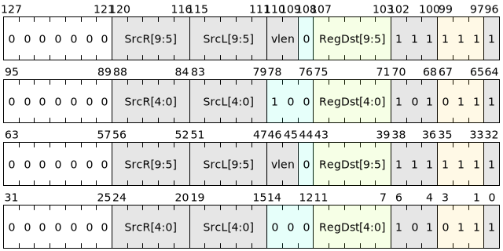

# Integer multiplication and division instructions

Integer multiplication and division instructions provide unified **multiplication**, **division**, or **remainder** operations within each execution lane (lane). Signed and unsigned operands are uniformly supported, and the symbol attributes and data width are specified by the `{T}`, `{W}` identifiers.

## Multiplication and multiply-accumulate instructions

| Microinstructions | Assembly format | Description |
|--------------|----------------------------------|-------------------------------------------------------------|
| V.MUL | `v.mul SrcL.{T}, SrcR.{T}, ->Dst.{W}` | Multiply two integer inputs and write the result to the destination register |
| V.MADD | `v.madd SrcL.{T}, SrcR.{T}, SrcD.{T}, ->Dst.{W}` | Multiply and add three integer inputs, and the result is written to the destination register |

The encoding is as follows:

## Division remainder command

| Microinstructions | Assembly format | Description |
|-------------|--------------------------|--------------------------------------|
| V.DIV | `v.div SrcL.{T}, SrcR.{T}, ->Dst.{W}` | Divide two integer inputs and write the **quotient** to the destination register |
| V.REM | `v.rem SrcL.{T}, SrcR.{T}, ->Dst.{W}` | Divide two integer inputs and write the **remainder** to the destination register |

The encoding is as follows:

## exception and boundary conditions

Division and remainder trigger a divide-by-zero error when the divisor is zero; other exception visibility and handling follow the global exception model.