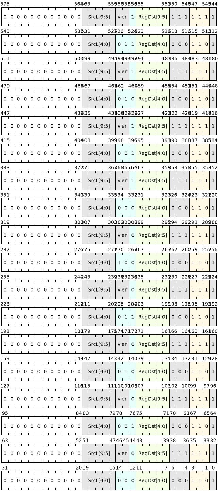

# Reduce instructions

In the SIMT (Single Instruction, Multiple Threads) architecture, reduce is a common operation used to merge the results of multiple lane calculations into one result.

Multiple lanes of a parallel block execute the same instructions simultaneously, but each lane processes different data. When you need to combine the calculation results of multiple lanes into one result, you need to use the reduce operation.

Specifically, reduce operations typically involve the following steps:

1. Store the results of each lane calculation in the parallel block-privateT,U,M,N registers.
2. Perform reduction operations on the results of corresponding private registers in different lanes, such as summing, maximizing, minimizing, etc.
3. Store the reduction result in a global register so that other block instruction can access it.

{ width = "800" }

Therefore, the reduce instruction has the following restrictions:

- Reduce operations in different lanes are out of order.
- The result of the reduce instruction can be output to the global register or the scalar register T or U within the block.
- When reducing to the global register, the result of the reduce is accumulated into the global register instead of written directly.

Through reduce operations, the calculation results of multiple lanes can be efficiently merged, thereby improving the efficiency of parallel computing. In many parallel computing tasks, reduce operations are an essential step.

## Command list

| Microinstructions | Assembly format | Description |
|-------------|--------------------------|--------------------------------------|
| V.RDADD | `v.rdadd SrcL.{T}, ->Dst.d` | Add the integers in SrcL.{T} in all valid lanes of the current Group, and write the result to the Dst register |
| V.RDAND | `v.rdand SrcL.{T}, ->Dst.d` | Bitwise AND the values in SrcL.{T} in all valid lanes of the current Group, and write the result to the register Dst.  |
| V.RDOR | `v.rdor  SrcL.{T}, ->Dst.d` | Bitwise OR the values in SrcL.{T} in all valid lanes of the current Group, and write the result to the register Dst.  |
| V.RDXOR | `v.rdxor  SrcL.{T}, ->Dst.d` | Bitwise XOR the values in SrcL.{T} in all valid lanes of the current Group, and write the result to the register Dst.  |
| V.RDFADD | `v.rdfadd SrcL.{T}, ->Dst.d` | Add the floating point numbers in SrcL.{T} in all valid lanes of the current Group, and write the result to the register Dst |
| V.RDMAX | `v.rdmaxu SrcL.{T}, ->Dst.d` | Compare the integers of SrcL.{T} in all valid lanes of the current Group, and write the maximum value to the register Dst.  |
| V.RDMIN | `v.rdminu SrcL.{T}, ->Dst.d` | Compare the integers of SrcL.{T} in all valid lanes of the current Group, and write the minimum value to the register Dst.  |
| V.RDFMAX | `v.rdfmax SrcL.{T}, ->Dst.d` | Compare the floating point numbers in SrcL.{T} in all valid lanes of the current Group and write the maximum value to the register Dst.  |
| V.RDFMIN | `v.rdfmin SrcL.{T}, ->Dst.d` | Compare the floating point numbers in SrcL.{T} in all valid lanes of the current Group, and write the minimum value to the register Dst.  |

## Command encoding

