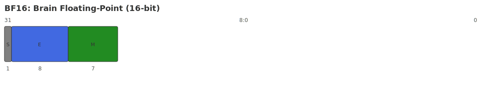

# BF16

## Description

The data format is **16-bit half-precision floating point number representation format**, which follows the IEEE 754-2008 standard specification.

## Binary structure

The binary structure of BF16 contains 1 bit sign bit, 8 bit exponent and 7 bit mantissa, abbreviated as **E8M7**. The schematic diagram is as follows:

{ width="1100" }

## Value range

The exponent offset of BF16 is 127, and the values that can be expressed are defined by the formula as follows.

1. For normalized floating point numbers:
$$
    Value = (−1)^S x 2^{E−127} x (1 + \Sigma_{i=0}^6 m_i x 2^{-7+i})
$$

2. For denormalized floating point numbers:
$$
    Value = (−1)^S x 2^{E−127+1} x \Sigma_{i=0}^6 m_i x 2^{-7+i}
$$

Among them:

- S ∈ {0,1}.
- E ∈ [0, 255], but all 0's and all 1's are used for special values.
- $m_i$ is the i-th bit of the mantissa, i ∈ [0, 6].

The value range of BF16 is:

| Numeric value | S | Exponent | Mantissa | Expression range |
|--------|-----|------------|-------------|--------------------------|
| Zeros | 0/1 | 5'h00 | 10'h000 | $\pm$0 |
| Minimum subnormal number (Min Subnormal) | 0/1 | 5'h00 | 10'h001 | $\pm$2^{-7} x 2^{-126} |
| Max Subnormal | 0/1 | 5'h00 | 10'h3FF | $\pm$(2^{-1} + 2^{-2} + ... + 2^{-7}) x 2^{-126} |
| Minimum specification number (Min Normal) | 0/1 | 5'h01 | 10'h000 | $\pm$2^{-126} |
| Maximum number of specifications (Max Normal) | 0/1 | 5'h1E | 10'h3FF | $\pm$(1 + 2^{-1} + 2^{-2} + ... + 2^{-7}) x 2^127 |
| Infinities | 0/1 | 5'h1F | 10'h000 | $\pm$ $\infty$ |
| Not a Number (NaN) | 0/1 | 5'h1F | !=0 | Not a Number |

## Note

Overflow or underflow occurs when a value exceeds the range.