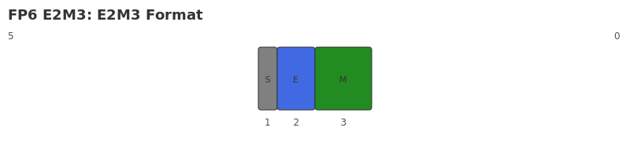

# FP6

## Description

The data format is **6-bit low-precision floating-point number representation format**, which follows the IEEE 754-2008 standard specification.

FP6 contains two storage structures: **E3M2** and **E2M3**.

## E3M2

### Binary structure

The binary structure of FP6-E3M2 includes 1 bit sign bit, 3 bit exponent and 2 bit mantissa, abbreviated as **E3M2**. The schematic diagram is as follows:

{ width="800" }

### Value range

The exponential offset of FP6-E3M2 is 3, and the values that can be expressed are defined by the formula as follows.

1. For normalized floating point numbers:
$$
    Value = (−1)^S x 2^{E−3} x (1 + \Sigma_{i=0}^1 m_i x 2^{-2+i})
$$

2. For denormalized floating point numbers:
$$
    Value = (−1)^S x 2^{E−3+1} x \Sigma_{i=0}^1 m_i x 2^{-2+i}
$$

Among them:

- S ∈ {0,1}.
- E ∈ [0, 7], but all zeros are used for special values.
- $m_i$ is the i-th bit of the mantissa, i ∈ [0, 1].

The value range of FP6-E3M2 is:

| Numeric value | S | Exponent | Mantissa | Expression range |
|--------|-----|------------|-------------|--------------------------|
| Zeros | 0/1 | 000 | 00 | $\pm$0 |
|Min Subnormal | 0/1 | 000 | 01 | $\pm$2^{-2} x 2^{-2} |
| Max Subnormal | 0/1 | 000 | 11 | $\pm$(2^{-1} + 2^{-2}) x 2^{-2} |
| Minimum specification number (Min Normal) | 0/1 | 001 | 00 | $\pm$2^{-2} |
| Maximum number of specifications (Max Normal) | 0/1 | 111 | 11 | $\pm$(1 + 2^{-1} + 2^{-2}) x 2^4 |
| Infinities | - | - | - | - |
| Not a number (NaN) | - | - | - | - |

## E2M3

### Binary structure

The binary structure of FP6-E2M3 includes 1 bit sign bit, 2 bit exponent and 3 bit mantissa, abbreviated as **E2M3**. The schematic diagram is as follows:

{ width="800" }

### Value range

The exponential offset of FP6-E2M3 is 1, and the values that can be expressed are defined by the formula as follows.

1. For normalized floating point numbers:
$$
    Value = (−1)^S x 2^{E−1} x (1 + \Sigma_{i=0}^2 m_i x 2^{-3+i})
$$

2. For denormalized floating point numbers:
$$
    Value = (−1)^S x 2^{E−1+1} x \Sigma_{i=0}^2 m_i x 2^{-3+i}
$$

Among them:

- S ∈ {0,1}.
- E ∈ [0, 3], but all zeros are used for special values.
- $m_i$ is the i-th bit of the mantissa, i ∈ [0, 2].

The value range of FP6-E2M3 is:| Numeric value | S | Exponent | Mantissa | Expression range |
|--------|-----|------------|-------------|--------------------------|
| Zeros | 0/1 | 00 | 000 | $\pm$0 |
|Min Subnormal | 0/1 | 00 | 001 | $\pm$2^{-3} x 2^0 |
| Maximum non-standard number (Max Subnormal) | 0/1 | 00 | 111 | $\pm$(2^{-1} + 2^{-2} + 2^{-3}) x 2^0 |
| Minimum specification number (Min Normal) | 0/1 | 01 | 000 | $\pm$2^0 |
| Maximum number of specifications (Max Normal) | 0/1 | 11 | 111 | $\pm$(1 + 2^{-1} + 2^{-2} + 2^{-3}) x 2^2 |
| Infinities | - | - | - | - |
| Not a number (NaN) | - | - | - | - |

## Note

Overflow or underflow occurs when a value exceeds the range.