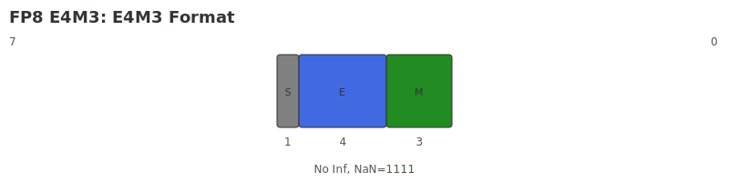
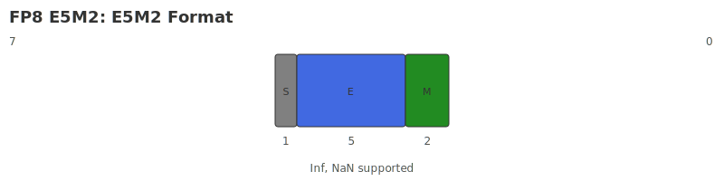

# FP8

## Description

The data format is **8-bit low-precision floating-point number representation format**, which follows the IEEE 754-2008 standard specification.

FP8 contains two storage structures: **E4M3** and **E5M2**.

## E4M3

The FP8-E4M3 format extends the narrow dynamic range by representing fewer special values and using bit patterns of special values for normal values. The E4M3 format retains only a mantissa bit pattern for NaN, and does not represent infinity.

### Binary structure

The binary structure of FP8 contains 1 bit sign bit, 4 bit exponent and 3 bit mantissa, abbreviated as **E4M3**. The schematic diagram is as follows:

{ width="800" }

### Value range

The index offset of FP8-E4M3 is 7, and the values that can be expressed are defined by the formula as follows.

1. For normalized floating point numbers:
$$
    Value = (−1)^S x 2^{E−7} x (1 + \Sigma_{i=0}^2 m_i x 2^{-3+i})
$$

2. For denormalized floating point numbers:
$$
    Value = (−1)^S x 2^{E−7+1} x \Sigma_{i=0}^2 m_i x 2^{-3+i}
$$

Among them:

- S ∈ {0,1}.
- E ∈ [0, 15], but all zeros are used for special values.
- $m_i$ is the i-th bit of the mantissa, i ∈ [0, 2].

The value range of FP8-E4M3 is:

| Numeric value | S | Exponent | Mantissa | Expression range |
|--------|-----|------------|-------------|--------------------------|
| Zeros | 0/1 | 4'h0 | 000 | $\pm$0 |
|Min Subnormal | 0/1 | 4'h0 | 001 | $\pm$2^{-3} x 2^{-6} |
| Max Subnormal | 0/1 | 4'h0 | 111 | $\pm$(2^{-1} + 2^{-3}) x 2^{-6} |
| Minimum specification number (Min Normal) | 0/1 | 4'h1 | 000 | $\pm$2^{-6} |
| Maximum number of specifications (Max Normal) | 0/1 | 4'hF | 110 | $\pm$(1 + 2^{-1} + 2^{-3}) x 2^8 |
| Infinities | 0/1 | - | - | - |
| Not a number (NaN) | 0/1 | 4'hF | 111 | Not a Number |

## E5M2

### Binary structure

The binary structure of FP8-E5M2 includes 1 bit sign bit, 5 bit exponent and 2 bit mantissa, abbreviated as **E5M2**. The schematic diagram is as follows:

{ width="800" }

### Value range

The index offset of FP8-E5M2 is 15, and the values that can be expressed are defined by the formula as follows.

1. For normalized floating point numbers:
$$
    Value = (−1)^S x 2^{E−15} x (1 + \Sigma_{i=0}^1 m_i x 2^{-2+i})
$$

2. For denormalized floating point numbers:
$$
    Value = (−1)^S x 2^{E−15+1} x \Sigma_{i=0}^1 m_i x 2^{-2+i}
$$

Among them:

- S ∈ {0,1}.
- E ∈ [0, 31], but all 0's and all 1's are used for special values.
- $m_i$ is the i-th bit of the mantissa, i ∈ [0, 1].The value range of FP8-E5M2 is:

| Numeric value | S | Exponent | Mantissa | Expression range |
|--------|-----|------------|-------------|--------------------------|
| Zeros | 0/1 | 5'h00 | 00 | $\pm$0 |
|Min Subnormal | 0/1 | 5'h00 | 01 | $\pm$2^{-2} x 2^{-14} |
| Max Subnormal | 0/1 | 5'h00 | 11 | $\pm$(2^{-1} + 2^{-2}) x 2^{-14} |
| Minimum specification number (Min Normal) | 0/1 | 5'h01 | 00 | $\pm$2^{-14} |
| Maximum number of specifications (Max Normal) | 0/1 | 5'h1E | 11 | $\pm$(1 + 2^{-1} + 2^{-2}) x 2^15 |
| Infinities | 0/1 | 5'h1F | 00 | $\pm$ $\infty$ |
| Not a Number (NaN) | 0/1 | 5'h1F | !=0 | Not a Number |

## Note

Overflow or underflow occurs when a value exceeds the range.