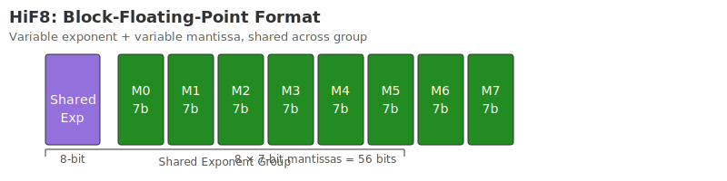

# HiF8

The data format is **8-bit low-precision floating-point number representation format**.

## Binary structure

HiF8 defines an additional point field (D) based on IEEE 754, accounting for 2~4 bits. The D value explicitly indicates the number of bits occupied by the exponent field and implies the mantissa width. Different point fields have different encodings in the HiF8 format, as shown in the figure below.

{ width="800" }

The sign, exponent, and mantissa are abbreviated as "S", "E", and "M" respectively.

# Value range

HiF8 can express two types of data: normalized floating point numbers (normal) and denormalized floating point numbers (subnormal).

1. For normalized floating point numbers:
$$
    Value = Sv x 2^(Ev) x (1 + Mv)
$$

Among them:

- Sv is the sign bit encoded in S. When encoded as 0, it represents a positive number, and when encoded as 1, it represents a negative number.
- Ev is the actual exponent value encoded in the E field. The most significant bit of the E field is the sign bit, and {1b1:E[MSB-1, LSB]} is the absolute value of Ev.
- Mv is the actual mantissa value encoded in the M field, which is calculated as $Mv = \frac{M}{M^w}$. (w is the bit width of the M field)

2. For denormalized floating point numbers:
$$
    Value = Sv x 2^(Mv-23)
$$

- Sv is the sign bit encoded in S.
- Ev is undefined.
- Mv is the exponent bit, ranging from 0 to 7. (When it is 0, it means Zero or NaN).

HiF8 encoding details are as follows:

| S | D | E | M | Sv | Ev | Mv |
|----|----|----|----|----|----|----|
| 0~1 | 0000 | - | 000~111 | $\pm$1 | - | [0, 7] |
| 0~1 | 0001 | - | 000~111 | $\pm$1 | 0 | [$\frac{0}{8}$, $\frac{7}{8}$] |
| 0~1 | 001 | 0~1 | 000~111 | $\pm$1 | $\pm$1 | [$\frac{0}{8}$, $\frac{7}{8}$] |
| 0~1 | 01 | 00~11 | 000~111 | $\pm$1 | $\pm$[2, 3] | [$\frac{0}{8}$, $\frac{7}{8}$] |
| 0~1 | 10 | 000~111 | 00~11 | $\pm$1 | $\pm$[4, 7] | [$\frac{0}{4}$, $\frac{3}{4}$] |
| 0~1 | 11 | 0000~1111 | 0~1 | $\pm$1 | $\pm$[8, 15] | [$\frac{0}{2}$, $\frac{1}{2}$] |

Some special values are listed below:

| S | D | E | M | Value |
|---|---|---|---|-------|
| 0 | 0000 | - | 000 | Zero |
| 1 | 0000 | - | 000 | NaN |
| 0 | 11 | 0111 | 1 | +INF (positive infinity) |
| 1 | 11 | 0111 | 1 | -INF (negative infinity) |