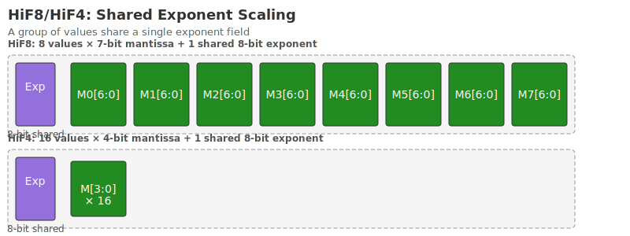
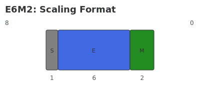

# HiF Microscaling

## Scaling factor

The scale factor of the HiF4 data format `X` is a 32-bit data format consisting of 3 parts with a total of 64 elements shared:

* **E6M2 (6-bit exponent, 2-bit mantissa)**: shared by all 64 elements.
* **E1_8 (8 1-bit exponents)**: each shared by 8 elements.
* **E1_16 (16 1-bit exponents)**: each shared by 4 elements.

### Encoding rules

* `E6M2` is 8 bits and is written as `Ea`.
* `E1_8` is 8 bits in total, each bit corresponds to 1 bit `Ebi` (`i ∈ {0,..., 7}`).
* `E1_16` is 16 bits in total, each bit corresponds to 1 bit `Ecj` (`j ∈ {0,..., 15}`).

### Data range

`Ea` is the first stage 8-digit fraction `E6M2`, shared by all 64 elements.
`Ebi` (`i ∈ {0,..., 7}`) is the second stage 1-bit exponent `E1_8`, shared by data `8i` through `8i + 7`.
`Ecj` (`j ∈ {0,..., 15}`) is the third stage 1-bit exponent `E1_16`, shared by data `4j` through `4j + 3`.

Therefore, for the data `N` (`N ∈ {0,..., 63}`) in `group=64`, the final scaling factor calculation formula is:

`X = Ea x 2^(Ebi + Ecj)` (where `i = N/8`; `j = N/4`). The sharing relationship is as follows:| E6M2 | E1_8 | E1_16 | Final scaling factor | Shared data range |
| :--- | :--- | :---- | :-------------------------- | :------------- |
| Ea | Eb0 | Ec0 | Ea x 2^(Eb0 + Ec0) | 0-3 |
| | | Ec1 | Ea x 2^(Eb0 + Ec1) | 4-7 |
| | Eb1 | Ec2 | Ea x 2^(Eb1 + Ec2) | 8-11 |
| | | Ec3 | Ea x 2^(Eb1 + Ec3) | 12-15 |
| | Eb2 | Ec4 | Ea x 2^(Eb2 + Ec4) | 16-19 |
| | | Ec5 | Ea x 2^(Eb2 + Ec5) | 20-23 |
| | Eb3 | Ec6 | Ea x 2^(Eb3 + Ec6) | 24-27 |
| | | Ec7 | Ea x 2^(Eb3 + Ec7) | 28-31 |
| | Eb4 | Ec8 | Ea x 2^(Eb4 + Ec8) | 32-35 |
| | | Ec9 | Ea x 2^(Eb4 + Ec9) | 36-39 |
| | Eb5 | Ec10 | Ea x 2^(Eb5 + Ec10) | 40-43 |
| | | Ec11 | Ea x 2^(Eb5 + Ec11) | 44-47 |
| | Eb6 | Ec12 | Ea x 2^(Eb6 + Ec12) | 48-51 |
| | | Ec13 | Ea x 2^(Eb6 + Ec13) | 52-55 |
| | Eb7 | Ec14 | Ea x 2^(Eb7 + Ec14) | 56-59 |
| | | Ec15 | Ea x 2^(Eb7 + Ec15) | 60-63 |

The diagram is as follows:

{ width="800" }

The value calculation formula of the first-order decimal `e6m2` is as follows:

```text
X = 2^E x 1.M
```

{ width="400" }

## Zoom results

Since we have elaborated on each component, it is now possible to consider the HiF4 unit as a whole and calculate its representative values. As shown in Figure 2, a single group in the HiF4 format contains four levels of multiplicatively related data hierarchies. Define the following symbols:- Let $\{S1P2\}_i$ represent the element value of the $i$th group, where $i \in [1, 64]$
- Let $\{E1\_8\}_j$ represent the $j$th microexponent in the second-level scaling metadata, where $j \in [1, 8]$
- Let $\{E1\_16\}_k$ represent the $k$th microexponent in the third-level scaling metadata, where $k \in [1, 16]$
- Let $\{V_i\}_{i=1}^{64}$ represent the 64 real numbers in the HiF4 group

Based on the above definition, each value of the HiF4 unit can be calculated as follows:

**Calculation rules:**

1. If $E6M2 = NaN$, then for all $i \in [1, 64]$ it satisfies:
   $$V_i = NaN$$

2. Otherwise:
   $$V_i = E6M2 \times 2^{\left( \{E1\_8\}_{\lceil i/8 \rceil} + \{E1\_16\}_{\lceil i/4 \rceil} \right)} \times \{S1P2\}_i$$