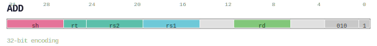
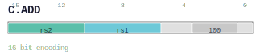
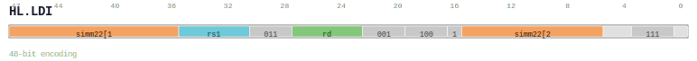
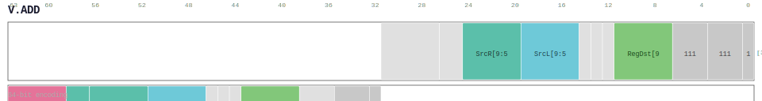

# Instruction Encoding Formats

> **ISA Version:** v0.56.4 &nbsp;|&nbsp; **Chapter 03** of the ISA Manual

LinxISA v0.56 supports four instruction lengths in a little-endian
halfword-oriented model. Bit positions are shown as `[msb:0]`
(MSB leftmost, LSB rightmost), matching ARM and RISC-V conventions.

## Instruction Lengths

| Namespace | Format | Bits | Composition | Example |
|-----------|--------|------|-------------|---------|
| **C.** | C16 | 16 | Single 16-bit part | `C.ADD`, `C.LD`, `C.BSTART.FP` |
| *(base)* | LX32 | 32 | Single 32-bit part | `ADD`, `LD`, `BSTART CALL` |
| **HL.** | HL48 | 48 | 16-bit prefix + 32-bit main | `HL.LDI`, `HL.CASB`, `HL.SETRET` |
| **V.** | V64 | 64 | 32-bit prefix + 32-bit main | `V.ADD`, `V.FMADD`, `V.DIV` |

> **Note:** 48-bit (`HL.*`) and 64-bit (`V.*`) forms are *prefix + main* compositions.
> The prefix augments the following instruction and has no standalone semantics.

## Decode Format Tags

Each instruction carries a decode `Type` tag describing its operand field layout:

### 16-bit (C.) Decode Types

| Tag | Typical operands |
|-----|-----------------|
| `C.Type A` | `SrcL`, `SrcR` — two-register |
| `C.Type B` | `SrcL`, `uimm5` — register + small immediate |
| `C.Type C` | `SrcL`, `Func` — register + function code |
| `C.Type D` | `SrcL`, `RegDst` — register move |
| `C.Type E` | `RegDst`, `uimm5` — move-immediate / setret |
| `C.Type F` | `Func`, `uimm5` — function + small immediate |
| `C.Type G` | immediate-only (block markers) |
| `C.Type H` | `imm10` — larger immediate |
| `C.Type I` | `imm12` — PC-relative forms |

### 32-bit Decode Types

| Tag | Typical operands |
|-----|-----------------|
| `Type A` | `RegDst`, `SrcL`, `SrcR` [, `SrcD`] — 3-source |
| `Type B` | `RegDst`, `SrcL`, `SrcR` + small `imm` |
| `Type C` | `SrcL`, `SrcR` + 2 immediates |
| `Type D` | `RegDst`, `SrcL` + `simm` — compare/branch |
| `Type F` | `RegDst`, `SrcL` + `simm` — load/store |
| `Type G` | `RegDst` + `simm` — load-immediate |
| `Type H` | `SrcL`, `SrcR` + `simm` — ALU-immediate |

## Encoding Space

| Encoding | Major opcode bits | Slots | Usage |
|----------|-----------------|-------|-------|
| C16 | `[15:13]` | 8 | Compressed 16-bit forms |
| LX32 | `[31:26]` | 64 | Base 32-bit forms |
| HL48 | `[47:40]` | 256 | High-level prefix |
| V64 | `[63:58]` | 64 | Vector prefix |

See [Encoding Space Analysis](../reference/encoding_space_report.md) for the full
conflict-free allocation table.

## Field Colour Key

| Colour | Field | Colour | Field |
|--------|-------|--------|-------|
| Green | Rd / RegDst | Purple | funct / opcode |
| Cyan | Rs1 / SrcL | Pink | shamt |
| Teal | Rs2 / SrcR | Amber | imm / offset |
| Orange | Rs3 / SrcD | Gray | reserved / zero |

## Example Diagrams

### 32-bit: ADD

### 16-bit: C.ADD

### 48-bit: HL.LDI

### 64-bit: V.ADD

## See Also

- [Full ISA Manual overview](https://github.com/LinxISA/linx-isa/tree/main/docs/architecture/isa-manual/src)
- [Instruction reference index](index.md)
- [Encoding Space Analysis](../reference/encoding_space_report.md)
