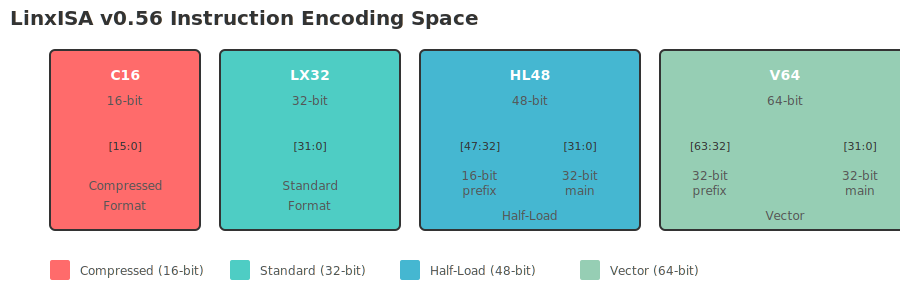
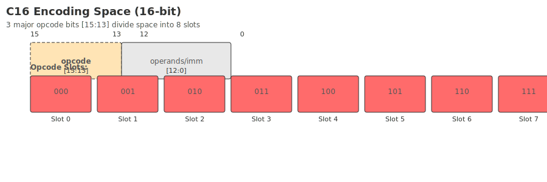
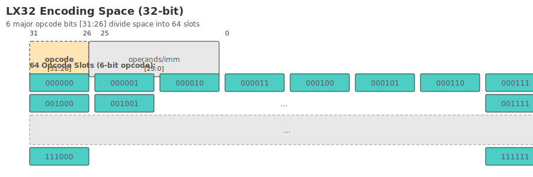
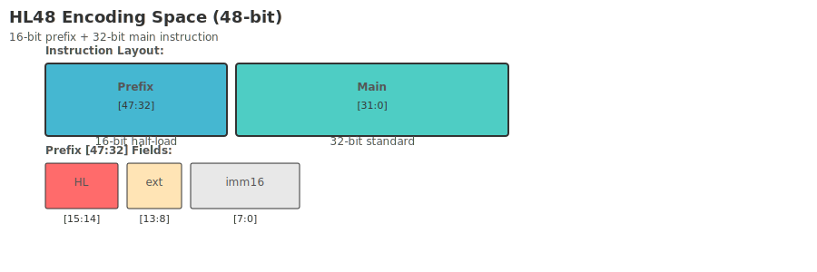
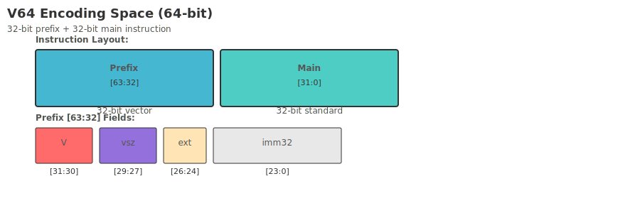

# command space

The instruction space chapter is used to explain the usage of the overall coding space by the instructions defined in LinxISA and what expansion space can be used in the future.

## Space Overview

The instruction spaces of different lengths in LinxISA are shown in the figure below:

## Compress instruction space

{ width="900" }

## Standard command space

{ width="900" }

## Enhance command space

{ width="900" }

## Extra long instruction space

{ width="900" }