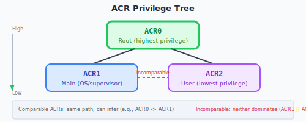

# Run privilege level

The program running level of Linx Instruction Set Architecture is managed through **Access Control Ring (ACR) (Access Control Ring)**, and the function access permissions of the running software roles are controlled. The Linx logical core supports up to 16 privilege levels to be assigned to different software roles. In the ACR mechanism, each software with different permissions uses a different ACR. For example, a native operating system kernel and an operating system kernel in a virtual machine need to use different ACRs because the two have different permissions for the software.

Different privilege levels are represented by ACR{n}, and n can be [0..15]. The Linx core is in the ACR0 state by default when reset. It can only be changed through specific events and can only follow a specific path. This change rule is specifically defined by ACR switching.

ACR functions already used in the current version include:

| ACR ID | |
|---------------------|-------------|
|0|**Root priority**, with the highest authority in the entire system. Typically used in firmware and initialization programs |
|1|**Main system priority**, usually can be used as Host OS or Hypervisor|
|2|**Main system user priority**, usually used as the Host user program|
|3|**Guest OS system priority**, usually used in the kernel of Guest OS|
|4|**Guest user priority**, usually used in user mode programs of Guest OS|

ACR{n} (n=[0..2]) is a privilege level that all implementations must provide, other privilege levels will only be supported when specific extensions are enabled.  
All supported ACRs are always organized into a tree rooted at ACR0. For implementations containing ACR0, 1, 2 and optionally 3 and 4, the ACR is defined as the following tree structure:

In the ACR tree, the parent node has a higher privilege level than the child node, and the same ACR node is considered to have "equal" privilege level. In both cases, the two privilege levels are considered "comparable".
Otherwise, ACRs on different tree branches are considered "incomparable". ACR switching can only occur between two comparable ACRs.

If ACRn and ACRm are comparable:

- If ACRn has higher privileges than ACRm, the description is: "n p> m" or "m p < n".
- If ARCn has a higher privilege level than ACRm or the two are equal, the description is: "n p>= m" or "m p<= n".
- If the privilege levels of ARCn and ACRm are equal, the description is: "n p= m" or "m p= n".

Linx Instruction Set Architecture decides how to provide functions based on ACR. Some instructions (including but not limited to access to SSR content) will behave differently due to different ACRs.