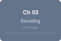
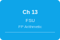
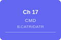
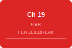
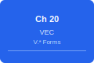

# LinxISA Instruction Reference

<!-- Hero Banner -->

**ISA Version:** v0.56.4 &nbsp;·&nbsp; **740 instruction forms** &nbsp;·&nbsp; **66 groups** &nbsp;·&nbsp; **4 encoding formats**

---

Browse by chapter, instruction group, or search by mnemonic. Each instruction page includes its encoding diagram, assembly syntax, and description.

**Jump to:** [Encoding Formats](encoding.md) · [Groups Index](groups/index.md) · [A–Z Index](instructions/index.md)

---

## Browse by Chapter

The LinxISA manual is organized into 12 chapters covering distinct functional units. Click any chapter to jump to its first instruction group.

[{:.chapter-card style="--ch-color:#64748b" width="120" height="80"} **Ch 03 — Encoding Formats**{:.chapter-card style="--ch-color:#64748b"}
: Bit numbering, instruction lengths, decode tags, field colour key

[{:.chapter-card style="--ch-color:#8b5cf6" width="120" height="80"} **Ch 04 — Block ISA**{:.chapter-card style="--ch-color:#8b5cf6"}
: BSTART, BSTOP, B.ARG, B.DIM, tile/SIMT control flow

[{:.chapter-card style="--ch-color:#059669" width="120" height="80"} **Ch 11 — AGU**{:.chapter-card style="--ch-color:#059669"}
: Loads, stores, prefetch, all addressing modes

[{:.chapter-card style="--ch-color:#0891b2" width="120" height="80"} **Ch 12 — ALU**{:.chapter-card style="--ch-color:#0891b2"}
: ADD, SUB, MUL, DIV, shifts, bit manip, LUI, CSEL

[{:.chapter-card style="--ch-color:#0ea5e9" width="120" height="80"} **Ch 13 — FSU**{:.chapter-card style="--ch-color:#0ea5e9"}
: Floating-point arithmetic, FMA, format conversion

[{:.chapter-card style="--ch-color:#e11d48" width="120" height="80"} **Ch 14 — AMO**{:.chapter-card style="--ch-color:#e11d48"}
: LR/SC, atomic fetch-op, CAS

[{:.chapter-card style="--ch-color:#8b5cf6" width="120" height="80"} **Ch 15 — BBD**{:.chapter-card style="--ch-color:#8b5cf6"}
: C.BSTART, C.BSTOP, block delimiters

[{:.chapter-card style="--ch-color:#7c3aed" width="120" height="80"} **Ch 16 — BRU**{:.chapter-card style="--ch-color:#7c3aed"}
: Branches, CMP, SETC, SETRET, ADDTPC

[{:.chapter-card style="--ch-color:#6366f1" width="120" height="80"} **Ch 17 — CMD**{:.chapter-card style="--ch-color:#6366f1"}
: B.CATR, B.DATR, B.HINT, block attributes

[{:.chapter-card style="--ch-color:#a16207" width="120" height="80"} **Ch 18 — RSV**{:.chapter-card style="--ch-color:#a16207"}
: HL.BFI, HL.MIADD, HL.MISUB

[{:.chapter-card style="--ch-color:#dc2626" width="120" height="80"} **Ch 19 — SYS**{:.chapter-card style="--ch-color:#dc2626"}
: FENCE, barriers, EBREAK, ACR\*, cache/TLB maintenance

[{:.chapter-card style="--ch-color:#2563eb" width="120" height="80"} **Ch 20 — VEC**{:.chapter-card style="--ch-color:#2563eb"}
: V.\* vector forms, shuffles, reductions, division

---

## Browse by Group

[Arithmetic (1)](groups/arithmetic.md){.group-card} [Arithmetic Operation (20)](groups/arithmetic_operation.md){.group-card} [Arithmetic Operation 32bit (21)](groups/arithmetic_operation_32bit.md){.group-card} [Arithmetic Operation 64bit (21)](groups/arithmetic_operation_64bit.md){.group-card}
[Atomic (4)](groups/atomic.md){.group-card} [Atomic Operation (68)](groups/atomic_operation.md){.group-card} [BSTART (11)](groups/bstart.md){.group-card} [Bit Manipulation (8)](groups/bit_manipulation.md){.group-card}
[Bit Operation (8)](groups/bit_operation.md){.group-card} [Block Argument (9)](groups/block_argument.md){.group-card} [Block Control Attribute (1)](groups/block_control_attribute.md){.group-card} [Block Data Attribute (1)](groups/block_data_attribute.md){.group-card}
[Block Dimension (2)](groups/block_dimension.md){.group-card} [Block Hint (2)](groups/block_hint.md){.group-card} [Block Input & Output (5)](groups/block_input_output.md){.group-card} [Block Offset (1)](groups/block_offset.md){.group-card}
[Block Split (45)](groups/block_split.md){.group-card} [Branch (10)](groups/branch.md){.group-card} [C.BSTART (7)](groups/c_bstart.md){.group-card} [C.TINST (6)](groups/c_tinst.md){.group-card}
[C.UNARY (7)](groups/c_unary.md){.group-card} [Cache Maintain (16)](groups/cache_maintain.md){.group-card} [Compare Instruction (40)](groups/compare_instruction.md){.group-card} [Compound Operation (1)](groups/compound_operation.md){.group-card}
[Concat (2)](groups/concat.md){.group-card} [Division (2)](groups/division.md){.group-card} [Execution Control (10)](groups/execution_control.md){.group-card} [Floating Point Arithmetic (5)](groups/floating_point_arithmetic.md){.group-card}
[Floating-point Arithmetic (12)](groups/floating_point_arithmetic.md){.group-card} [Floating-point Compare (8)](groups/floating_point_compare.md){.group-card} [Format Convert (12)](groups/format_convert.md){.group-card} [General (3)](groups/general.md){.group-card}
[General Manager (2)](groups/general_manager.md){.group-card} [Immediate (2)](groups/immediate.md){.group-card} [Load Immediate Offset (23)](groups/load_immediate_offset.md){.group-card} [Load Long Offset (12)](groups/load_long_offset.md){.group-card}
[Load PC-Relative (7)](groups/load_pc_relative.md){.group-card} [Load Pair (19)](groups/load_pair.md){.group-card} [Load Post-Index (19)](groups/load_post_index.md){.group-card} [Load Pre-Index (19)](groups/load_pre_index.md){.group-card}
[Load Register Offset (22)](groups/load_register_offset.md){.group-card} [Load Symbol (7)](groups/load_symbol.md){.group-card} [Load UnScaled (16)](groups/load_unscaled.md){.group-card} [Long Immediate (2)](groups/long_immediate.md){.group-card}
[Max-Min (6)](groups/max_min.md){.group-card} [Move (3)](groups/move.md){.group-card} [Multi-Cycle ALU (28)](groups/multi_cycle_alu.md){.group-card} [PC-Relative (4)](groups/pc_relative.md){.group-card}
[Prefetch (4)](groups/prefetch.md){.group-card} [RESERVE (3)](groups/reserve.md){.group-card} [Reduce Operation with Register (9)](groups/reduce_operation_with_register.md){.group-card} [SSR Access (7)](groups/ssr_access.md){.group-card}
[Set Commit Argument (26)](groups/set_commit_argument.md){.group-card} [Shuffle (8)](groups/shuffle.md){.group-card} [Store Immediate Offset (9)](groups/store_immediate_offset.md){.group-card} [Store Long Offset (7)](groups/store_long_offset.md){.group-card}
[Store Offset (14)](groups/store_offset.md){.group-card} [Store PC-Relative (4)](groups/store_pc_relative.md){.group-card} [Store Pair (14)](groups/store_pair.md){.group-card} [Store Post-Index (14)](groups/store_post_index.md){.group-card}
[Store Pre-Index (14)](groups/store_pre_index.md){.group-card} [Store Register Offset (21)](groups/store_register_offset.md){.group-card} [Store Symbol (4)](groups/store_symbol.md){.group-card} [Three Source Integer (2)](groups/three_source_integer.md){.group-card}
[Three-Source Floating Point (8)](groups/three_source_floating_point.md){.group-card} [Two-Source Floating Point (12)](groups/two_source_floating_point.md){.group-card}

See also: [Groups Index (detailed)](groups/index.md) · [All Instructions A–Z](instructions/index.md)

---

## Instruction Quick Index

Click any mnemonic to jump to its full reference page. See the [full alphabetical list](instructions/index.md) for all 740 forms.

### By Prefix

| Prefix | Description | Widths | Groups |
|--------|-------------|--------|--------|
| *(base)* | Standard scalar integer, FP, control | 32-bit | ALU, FSU, BRU, SYS, AMO |
| **C.** | Compressed 16-bit forms | 16-bit | Arithmetic, Load/Store, Branch |
| **HL.** | Half-long 48-bit forms | 48-bit | Extended loads, stores, immediates |
| **V.** | Vector 64-bit forms | 64-bit | Vector ALU, FP, reductions, shuffles |

### Alphabetical Index (Sample)

| Mnemonic | Group | Bits | Description |
|----------|-------|:----:|------------|
| [ACRC](instructions/acrc.md) | execution_control | 32 | Architectural control (ring call). Calls an ACR. |
| [ACRE](instructions/acre.md) | execution_control | 32 | Architectural control (ring entry). Enters an ACR. |
| [ADD](instructions/add.md) | arithmetic_operation_64bit | 32 | Integer addition. Writes sum of two registers to destination. |
| [ADDI](instructions/addi.md) | arithmetic_operation_64bit | 32 | Integer add-immediate. Adds sign-extended 12-bit immediate to register. |
| [AND](instructions/and.md) | arithmetic_operation_64bit | 32 | Bitwise AND of two registers. |
| [ANDI](instructions/andi.md) | arithmetic_operation_64bit | 32 | Bitwise AND with an immediate. |
| [B.EQ](instructions/b_eq.md) | branch | 32 | Conditional branch when SrcL equals SrcR. |
| [B.GE](instructions/b_ge.md) | branch | 32 | Conditional branch when SrcL ≥ SrcR (signed). |
| [B.LT](instructions/b_lt.md) | branch | 32 | Conditional branch when SrcL < SrcR (signed). |
| [BC.IALL](instructions/bc_iall.md) | cache_maintain | 32 | Branch-predictor cache invalidate all entries. |
| [BCNT](instructions/bcnt.md) | bit_operation | 32 | Population count. Counts set bits in a register. |
| [BSTART](instructions/bstart.md) | block_split | 32 | Block split marker. Terminates current block, begins next. |
| [C.ADD](instructions/c_add.md) | arithmetic_operation | 16 | Compressed integer addition. |
| [C.LDI](instructions/c_ldi.md) | load_immediate_offset | 16 | Compressed load immediate. |
| [CSEL](instructions/csel.md) | compound_operation | 32 | Conditional select: `Dest = (SrcP != 0) ? SrcL : SrcR`. |
| [DIV](instructions/div.md) | multi_cycle_alu | 32 | Signed integer division. |
| [FADD](instructions/fadd.md) | floating_point_arithmetic | 32 | Floating-point addition. |
| [FCVT](instructions/fcvt.md) | format_convert | 32 | Floating-point format conversion. |
| [FEQ](instructions/feq.md) | floating_point_compare | 32 | Floating-point equality. Writes 1 if ordered and equal. |
| [HL.LDI](instructions/hl_ldi.md) | load_long_offset | 48 | 48-bit load immediate. |
| [LB](instructions/lb.md) | load_register_offset | 32 | Load signed 8-bit value from memory. |
| [LD](instructions/ld.md) | load_register_offset | 32 | Load 64-bit value from memory. |
| [LUI](instructions/lui.md) | immediate | 32 | Load upper immediate. Materializes 20-bit constant. |
| [SB](instructions/sb.md) | store_register_offset | 32 | Store 8-bit register value to memory. |
| [SD](instructions/sd.md) | store_register_offset | 32 | Store 64-bit register value to memory. |
| [SETRET](instructions/setret.md) | pc_relative | 32 | Materializes return address using PC-relative offset. |
| [V.ADD](instructions/v_add.md) | arithmetic_operation | 64 | Vector integer addition (64-bit). |
| [V.FADD](instructions/v_fadd.md) | three_source_floating_point | 64 | Vector floating-point addition. |
| [V.FMADD](instructions/v_fmadd.md) | three_source_floating_point | 64 | Vector FMA: a × b + c. |
| [V.DIV](instructions/v_div.md) | division | 64 | Vector signed integer division. |
| [V.RDADD](instructions/v_rdadd.md) | reduce_operation_with_register | 64 | Vector reduction: add all lane values. |

[View all 740 instructions →](instructions/index.md)
