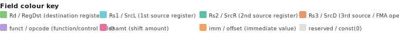

# LinxISA Instruction Reference

> **ISA Version:** v0.56.2 &nbsp;|&nbsp; **Total forms:** 740 &nbsp;|&nbsp;
> **Groups:** 66 &nbsp;|&nbsp; **Formats:** 16-bit C. / 32-bit / 48-bit HL. / 64-bit V.

---

## Manual Chapters

The LinxISA manual is organized into numbered chapters. Browse instructions by chapter:

| Ch | Chapter | Key Groups |
|----|---------|-----------|
| [03](encoding.md) | Encoding Formats | Bit numbering, instruction lengths, decode tags |
| [04](groups/block_split.md) | Block ISA | `BSTART.*`, `BSTOP`, `B.IOR`, `B.TEXT`, `B.DIM`, tile/SIMT blocks |
| [11](groups/load_register_offset.md) | AGU | Loads, stores, prefetch, all addressing modes |
| [12](groups/arithmetic.md) | ALU | `ADD`, `SUB`, `MUL`, `DIV`, shifts, bit manip, `LUI`, `CSEL` |
| [13](groups/floating_point_arithmetic.md) | FSU | Floating-point arithmetic, FMA, format conversion |
| [14](groups/atomic.md) | AMO | `LR`/`SC`, atomic fetch-op, `CAS` |
| [15](groups/c_bstart.md) | BBD | `C.BSTART.*`, `C.BSTOP`, block delimiters |
| [16](groups/branch.md) | BRU | Branches, `CMP.*`, `SETC.*`, `SETRET`, `ADDTPC` |
| [17](groups/block_control_attribute.md) | CMD | `B.CATR`, `B.DATR`, `B.HINT`, block attributes |
| [18](groups/reserve.md) | RSV | `HL.BFI`, `HL.MIADD`, `HL.MISUB` |
| [19](groups/execution_control.md) | SYS | `FENCE`, barriers, `EBREAK`, `ACR*`, cache/TLB maint. |
| [20](groups/shuffle.md) | VEC | `V.*` vector forms, shuffles, reductions |

## Browse by Group

| Group | Forms | Group | Forms |
|-------|-------|-------|-------|
| [execution_control](groups/execution_control.md) (10) | 10 | [atomic](groups/atomic.md) (4) | 4 |
| [arithmetic_operation_64bit](groups/arithmetic_operation_64bit.md) (21) | 21 | [concat](groups/concat.md) (2) | 2 |
| [arithmetic_operation_32bit](groups/arithmetic_operation_32bit.md) (21) | 21 | [load_pc_relative](groups/load_pc_relative.md) (7) | 7 |
| [pc_relative](groups/pc_relative.md) (4) | 4 | [load_post_index](groups/load_post_index.md) (19) | 19 |
| [block_argument](groups/block_argument.md) (9) | 9 | [load_pre_index](groups/load_pre_index.md) (19) | 19 |
| [block_control_attribute](groups/block_control_attribute.md) (1) | 1 | [load_long_offset](groups/load_long_offset.md) (12) | 12 |
| [block_data_attribute](groups/block_data_attribute.md) (1) | 1 | [load_pair](groups/load_pair.md) (19) | 19 |
| [branch](groups/branch.md) (10) | 10 | [long_immediate](groups/long_immediate.md) (2) | 2 |
| [block_hint](groups/block_hint.md) (2) | 2 | [immediate](groups/immediate.md) (2) | 2 |
| [block_input_output](groups/block_input_output.md) (5) | 5 | [prefetch](groups/prefetch.md) (4) | 4 |
| [block_offset](groups/block_offset.md) (1) | 1 | [general](groups/general.md) (3) | 3 |
| [cache_maintain](groups/cache_maintain.md) (16) | 16 | [store_pc_relative](groups/store_pc_relative.md) (4) | 4 |
| [bit_operation](groups/bit_operation.md) (8) | 8 | [store_post_index](groups/store_post_index.md) (14) | 14 |
| [block_split](groups/block_split.md) (45) | 45 | [store_pre_index](groups/store_pre_index.md) (14) | 14 |
| [bstart](groups/bstart.md) (11) | 11 | [store_long_offset](groups/store_long_offset.md) (7) | 7 |
| [arithmetic_operation](groups/arithmetic_operation.md) (20) | 20 | [store_pair](groups/store_pair.md) (14) | 14 |
| [arithmetic](groups/arithmetic.md) (1) | 1 | [ssr_access](groups/ssr_access.md) (7) | 7 |
| [block_dimension](groups/block_dimension.md) (2) | 2 | [load_register_offset](groups/load_register_offset.md) (22) | 22 |
| [c_bstart](groups/c_bstart.md) (7) | 7 | [load_symbol](groups/load_symbol.md) (7) | 7 |
| [c_tinst](groups/c_tinst.md) (6) | 6 | [atomic_operation](groups/atomic_operation.md) (68) | 68 |
| [load_immediate_offset](groups/load_immediate_offset.md) (23) | 23 | [load_unscaled](groups/load_unscaled.md) (16) | 16 |
| [move](groups/move.md) (3) | 3 | [store_register_offset](groups/store_register_offset.md) (21) | 21 |
| [store_immediate_offset](groups/store_immediate_offset.md) (9) | 9 | [store_symbol](groups/store_symbol.md) (4) | 4 |
| [set_commit_argument](groups/set_commit_argument.md) (26) | 26 | [bit_manipulation](groups/bit_manipulation.md) (8) | 8 |
| [c_unary](groups/c_unary.md) (7) | 7 | [three_source_integer](groups/three_source_integer.md) (2) | 2 |
| [compare_instruction](groups/compare_instruction.md) (40) | 40 | [division](groups/division.md) (2) | 2 |
| [compound_operation](groups/compound_operation.md) (1) | 1 | [floating_point_arithmetic](groups/floating_point_arithmetic.md) (5) | 5 |
| [multi_cycle_alu](groups/multi_cycle_alu.md) (28) | 28 | [three_source_floating_point](groups/three_source_floating_point.md) (8) | 8 |
| [floating_point_arithmetic](groups/floating_point_arithmetic.md) (12) | 12 | [two_source_floating_point](groups/two_source_floating_point.md) (12) | 12 |
| [format_convert](groups/format_convert.md) (12) | 12 | [general_manager](groups/general_manager.md) (2) | 2 |
| [floating_point_compare](groups/floating_point_compare.md) (8) | 8 | [reduce_operation_with_register](groups/reduce_operation_with_register.md) (9) | 9 |
| [max_min](groups/max_min.md) (6) | 6 | [store_offset](groups/store_offset.md) (14) | 14 |
| [reserve](groups/reserve.md) (3) | 3 | [shuffle](groups/shuffle.md) (8) | 8 |

## Quick Index

Use **Ctrl+F** / **Cmd+F** to search, or browse the [full alphabetical list](instructions/index.md).

### All Instructions (740 forms)

| Mnemonic | Group | Bits | Description |
|----------|-------|------|-------------|
| [ACRC](instructions/acrc.md) | execution_control | 32 | Architectural control (ring call). Calls an implementation-defined ACR. |
| [ACRE](instructions/acre.md) | execution_control | 32 | Architectural control (ring entry). Enters an implementation-defined ACR. |
| [ASSERT](instructions/assert.md) | execution_control | 32 | Architectural assertion. Traps if the condition register is zero. |
| [BSE](instructions/bse.md) | execution_control | 32 | Execution control instruction. |
| [BWE](instructions/bwe.md) | execution_control | 32 | Execution control instruction. |
| [ADD](instructions/add.md) | arithmetic_operation_64bit | 32 | Integer addition. Writes the sum of two registers to the destination. |
| [ADDI](instructions/addi.md) | arithmetic_operation_64bit | 32 | Integer add-immediate. Adds a sign-extended 12-bit immediate to a register. |
| [AND](instructions/and.md) | arithmetic_operation_64bit | 32 | Bitwise AND of two registers. |
| [ANDI](instructions/andi.md) | arithmetic_operation_64bit | 32 | Bitwise AND with an immediate. |
| [HL.ADDI](instructions/hl_addi.md) | arithmetic_operation_64bit | 48 | [48-bit HL.] Instruction from the Arithmetic Operation 64bit group. |
| [ADDIW](instructions/addiw.md) | arithmetic_operation_32bit | 32 | 32-bit word add-immediate. |
| [ADDW](instructions/addw.md) | arithmetic_operation_32bit | 32 | 32-bit word integer addition. |
| [ANDIW](instructions/andiw.md) | arithmetic_operation_32bit | 32 | 32-bit word AND-immediate. |
| [ANDW](instructions/andw.md) | arithmetic_operation_32bit | 32 | 32-bit word bitwise AND. |
| [HL.ADDIW](instructions/hl_addiw.md) | arithmetic_operation_32bit | 48 | [48-bit HL.] Instruction from the Arithmetic Operation 32bit group. |
| [ADDTPC](instructions/addtpc.md) | pc_relative | 32 | PC-relative addition. Adds an immediate to the current PC/TPC and writes the result. |
| [HL.ADDTPC](instructions/hl_addtpc.md) | pc_relative | 48 | [48-bit HL.] Instruction from the PC-Relative group. |
| [HL.SETRET](instructions/hl_setret.md) | pc_relative | 48 | [48-bit HL.] Instruction from the PC-Relative group. |
| [SETRET](instructions/setret.md) | pc_relative | 32 | Materializes a return address (ra) using a PC-relative offset. Used in call headers. |
| [B.ARG](instructions/b_arg.md) | block_argument | 32 | Instruction from the Block Argument group. |
| [B.DIM](instructions/b_dim.md) | block_argument | 32 | Instruction from the Block Argument group. |
| [B.CATR](instructions/b_catr.md) | block_control_attribute | 32 | Instruction from the Block Control Attribute group. |
| [B.DATR](instructions/b_datr.md) | block_data_attribute | 32 | Instruction from the Block Data Attribute group. |
| [B.EQ](instructions/b_eq.md) | branch | 32 | Conditional branch taken when SrcL equals SrcR. |
| [B.GE](instructions/b_ge.md) | branch | 32 | Conditional branch taken when SrcL is greater than or equal to SrcR (signed). |
| [B.GEU](instructions/b_geu.md) | branch | 32 | Conditional branch taken when SrcL is greater than or equal to SrcR (unsigned). |
| [B.LT](instructions/b_lt.md) | branch | 32 | Conditional branch taken when SrcL is less than SrcR (signed). |
| [B.LTU](instructions/b_ltu.md) | branch | 32 | Conditional branch taken when SrcL is less than SrcR (unsigned). |
| [B.HINT](instructions/b_hint.md) | block_hint | 32 | Instruction from the Block Hint group. |
| [B.IOD](instructions/b_iod.md) | block_input_output | 32 | Instruction from the Block Input & Output group. |
| [B.IOR](instructions/b_ior.md) | block_input_output | 32 | Instruction from the Block Input & Output group. |
| [B.IOT](instructions/b_iot.md) | block_input_output | 32 | Instruction from the Block Input & Output group. |
| [B.TEXT](instructions/b_text.md) | block_offset | 32 | Instruction from the Block Offset group. |
| [BC.IALL](instructions/bc_iall.md) | cache_maintain | 32 | Branch-predictor cache invalidate all entries. |
| [BC.IVA](instructions/bc_iva.md) | cache_maintain | 32 | Branch-predictor cache invalidate by address. |
| [DC.CISW](instructions/dc_cisw.md) | cache_maintain | 32 | Data cache clean-and-invalidate by set/way. |
| [DC.CIVA](instructions/dc_civa.md) | cache_maintain | 32 | Cache maintenance operation. |
| [DC.CSW](instructions/dc_csw.md) | cache_maintain | 32 | Cache maintenance operation. |
| [BCNT](instructions/bcnt.md) | bit_operation | 32 | Population count. Counts the number of set bits in a register. |
| [BIC](instructions/bic.md) | bit_operation | 32 | Bit clear / AND-NOT. |
| [BIS](instructions/bis.md) | bit_operation | 32 | Bit set / OR. |
| [BXS](instructions/bxs.md) | bit_operation | 32 | Bit-field extract signed. |
| [BXU](instructions/bxu.md) | bit_operation | 32 | Bit-field extract unsigned. |
| [BSTART](instructions/bstart.md) | block_split | 32 | Block split marker. Terminates the current basic block and begins the next. Encodes block type and transition kind. |
| [BSTART.ACCCVT](instructions/bstart_acccvt.md) | block_split | 32 | Terminates the current block and begins the next. |
| [BSTART.CUBE](instructions/bstart_cube.md) | block_split | 32 | Terminates the current block and begins the next. |
| [BSTART.FIXP](instructions/bstart_fixp.md) | block_split | 32 | Terminates the current block and begins the next. |
| [BSTART.FP](instructions/bstart_fp.md) | block_split | 32 | Terminates the current block and begins the next. |
| [BSTART CALL](instructions/bstart_call.md) | bstart | 32 | Terminates the current block and begins the next. |
| [HL.BSTART CALL](instructions/hl_bstart_call.md) | bstart | 48 | [48-bit HL.] Terminates the current block and begins the next. |
| [HL.BSTART.FP](instructions/hl_bstart_fp.md) | bstart | 48 | [48-bit HL.] Terminates the current block and begins the next. |
| [HL.BSTART.STD](instructions/hl_bstart_std.md) | bstart | 48 | [48-bit HL.] Terminates the current block and begins the next. |
| [HL.BSTART.SYS](instructions/hl_bstart_sys.md) | bstart | 48 | [48-bit HL.] Terminates the current block and begins the next. |
| [C.ADD](instructions/c_add.md) | arithmetic_operation | 16 | [16-bit C.] Integer addition. |
| [C.AND](instructions/c_and.md) | arithmetic_operation | 16 | [16-bit C.] Bitwise AND. |
| [C.OR](instructions/c_or.md) | arithmetic_operation | 16 | [16-bit C.] Bitwise OR. |
| [C.SUB](instructions/c_sub.md) | arithmetic_operation | 16 | [16-bit C.] Integer subtraction. |
| [V.ADD](instructions/v_add.md) | arithmetic_operation | 64 | [64-bit V.] Integer addition. |
| [C.ADDI](instructions/c_addi.md) | arithmetic | 16 | [16-bit C.] Instruction from the Arithmetic group. |
| [C.B.DIM](instructions/c_b_dim.md) | block_dimension | 16 | [16-bit C.] Instruction from the Block Dimension group. |
| [C.B.DIMI](instructions/c_b_dimi.md) | block_dimension | 16 | [16-bit C.] Instruction from the Block Dimension group. |
| [C.BSTART.FP](instructions/c_bstart_fp.md) | c_bstart | 16 | [16-bit C.] Terminates the current block and begins the next. |
| [C.BSTART.MPAR](instructions/c_bstart_mpar.md) | c_bstart | 16 | [16-bit C.] Terminates the current block and begins the next. |
| [C.BSTART.MSEQ](instructions/c_bstart_mseq.md) | c_bstart | 16 | [16-bit C.] Terminates the current block and begins the next. |
| [C.BSTART.STD](instructions/c_bstart_std.md) | c_bstart | 16 | [16-bit C.] Terminates the current block and begins the next. |
| [C.BSTART.SYS](instructions/c_bstart_sys.md) | c_bstart | 16 | [16-bit C.] Terminates the current block and begins the next. |
| [C.CMP.EQI](instructions/c_cmp_eqi.md) | c_tinst | 16 | [16-bit C.] Instruction from the C.TINST group. |
| [C.CMP.NEI](instructions/c_cmp_nei.md) | c_tinst | 16 | [16-bit C.] Instruction from the C.TINST group. |
| [C.EBREAK](instructions/c_ebreak.md) | c_tinst | 16 | [16-bit C.] Instruction from the C.TINST group. |
| [C.SLLI](instructions/c_slli.md) | c_tinst | 16 | [16-bit C.] Instruction from the C.TINST group. |
| [C.SRLI](instructions/c_srli.md) | c_tinst | 16 | [16-bit C.] Instruction from the C.TINST group. |
| [C.LDI](instructions/c_ldi.md) | load_immediate_offset | 16 | [16-bit C.] Loads a value from memory into a register. |
| [C.LWI](instructions/c_lwi.md) | load_immediate_offset | 16 | [16-bit C.] Loads a value from memory into a register. |
| [LBI](instructions/lbi.md) | load_immediate_offset | 32 | Loads a value from memory into a register. |
| [LBUI](instructions/lbui.md) | load_immediate_offset | 32 | Loads a value from memory into a register. |
| [LDI](instructions/ldi.md) | load_immediate_offset | 32 | Loads a value from memory into a register. |
| [C.MOVI](instructions/c_movi.md) | move | 16 | [16-bit C.] Instruction from the Move group. |
| [C.MOVR](instructions/c_movr.md) | move | 16 | [16-bit C.] Instruction from the Move group. |
| [C.SETRET](instructions/c_setret.md) | move | 16 | [16-bit C.] Instruction from the Move group. |
| [C.SDI](instructions/c_sdi.md) | store_immediate_offset | 16 | [16-bit C.] Stores a register value to memory. |
| [C.SWI](instructions/c_swi.md) | store_immediate_offset | 16 | [16-bit C.] Stores a register value to memory. |
| [SBI](instructions/sbi.md) | store_immediate_offset | 32 | Stores a register value to memory. |
| [SDI](instructions/sdi.md) | store_immediate_offset | 32 | Stores a register value to memory. |
| [SDI.U](instructions/sdi_u.md) | store_immediate_offset | 32 | Stores a register value to memory. |
| [C.SETC.EQ](instructions/c_setc_eq.md) | set_commit_argument | 16 | [16-bit C.] Sets the block-commit condition. |
| [C.SETC.NE](instructions/c_setc_ne.md) | set_commit_argument | 16 | [16-bit C.] Sets the block-commit condition. |
| [HL.SETC.ANDI](instructions/hl_setc_andi.md) | set_commit_argument | 48 | [48-bit HL.] Sets the block-commit condition. |
| [HL.SETC.EQI](instructions/hl_setc_eqi.md) | set_commit_argument | 48 | [48-bit HL.] Sets the block-commit condition. |
| [HL.SETC.GEI](instructions/hl_setc_gei.md) | set_commit_argument | 48 | [48-bit HL.] Sets the block-commit condition. |
| [C.SETC.TGT](instructions/c_setc_tgt.md) | c_unary | 16 | [16-bit C.] Sets the block-commit condition. |
| [C.SEXT.B](instructions/c_sext_b.md) | c_unary | 16 | [16-bit C.] Instruction from the C.UNARY group. |
| [C.SEXT.H](instructions/c_sext_h.md) | c_unary | 16 | [16-bit C.] Instruction from the C.UNARY group. |
| [C.SEXT.W](instructions/c_sext_w.md) | c_unary | 16 | [16-bit C.] Instruction from the C.UNARY group. |
| [C.ZEXT.B](instructions/c_zext_b.md) | c_unary | 16 | [16-bit C.] Instruction from the C.UNARY group. |
| [CMP.AND](instructions/cmp_and.md) | compare_instruction | 32 | Instruction from the Compare Instruction group. |
| [CMP.ANDI](instructions/cmp_andi.md) | compare_instruction | 32 | Instruction from the Compare Instruction group. |
| [CMP.EQ](instructions/cmp_eq.md) | compare_instruction | 32 | Compare equal. Sets destination to 1 if operands are equal. |
| [CMP.EQI](instructions/cmp_eqi.md) | compare_instruction | 32 | Instruction from the Compare Instruction group. |
| [CMP.GE](instructions/cmp_ge.md) | compare_instruction | 32 | Compare greater-or-equal (signed). |
| [CSEL](instructions/csel.md) | compound_operation | 32 | Conditional select. `Dest = (SrcP != 0) ? SrcL : SrcR`. |
| [DIV](instructions/div.md) | multi_cycle_alu | 32 | Signed integer division. |
| [DIVU](instructions/divu.md) | multi_cycle_alu | 32 | Unsigned integer division. |
| [DIVUW](instructions/divuw.md) | multi_cycle_alu | 32 | 32-bit word unsigned integer division. |
| [DIVW](instructions/divw.md) | multi_cycle_alu | 32 | 32-bit word signed integer division. |
| [HL.DIV](instructions/hl_div.md) | multi_cycle_alu | 48 | [48-bit HL.] Signed integer division. |
| [FABS](instructions/fabs.md) | floating_point_arithmetic | 32 | Floating-point absolute value. |
| [FADD](instructions/fadd.md) | floating_point_arithmetic | 32 | Floating-point addition. |
| [FDIV](instructions/fdiv.md) | floating_point_arithmetic | 32 | Floating-point division. |
| [FEXP](instructions/fexp.md) | floating_point_arithmetic | 32 | Instruction from the Floating-point Arithmetic group. |
| [FMADD](instructions/fmadd.md) | floating_point_arithmetic | 32 | Instruction from the Floating-point Arithmetic group. |
| [FCVT](instructions/fcvt.md) | format_convert | 32 | Floating-point format conversion. |
| [FCVTA](instructions/fcvta.md) | format_convert | 32 | Instruction from the Format Convert group. |
| [FCVTM](instructions/fcvtm.md) | format_convert | 32 | Instruction from the Format Convert group. |
| [FCVTN](instructions/fcvtn.md) | format_convert | 32 | Instruction from the Format Convert group. |
| [FCVTP](instructions/fcvtp.md) | format_convert | 32 | Instruction from the Format Convert group. |
| [FEQ](instructions/feq.md) | floating_point_compare | 32 | Floating-point equality comparison. Writes 1 if ordered and equal. |
| [FEQS](instructions/feqs.md) | floating_point_compare | 32 | Instruction from the Floating-point Compare group. |
| [FGE](instructions/fge.md) | floating_point_compare | 32 | Floating-point greater-or-equal comparison (ordered). |
| [FGES](instructions/fges.md) | floating_point_compare | 32 | Instruction from the Floating-point Compare group. |
| [FLT](instructions/flt.md) | floating_point_compare | 32 | Floating-point less-than comparison (ordered). |
| [FMAX](instructions/fmax.md) | max_min | 32 | Floating-point maximum. |
| [FMIN](instructions/fmin.md) | max_min | 32 | Floating-point minimum. |
| [MAX](instructions/max.md) | max_min | 32 | Integer max (signed). |
| [MAXU](instructions/maxu.md) | max_min | 32 | Instruction from the Max-Min group. |
| [MIN](instructions/min.md) | max_min | 32 | Integer min (signed). |
| [HL.BFI](instructions/hl_bfi.md) | reserve | 48 | [48-bit HL.] Bit-field insert. |
| [HL.MIADD](instructions/hl_miadd.md) | reserve | 48 | [48-bit HL.] Instruction from the RESERVE group. |
| [HL.MISUB](instructions/hl_misub.md) | reserve | 48 | [48-bit HL.] Instruction from the RESERVE group. |
| [HL.CASB](instructions/hl_casb.md) | atomic | 48 | [48-bit HL.] Atomic memory read-modify-write operation. |
| [HL.CASD](instructions/hl_casd.md) | atomic | 48 | [48-bit HL.] Atomic memory read-modify-write operation. |
| [HL.CASH](instructions/hl_cash.md) | atomic | 48 | [48-bit HL.] Atomic memory read-modify-write operation. |
| [HL.CASW](instructions/hl_casw.md) | atomic | 48 | [48-bit HL.] Atomic memory read-modify-write operation. |
| [HL.CCAT](instructions/hl_ccat.md) | concat | 48 | [48-bit HL.] Instruction from the Concat group. |
| [HL.CCATW](instructions/hl_ccatw.md) | concat | 48 | [48-bit HL.] Instruction from the Concat group. |
| [HL.LB.PCR](instructions/hl_lb_pcr.md) | load_pc_relative | 48 | [48-bit HL.] Loads a value from memory into a register. |
| [HL.LBU.PCR](instructions/hl_lbu_pcr.md) | load_pc_relative | 48 | [48-bit HL.] Loads a value from memory into a register. |
| [HL.LD.PCR](instructions/hl_ld_pcr.md) | load_pc_relative | 48 | [48-bit HL.] Loads a value from memory into a register. |
| [HL.LH.PCR](instructions/hl_lh_pcr.md) | load_pc_relative | 48 | [48-bit HL.] Loads a value from memory into a register. |
| [HL.LHU.PCR](instructions/hl_lhu_pcr.md) | load_pc_relative | 48 | [48-bit HL.] Loads a value from memory into a register. |
| [HL.LB.PO](instructions/hl_lb_po.md) | load_post_index | 48 | [48-bit HL.] Loads a value from memory into a register. |
| [HL.LBI.PO](instructions/hl_lbi_po.md) | load_post_index | 48 | [48-bit HL.] Loads a value from memory into a register. |
| [HL.LBU.PO](instructions/hl_lbu_po.md) | load_post_index | 48 | [48-bit HL.] Loads a value from memory into a register. |
| [HL.LBUI.PO](instructions/hl_lbui_po.md) | load_post_index | 48 | [48-bit HL.] Loads a value from memory into a register. |
| [HL.LD.PO](instructions/hl_ld_po.md) | load_post_index | 48 | [48-bit HL.] Loads a value from memory into a register. |
| [HL.LB.PR](instructions/hl_lb_pr.md) | load_pre_index | 48 | [48-bit HL.] Loads a value from memory into a register. |
| [HL.LBI.PR](instructions/hl_lbi_pr.md) | load_pre_index | 48 | [48-bit HL.] Loads a value from memory into a register. |
| [HL.LBU.PR](instructions/hl_lbu_pr.md) | load_pre_index | 48 | [48-bit HL.] Loads a value from memory into a register. |
| [HL.LBUI.PR](instructions/hl_lbui_pr.md) | load_pre_index | 48 | [48-bit HL.] Loads a value from memory into a register. |
| [HL.LD.PR](instructions/hl_ld_pr.md) | load_pre_index | 48 | [48-bit HL.] Loads a value from memory into a register. |
| [HL.LBI](instructions/hl_lbi.md) | load_long_offset | 48 | [48-bit HL.] Loads a value from memory into a register. |
| [HL.LBUI](instructions/hl_lbui.md) | load_long_offset | 48 | [48-bit HL.] Loads a value from memory into a register. |
| [HL.LDI](instructions/hl_ldi.md) | load_long_offset | 48 | [48-bit HL.] Loads a value from memory into a register. |
| [HL.LDI.U](instructions/hl_ldi_u.md) | load_long_offset | 48 | [48-bit HL.] Loads a value from memory into a register. |
| [HL.LHI](instructions/hl_lhi.md) | load_long_offset | 48 | [48-bit HL.] Loads a value from memory into a register. |
| [HL.LBIP](instructions/hl_lbip.md) | load_pair | 48 | [48-bit HL.] Loads a value from memory into a register. |
| [HL.LBP](instructions/hl_lbp.md) | load_pair | 48 | [48-bit HL.] Loads a value from memory into a register. |
| [HL.LBUIP](instructions/hl_lbuip.md) | load_pair | 48 | [48-bit HL.] Loads a value from memory into a register. |
| [HL.LBUP](instructions/hl_lbup.md) | load_pair | 48 | [48-bit HL.] Loads a value from memory into a register. |
| [HL.LDIP](instructions/hl_ldip.md) | load_pair | 48 | [48-bit HL.] Loads a value from memory into a register. |
| [HL.LIS](instructions/hl_lis.md) | long_immediate | 48 | [48-bit HL.] Instruction from the Long Immediate group. |
| [HL.LIU](instructions/hl_liu.md) | long_immediate | 48 | [48-bit HL.] Instruction from the Long Immediate group. |
| [HL.LUI](instructions/hl_lui.md) | immediate | 48 | [48-bit HL.] Instruction from the Immediate group. |
| [LUI](instructions/lui.md) | immediate | 32 | Load upper immediate. Materializes a 20-bit constant in the upper bits of the destination. |
| [HL.PRF](instructions/hl_prf.md) | prefetch | 48 | [48-bit HL.] Instruction from the Prefetch group. |
| [HL.PRF.A](instructions/hl_prf_a.md) | prefetch | 48 | [48-bit HL.] Instruction from the Prefetch group. |
| [HL.PRFI.U](instructions/hl_prfi_u.md) | prefetch | 48 | [48-bit HL.] Instruction from the Prefetch group. |
| [HL.PRFI.UA](instructions/hl_prfi_ua.md) | prefetch | 48 | [48-bit HL.] Instruction from the Prefetch group. |
| [HL.QMT](instructions/hl_qmt.md) | general | 48 | [48-bit HL.] Instruction from the General group. |
| [HL.QPOP](instructions/hl_qpop.md) | general | 48 | [48-bit HL.] Instruction from the General group. |
| [HL.QPUSH](instructions/hl_qpush.md) | general | 48 | [48-bit HL.] Instruction from the General group. |
| [HL.SB.PCR](instructions/hl_sb_pcr.md) | store_pc_relative | 48 | [48-bit HL.] Stores a register value to memory. |
| [HL.SD.PCR](instructions/hl_sd_pcr.md) | store_pc_relative | 48 | [48-bit HL.] Stores a register value to memory. |
| [HL.SH.PCR](instructions/hl_sh_pcr.md) | store_pc_relative | 48 | [48-bit HL.] Stores a register value to memory. |
| [HL.SW.PCR](instructions/hl_sw_pcr.md) | store_pc_relative | 48 | [48-bit HL.] Stores a register value to memory. |
| [HL.SB.PO](instructions/hl_sb_po.md) | store_post_index | 48 | [48-bit HL.] Stores a register value to memory. |
| [HL.SBI.PO](instructions/hl_sbi_po.md) | store_post_index | 48 | [48-bit HL.] Stores a register value to memory. |
| [HL.SD.PO](instructions/hl_sd_po.md) | store_post_index | 48 | [48-bit HL.] Stores a register value to memory. |
| [HL.SD.UPO](instructions/hl_sd_upo.md) | store_post_index | 48 | [48-bit HL.] Stores a register value to memory. |
| [HL.SDI.PO](instructions/hl_sdi_po.md) | store_post_index | 48 | [48-bit HL.] Stores a register value to memory. |
| [HL.SB.PR](instructions/hl_sb_pr.md) | store_pre_index | 48 | [48-bit HL.] Stores a register value to memory. |
| [HL.SBI.PR](instructions/hl_sbi_pr.md) | store_pre_index | 48 | [48-bit HL.] Stores a register value to memory. |
| [HL.SD.PR](instructions/hl_sd_pr.md) | store_pre_index | 48 | [48-bit HL.] Stores a register value to memory. |
| [HL.SD.UPR](instructions/hl_sd_upr.md) | store_pre_index | 48 | [48-bit HL.] Stores a register value to memory. |
| [HL.SDI.PR](instructions/hl_sdi_pr.md) | store_pre_index | 48 | [48-bit HL.] Stores a register value to memory. |
| [HL.SBI](instructions/hl_sbi.md) | store_long_offset | 48 | [48-bit HL.] Stores a register value to memory. |
| [HL.SDI](instructions/hl_sdi.md) | store_long_offset | 48 | [48-bit HL.] Stores a register value to memory. |
| [HL.SDI.U](instructions/hl_sdi_u.md) | store_long_offset | 48 | [48-bit HL.] Stores a register value to memory. |
| [HL.SHI](instructions/hl_shi.md) | store_long_offset | 48 | [48-bit HL.] Stores a register value to memory. |
| [HL.SHI.U](instructions/hl_shi_u.md) | store_long_offset | 48 | [48-bit HL.] Stores a register value to memory. |
| [HL.SBIP](instructions/hl_sbip.md) | store_pair | 48 | [48-bit HL.] Stores a register value to memory. |
| [HL.SBP](instructions/hl_sbp.md) | store_pair | 48 | [48-bit HL.] Stores a register value to memory. |
| [HL.SDIP](instructions/hl_sdip.md) | store_pair | 48 | [48-bit HL.] Stores a register value to memory. |
| [HL.SDIP.U](instructions/hl_sdip_u.md) | store_pair | 48 | [48-bit HL.] Stores a register value to memory. |
| [HL.SDP](instructions/hl_sdp.md) | store_pair | 48 | [48-bit HL.] Stores a register value to memory. |
| [HL.SSRGET](instructions/hl_ssrget.md) | ssr_access | 48 | [48-bit HL.] Instruction from the SSR Access group. |
| [HL.SSRSET](instructions/hl_ssrset.md) | ssr_access | 48 | [48-bit HL.] Instruction from the SSR Access group. |
| [LSRGET](instructions/lsrget.md) | ssr_access | 32 | Instruction from the SSR Access group. |
| [SETC.TGT](instructions/setc_tgt.md) | ssr_access | 32 | Sets the block-commit condition. |
| [SSRGET](instructions/ssrget.md) | ssr_access | 32 | Instruction from the SSR Access group. |
| [LB](instructions/lb.md) | load_register_offset | 32 | Loads a signed 8-bit value from memory. |
| [LBU](instructions/lbu.md) | load_register_offset | 32 | Loads a 8-bit value from memory. |
| [LD](instructions/ld.md) | load_register_offset | 32 | Loads a 64-bit value from memory. |
| [LH](instructions/lh.md) | load_register_offset | 32 | Loads a signed 16-bit value from memory. |
| [LHU](instructions/lhu.md) | load_register_offset | 32 | Loads a 16-bit value from memory. |
| [LB.PCR](instructions/lb_pcr.md) | load_symbol | 32 | Loads a value from memory into a register. |
| [LBU.PCR](instructions/lbu_pcr.md) | load_symbol | 32 | Loads a value from memory into a register. |
| [LD.PCR](instructions/ld_pcr.md) | load_symbol | 32 | Loads a value from memory into a register. |
| [LH.PCR](instructions/lh_pcr.md) | load_symbol | 32 | Loads a value from memory into a register. |
| [LHU.PCR](instructions/lhu_pcr.md) | load_symbol | 32 | Loads a value from memory into a register. |
| [LD.ADD](instructions/ld_add.md) | atomic_operation | 32 | Atomic memory read-modify-write operation. |
| [LD.AND](instructions/ld_and.md) | atomic_operation | 32 | Atomic memory read-modify-write operation. |
| [LD.OR](instructions/ld_or.md) | atomic_operation | 32 | Atomic memory read-modify-write operation. |
| [LD.SMAX](instructions/ld_smax.md) | atomic_operation | 32 | Atomic memory read-modify-write operation. |
| [LD.SMIN](instructions/ld_smin.md) | atomic_operation | 32 | Atomic memory read-modify-write operation. |
| [LDI.U](instructions/ldi_u.md) | load_unscaled | 32 | Loads a value from memory into a register. |
| [LHI.U](instructions/lhi_u.md) | load_unscaled | 32 | Loads a value from memory into a register. |
| [LHUI.U](instructions/lhui_u.md) | load_unscaled | 32 | Loads a value from memory into a register. |
| [LWI.U](instructions/lwi_u.md) | load_unscaled | 32 | Loads a value from memory into a register. |
| [LWUI.U](instructions/lwui_u.md) | load_unscaled | 32 | Loads a value from memory into a register. |
| [SB](instructions/sb.md) | store_register_offset | 32 | Stores a register value to memory. |
| [SD](instructions/sd.md) | store_register_offset | 32 | Stores a register value to memory. |
| [SD.U](instructions/sd_u.md) | store_register_offset | 32 | Stores a register value to memory. |
| [SH](instructions/sh.md) | store_register_offset | 32 | Stores a register value to memory. |
| [SH.U](instructions/sh_u.md) | store_register_offset | 32 | Stores a register value to memory. |
| [SB.PCR](instructions/sb_pcr.md) | store_symbol | 32 | Stores a register value to memory. |
| [SD.PCR](instructions/sd_pcr.md) | store_symbol | 32 | Stores a register value to memory. |
| [SH.PCR](instructions/sh_pcr.md) | store_symbol | 32 | Stores a register value to memory. |
| [SW.PCR](instructions/sw_pcr.md) | store_symbol | 32 | Stores a register value to memory. |
| [V.BCNT](instructions/v_bcnt.md) | bit_manipulation | 64 | [64-bit V.] Population count. |
| [V.BIC](instructions/v_bic.md) | bit_manipulation | 64 | [64-bit V.] Bit clear. |
| [V.BIS](instructions/v_bis.md) | bit_manipulation | 64 | [64-bit V.] Bit set. |
| [V.BXS](instructions/v_bxs.md) | bit_manipulation | 64 | [64-bit V.] Bit-field extract signed. |
| [V.BXU](instructions/v_bxu.md) | bit_manipulation | 64 | [64-bit V.] Bit-field extract unsigned. |
| [V.CSEL](instructions/v_csel.md) | three_source_integer | 64 | [64-bit V.] Conditional select. |
| [V.PSEL](instructions/v_psel.md) | three_source_integer | 64 | [64-bit V.] Instruction from the Three Source Integer group. |
| [V.DIV](instructions/v_div.md) | division | 64 | [64-bit V.] Signed integer division. |
| [V.REM](instructions/v_rem.md) | division | 64 | [64-bit V.] Signed integer remainder. |
| [V.FABS](instructions/v_fabs.md) | floating_point_arithmetic | 64 | [64-bit V.] Instruction from the Floating Point Arithmetic group. |
| [V.FCLASS](instructions/v_fclass.md) | floating_point_arithmetic | 64 | [64-bit V.] Instruction from the Floating Point Arithmetic group. |
| [V.FEXP](instructions/v_fexp.md) | floating_point_arithmetic | 64 | [64-bit V.] Instruction from the Floating Point Arithmetic group. |
| [V.FRECIP](instructions/v_frecip.md) | floating_point_arithmetic | 64 | [64-bit V.] Instruction from the Floating Point Arithmetic group. |
| [V.FSQRT](instructions/v_fsqrt.md) | floating_point_arithmetic | 64 | [64-bit V.] Instruction from the Floating Point Arithmetic group. |
| [V.FADD](instructions/v_fadd.md) | three_source_floating_point | 64 | [64-bit V.] Instruction from the Three-Source Floating Point group. |
| [V.FDIV](instructions/v_fdiv.md) | three_source_floating_point | 64 | [64-bit V.] Instruction from the Three-Source Floating Point group. |
| [V.FMADD](instructions/v_fmadd.md) | three_source_floating_point | 64 | [64-bit V.] Instruction from the Three-Source Floating Point group. |
| [V.FMSUB](instructions/v_fmsub.md) | three_source_floating_point | 64 | [64-bit V.] Instruction from the Three-Source Floating Point group. |
| [V.FMUL](instructions/v_fmul.md) | three_source_floating_point | 64 | [64-bit V.] Instruction from the Three-Source Floating Point group. |
| [V.FEQ](instructions/v_feq.md) | two_source_floating_point | 64 | [64-bit V.] Instruction from the Two-Source Floating Point group. |
| [V.FEQS](instructions/v_feqs.md) | two_source_floating_point | 64 | [64-bit V.] Instruction from the Two-Source Floating Point group. |
| [V.FGE](instructions/v_fge.md) | two_source_floating_point | 64 | [64-bit V.] Instruction from the Two-Source Floating Point group. |
| [V.FGES](instructions/v_fges.md) | two_source_floating_point | 64 | [64-bit V.] Instruction from the Two-Source Floating Point group. |
| [V.FLT](instructions/v_flt.md) | two_source_floating_point | 64 | [64-bit V.] Instruction from the Two-Source Floating Point group. |
| [V.QPOP](instructions/v_qpop.md) | general_manager | 64 | [64-bit V.] Instruction from the General Manager group. |
| [V.QPUSH](instructions/v_qpush.md) | general_manager | 64 | [64-bit V.] Instruction from the General Manager group. |
| [V.RDADD](instructions/v_rdadd.md) | reduce_operation_with_register | 64 | [64-bit V.] Instruction from the Reduce Operation with Register group. |
| [V.RDAND](instructions/v_rdand.md) | reduce_operation_with_register | 64 | [64-bit V.] Instruction from the Reduce Operation with Register group. |
| [V.RDFADD](instructions/v_rdfadd.md) | reduce_operation_with_register | 64 | [64-bit V.] Instruction from the Reduce Operation with Register group. |
| [V.RDFMAX](instructions/v_rdfmax.md) | reduce_operation_with_register | 64 | [64-bit V.] Instruction from the Reduce Operation with Register group. |
| [V.RDFMIN](instructions/v_rdfmin.md) | reduce_operation_with_register | 64 | [64-bit V.] Instruction from the Reduce Operation with Register group. |
| [V.SBI](instructions/v_sbi.md) | store_offset | 64 | [64-bit V.] Stores a register value to memory. |
| [V.SBI.BRG](instructions/v_sbi_brg.md) | store_offset | 64 | [64-bit V.] Stores a register value to memory. |
| [V.SDI](instructions/v_sdi.md) | store_offset | 64 | [64-bit V.] Stores a register value to memory. |
| [V.SDI.BRG](instructions/v_sdi_brg.md) | store_offset | 64 | [64-bit V.] Stores a register value to memory. |
| [V.SDI.U](instructions/v_sdi_u.md) | store_offset | 64 | [64-bit V.] Stores a register value to memory. |
| [V.SHFL.BFLY](instructions/v_shfl_bfly.md) | shuffle | 64 | [64-bit V.] Instruction from the Shuffle group. |
| [V.SHFL.DOWN](instructions/v_shfl_down.md) | shuffle | 64 | [64-bit V.] Instruction from the Shuffle group. |
| [V.SHFL.IDX](instructions/v_shfl_idx.md) | shuffle | 64 | [64-bit V.] Instruction from the Shuffle group. |
| [V.SHFL.UP](instructions/v_shfl_up.md) | shuffle | 64 | [64-bit V.] Instruction from the Shuffle group. |
| [V.SHFLI.BFLY](instructions/v_shfli_bfly.md) | shuffle | 64 | [64-bit V.] Instruction from the Shuffle group. |

---

## Encoding Formats

LinxISA has four instruction lengths:

| Format | Bits | Composition | Example |
|--------|------|-------------|---------|
| **C.** | 16 | Single 16-bit part | `C.ADD`, `C.BSTART.FP` |
| **Base** | 32 | Single 32-bit part | `ADD`, `LD`, `BSTART CALL` |
| **HL.** | 48 | 16-bit prefix + 32-bit main | `HL.LDI`, `HL.CASB`, `HL.SETRET` |
| **V.** | 64 | 32-bit prefix + 32-bit main | `V.ADD`, `V.FMADD`, `V.DIV` |

### Field colour key

- **Green** — destination register (rd, RegDst)
- **Cyan** — first source register (rs1, SrcL)
- **Teal** — second source register (rs2, SrcR)
- **Orange** — third source / FMA operand (rs3, SrcD)
- **Purple** — opcode / function field
- **Pink** — shift amount (shamt)
- **Amber** — immediate value (imm)
- **Gray** — reserved / zeroed constant

### Encoding notes

- Bit positions are shown as `[msb:0]` (MSB left, LSB right), matching ARM and RISC-V conventions.
- Field names are abbreviated inside coloured boxes (`rd`, `rs1`, `rs2`, `imm`, etc.).
- Constant field values are shown in binary (≤4 bits) or hex (≥5 bits).
- Gray fields are reserved and must be zero.
