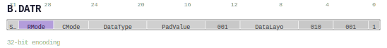

# B.DATR

<div class="insn-header">

<span class="badge-32">32-bit Base</span> **Group:** <a href="../groups/block_data_attribute.md">Block Data Attribute</a> &nbsp;|&nbsp;
<span class="ch-tag ch-tag-17">Ch 17</span>
&nbsp; <strong>CMD — Command and Control</strong> &nbsp;|&nbsp;
**Length:** <code>32</code> &nbsp;|&nbsp; **Decode:** <code>—</code>

</div>

## Assembly Syntax

- `B.DATR {layout.{canon, normal}, datatype, padvalue, cmode, rmode, sat}`

## Encoding

<div class="enc-diagram">

<figure>

<figcaption>Bitfield encoding diagram. MSB is on the left, LSB on the right.</figcaption>
</figure>

</div>

## Description

Instruction from the Block Data Attribute group.

## Pseudocode (informative)

```c
// Execute B.DATR as defined by the Block Data Attribute semantics.
```

## Encoding Notes

- `v0.56 split of legacy B.CATR/B.DATR data fields. CMode is 3 bits; RMode is 3 bits; Sat is bit 31.`

## Full Catalog Forms

| Assembly | Length | Decode |
|----------|--------|--------|
| `B.DATR {layout.{canon, normal}, datatype, padvalue, cmode, rmode, sat}` | 32 | — |

<div class="insn-nav">

← [Block Data Attribute](../groups/block_data_attribute.md) &nbsp;&nbsp; [Index](../index.md) &nbsp;&nbsp; [All instructions](index.md) →

</div>
