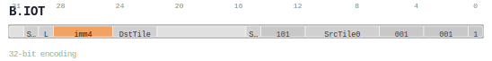

# B.IOT

<div class="insn-header">

<span class="badge-32">32-bit Base</span> **Group:** <a href="../groups/block_input_output.md">Block Input & Output</a> &nbsp;|&nbsp;
<span class="ch-tag ch-tag-04">Ch 04</span>
&nbsp; <strong>Block ISA — Block-structured Control Flow</strong> &nbsp;|&nbsp;
**Length:** <code>32</code> &nbsp;|&nbsp; **Decode:** <code>—</code>

</div>

## Assembly Syntax

- `B.IOT SrcTile0<.reuse>, <last>, ->DstTile<Size>`
- `B.IOT SrcTile0<.reuse>, SrcTile1<.reuse>, <last>, ->DstTile<Size>`
- `B.IOT <last>, ->DstTile<Size>`

## Encoding

<div class="enc-diagram">

<figure>

<figcaption>Bitfield encoding diagram. MSB is on the left, LSB on the right.</figcaption>
</figure>

</div>

## Description

Instruction from the Block Input & Output group.

## Pseudocode (informative)

```c
// Execute B.IOT as defined by the Block Input & Output semantics.
```

## Encoding Notes

- `v0.56 one-input immediate-size tile descriptor; function=101 means only SrcTile0 is valid.`
- `v0.56 two-input immediate-size tile descriptor. SrcTile0/1 are independent 6-bit fields; imm4 encodes 0B..512KB.`
- `v0.56 no-input immediate-size tile descriptor; function=110 means only the destination allocation is valid.`

## Full Catalog Forms

| Assembly | Length | Decode |
|----------|--------|--------|
| `B.IOT SrcTile0<.reuse>, <last>, ->DstTile<Size>` | 32 | — |
| `B.IOT SrcTile0<.reuse>, SrcTile1<.reuse>, <last>, ->DstTile<Size>` | 32 | — |
| `B.IOT <last>, ->DstTile<Size>` | 32 | — |

<div class="insn-nav">

← [Block Input & Output](../groups/block_input_output.md) &nbsp;&nbsp; [Index](../index.md) &nbsp;&nbsp; [All instructions](index.md) →

</div>
