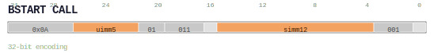

# BSTART CALL

<div class="insn-header">

<span class="badge-32">32-bit Base</span> **Group:** <a href="../groups/bstart.md">BSTART</a> &nbsp;|&nbsp;
<span class="ch-tag ch-tag-04">Ch 04</span>
&nbsp; <strong>Block ISA — Block-structured Control Flow</strong> &nbsp;|&nbsp;
**Length:** <code>32</code> &nbsp;|&nbsp; **Decode:** <code>—</code>

</div>

## Assembly Syntax

- `BSTART.CALL, <br_label>, <rt_label>, -> ra`

## Encoding

<div class="enc-diagram">

<figure>

<figcaption>Bitfield encoding diagram. MSB is on the left, LSB on the right.</figcaption>
</figure>

</div>

## Description

`BSTART.CALL` is the call form of the block split marker. It terminates the current block, initiates a new block, and stores the return address (the fall-through PC of the current block) into register `x10`/`ra`. At commit, the block engine unconditionally jumps to the `br_label` target encoded as a signed 12-bit immediate left-shifted by 1 (`PC + (simm12 << 1)`). Unlike `BSTART.COND`, the CALL transfer is unconditional — the branch is always taken.

**Contrast with other BSTART forms:**

| Form | Xfer kind | Taken? | Return addr? | Description |
|------|-----------|--------|-------------|-------------|
| `BSTART.FALL` | `FALL` | Never taken | No | Fall through to next block |
| `BSTART.DIRECT` | `DIRECT` | Always taken | No | Unconditional PC-relative jump |
| `BSTART.COND` | `COND` | Conditional | No | Conditional PC-relative jump |
| `BSTART.CALL` | `CALL` | Always taken | Yes (`x10/ra`) | Unconditional call with link register |
| `BSTART.IND` | `IND` | Always taken | No | Indirect jump via register |
| `BSTART.ICALL` | `ICALL` | Always taken | Yes (`x10/ra`) | Indirect call with link register |
| `BSTART.RET` | `RET` | Always taken | Yes (`x10/ra`) | Return to address in register |

The `CALL` transfer kind is encoded as `0b0011` in the `xfer_kind` field.

## Pseudocode (informative)

```c
// At decode: compute call target from simm12 immediate
target = PC + ZeroExtend(simm12 << 1);

// At commit:
x10 = next_bpc;   // write return address to link register (x10 = ra)
pc = target;       // jump to call target
ResetBARG();       // reset block argument register for new block
```

## Encoding Notes

The `BSTART CALL` encoding shares the same opcode base (`31:27=5'b01010`) as the other `BSTART` forms. The transfer kind (`xfer_kind = 0b0011`) and block type (`block_type = 0b0000`, STD) are encoded in the instruction bitfield as follows:

| Field | Bits | Value | Description |
|-------|------|-------|-------------|
| `opcode[4:0]` | `[31:27]` | `5'b01010` | BSTART opcode base |
| `uimm5` | `[26:22]` | — | Reserved; must be `5'b00000` for this form |
| `xfer_kind[1:0]` | `[21:20]` | `2'b01` | Transfer kind class |
| `block_type[2:0]` | `[19:17]` | `3'b011` | Block type = STD (`0b000`) |
| `contract_kind[0]` | `[16]` | `1'b0` | Contract kind |
| `simm12` | `[15:4]` | — | Signed 12-bit PC-relative target offset (left-shifted by 1) |
| `xfer_kind[3:2]` | `[3:1]` | `3'b001` | Transfer kind upper bits (`0b0011`) |
| `[0]` | `[0]` | `1'b0` | Terminal bit |

**Decode mask:** `(inst & 0x00007fff) == 0x00005101`

The `uimm5` field at `[26:22]` is extracted by the decoder but is reserved for future use; hardware ignores its value in this form.

## Exception and Trap Behavior

If the `br_label` target does not fall on a valid block start boundary, the block engine raises an exception (`EC_CFI_BAD_TARGET`) and traps to the current ACR's exception handler without modifying architectural state.

## Full Catalog Forms

| Assembly | Length | Decode |
|----------|--------|--------|
| `BSTART.CALL, <br_label>, <rt_label>, -> ra` | 32 | `31:27=0b01010, 21:20=0b01, 19:17=0b011, 3:1=0b001, 0=0` |

<div class="insn-nav">

← [BSTART](../groups/bstart.md) &nbsp;&nbsp; [Index](../index.md) &nbsp;&nbsp; [All instructions](index.md) →

</div>
