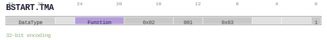

# BSTART.TMA

<div class="insn-header">

<span class="badge-32">32-bit Base</span> **Group:** <a href="../groups/block_split.md">Block Split</a> &nbsp;|&nbsp;
<span class="ch-tag ch-tag-04">Ch 04</span>
&nbsp; <strong>Block ISA — Block-structured Control Flow</strong> &nbsp;|&nbsp;
**Length:** <code>32</code> &nbsp;|&nbsp; **Decode:** <code>—</code>

</div>

## Assembly Syntax

- `BSTART.TMA Function, DataType`

## Encoding

<div class="enc-diagram">

<figure>

<figcaption>Bitfield encoding diagram. MSB is on the left, LSB on the right.</figcaption>
</figure>

</div>

## Description

Terminates the current block and begins the next.

## Pseudocode (informative)

```c
EndBlock(); BeginNextBlock(/* kind */);
```

## Encoding Notes

- `Generic TMA selector form. Function=0/1/2 are emitted as BSTART.TLOAD/BSTART.TSTORE/BSTART.TMOV aliases; 3..31 are reserved in v0.56 (architecturally illegal/UNPREDICTABLE): software must not generate them and implementations must not assign ad-hoc semantics.`

## Full Catalog Forms

| Assembly | Length | Decode |
|----------|--------|--------|
| `BSTART.TMA Function, DataType` | 32 | — |

<div class="insn-nav">

← [Block Split](../groups/block_split.md) &nbsp;&nbsp; [Index](../index.md) &nbsp;&nbsp; [All instructions](index.md) →

</div>
