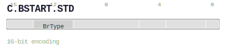

# C.BSTART.STD

<div class="insn-header">

<span class="badge-16">16-bit C.</span> **Group:** <a href="../groups/c_bstart.md">C.BSTART</a> &nbsp;|&nbsp;
<span class="ch-tag ch-tag-15">Ch 15</span>
&nbsp; <strong>BBD — Block Boundary Delimiters</strong> &nbsp;|&nbsp;
**Length:** <code>16</code> &nbsp;|&nbsp; **Decode:** <code>—</code>

</div>

## Assembly Syntax

- `C.BSTART.STD BrType`

## Encoding

<div class="enc-diagram">

<figure>

<figcaption>Bitfield encoding diagram. MSB is on the left, LSB on the right.</figcaption>
</figure>

</div>

## Description

[16-bit C.] Terminates the current block and begins the next.

## Pseudocode (informative)

```c
EndBlock(); BeginNextBlock(/* kind */);
```

## Encoding Notes

_No additional encoding notes._

## Full Catalog Forms

| Assembly | Length | Decode |
|----------|--------|--------|
| `C.BSTART.STD BrType` | 16 | — |

<div class="insn-nav">

← [C.BSTART](../groups/c_bstart.md) &nbsp;&nbsp; [Index](../index.md) &nbsp;&nbsp; [All instructions](index.md) →

</div>
