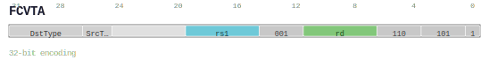

# FCVTA

<div class="insn-header">

<span class="badge-32">32-bit Base</span> **Group:** <a href="../groups/format_convert.md">Format Convert</a> &nbsp;|&nbsp;
<span class="ch-tag ch-tag-13">Ch 13</span>
&nbsp; <strong>FSU — Floating-point / SIMD Unit</strong> &nbsp;|&nbsp;
**Length:** <code>32</code> &nbsp;|&nbsp; **Decode:** <code>—</code>

</div>

## Assembly Syntax

- `fcvta.{srcT2dstT} SrcL, ->{t, u, Rd}`

## Encoding

<div class="enc-diagram">

<figure>

<figcaption>Bitfield encoding diagram. MSB is on the left, LSB on the right.</figcaption>
</figure>

</div>

## Description

Instruction from the Format Convert group.

## Pseudocode (informative)

```c
// Execute FCVTA as defined by the Format Convert semantics.
```

## Encoding Notes

_No additional encoding notes._

## Full Catalog Forms

| Assembly | Length | Decode |
|----------|--------|--------|
| `fcvta.{srcT2dstT} SrcL, ->{t, u, Rd}` | 32 | — |

<div class="insn-nav">

← [Format Convert](../groups/format_convert.md) &nbsp;&nbsp; [Index](../index.md) &nbsp;&nbsp; [All instructions](index.md) →

</div>
