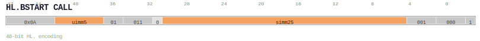

# HL.BSTART CALL

<div class="insn-header">

<span class="badge-48">48-bit HL.</span> **Group:** <a href="../groups/bstart.md">BSTART</a> &nbsp;|&nbsp;
<span class="ch-tag ch-tag-04">Ch 04</span>
&nbsp; <strong>Block ISA — Block-structured Control Flow</strong> &nbsp;|&nbsp;
**Length:** <code>48</code> &nbsp;|&nbsp; **Decode:** <code>—</code>

</div>

## Assembly Syntax

- `HL.BSTART.CALL, <br_label>, <rt_label>, -> ra`

## Encoding

<div class="enc-diagram">

<figure>

<figcaption>Bitfield encoding diagram. MSB is on the left, LSB on the right.</figcaption>
</figure>

</div>

## Description

[48-bit HL.] Terminates the current block and begins the next.

## Pseudocode (informative)

```c
EndBlock(); BeginNextBlock(/* kind */);
```

## Encoding Notes

_No additional encoding notes._

## Full Catalog Forms

| Assembly | Length | Decode |
|----------|--------|--------|
| `HL.BSTART.CALL, <br_label>, <rt_label>, -> ra` | 48 | — |

<div class="insn-nav">

← [BSTART](../groups/bstart.md) &nbsp;&nbsp; [Index](../index.md) &nbsp;&nbsp; [All instructions](index.md) →

</div>
