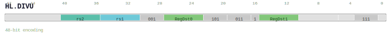

# HL.DIVU

<div class="insn-header">

<span class="badge-48">48-bit HL.</span> **Group:** <a href="../groups/multi_cycle_alu.md">Multi-Cycle ALU</a> &nbsp;|&nbsp;
<span class="ch-tag ch-tag-12">Ch 12</span>
&nbsp; <strong>ALU — Arithmetic Logic Unit</strong> &nbsp;|&nbsp;
**Length:** <code>48</code> &nbsp;|&nbsp; **Decode:** <code>—</code>

</div>

## Assembly Syntax

- `hl.divu SrcL, SrcR, ->Dst0, Dst1`

## Encoding

<div class="enc-diagram">

<figure>

<figcaption>Bitfield encoding diagram. MSB is on the left, LSB on the right.</figcaption>
</figure>

</div>

## Description

[48-bit HL.] Unsigned integer division.

## Pseudocode (informative)

```c
rd = (rs2 != 0) ? UnsignedDiv(rs1, rs2) : 0;
```

## Encoding Notes

_No additional encoding notes._

## Full Catalog Forms

| Assembly | Length | Decode |
|----------|--------|--------|
| `hl.divu SrcL, SrcR, ->Dst0, Dst1` | 48 | — |

<div class="insn-nav">

← [Multi-Cycle ALU](../groups/multi_cycle_alu.md) &nbsp;&nbsp; [Index](../index.md) &nbsp;&nbsp; [All instructions](index.md) →

</div>
