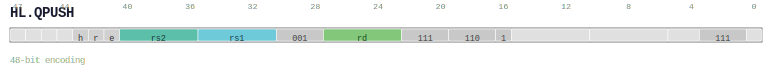

# HL.QPUSH

<div class="insn-header">

<span class="badge-48">48-bit HL.</span> **Group:** <a href="../groups/general.md">General</a> &nbsp;|&nbsp;
<span class="ch-tag ch-tag-04">Ch 04</span>
&nbsp; <strong>Block ISA — Block-structured Control Flow</strong> &nbsp;|&nbsp;
**Length:** <code>48</code> &nbsp;|&nbsp; **Decode:** <code>—</code>

</div>

## Assembly Syntax

- `hl.qpush.{h,e,r,he,hr,er,her} SrcL, SrcR, ->{t, u}`

## Encoding

<div class="enc-diagram">

<figure>

<figcaption>Bitfield encoding diagram. MSB is on the left, LSB on the right.</figcaption>
</figure>

</div>

## Description

[48-bit HL.] Instruction from the General group.

## Pseudocode (informative)

```c
// Execute HL.QPUSH as defined by the General semantics.
```

## Encoding Notes

_No additional encoding notes._

## Full Catalog Forms

| Assembly | Length | Decode |
|----------|--------|--------|
| `hl.qpush.{h,e,r,he,hr,er,her} SrcL, SrcR, ->{t, u}` | 48 | — |

<div class="insn-nav">

← [General](../groups/general.md) &nbsp;&nbsp; [Index](../index.md) &nbsp;&nbsp; [All instructions](index.md) →

</div>
