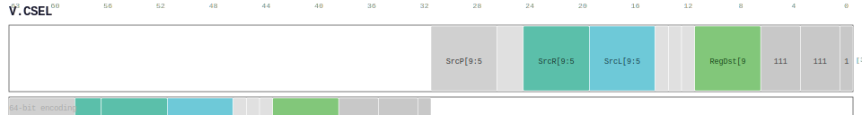

# V.CSEL

<div class="insn-header">

<span class="badge-64">64-bit V.</span> **Group:** <a href="../groups/three_source_integer.md">Three Source Integer</a> &nbsp;|&nbsp;
<span class="ch-tag ch-tag-20">Ch 20</span>
&nbsp; <strong>VEC — Vector / SIMD Execution (lx64)</strong> &nbsp;|&nbsp;
**Length:** <code>64</code> &nbsp;|&nbsp; **Decode:** <code>—</code>

</div>

## Assembly Syntax

- `v.csel SrcP, SrcL, SrcR<.neg>, ->Dst`

## Encoding

<div class="enc-diagram">

<figure>

<figcaption>Bitfield encoding diagram. MSB is on the left, LSB on the right.</figcaption>
</figure>

</div>

## Description

[64-bit V.] Conditional select.

## Pseudocode (informative)

```c
rd = (rs_p != 0) ? rs1 : rs2;
```

## Encoding Notes

_No additional encoding notes._

## Full Catalog Forms

| Assembly | Length | Decode |
|----------|--------|--------|
| `v.csel SrcP, SrcL, SrcR<.neg>, ->Dst` | 64 | — |

<div class="insn-nav">

← [Three Source Integer](../groups/three_source_integer.md) &nbsp;&nbsp; [Index](../index.md) &nbsp;&nbsp; [All instructions](index.md) →

</div>
