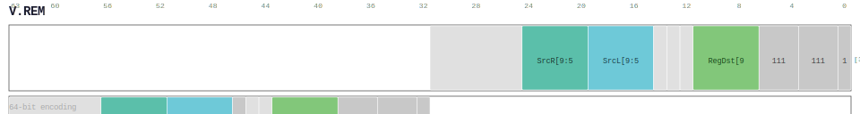

# V.REM

<div class="insn-header">

<span class="badge-64">64-bit V.</span> **Group:** <a href="../groups/division.md">Division</a> &nbsp;|&nbsp;
<span class="ch-tag ch-tag-20">Ch 20</span>
&nbsp; <strong>VEC — Vector / SIMD Execution (lx64)</strong> &nbsp;|&nbsp;
**Length:** <code>64</code> &nbsp;|&nbsp; **Decode:** <code>—</code>

</div>

## Assembly Syntax

- `v.rem SrcL, SrcR, ->Dst`

## Encoding

<div class="enc-diagram">

<figure>

<figcaption>Bitfield encoding diagram. MSB is on the left, LSB on the right.</figcaption>
</figure>

</div>

## Description

[64-bit V.] Signed integer remainder.

## Pseudocode (informative)

```c
rd = (rs2 != 0) ? (rs1 % rs2) : rs1;
```

## Encoding Notes

_No additional encoding notes._

## Full Catalog Forms

| Assembly | Length | Decode |
|----------|--------|--------|
| `v.rem SrcL, SrcR, ->Dst` | 64 | — |

<div class="insn-nav">

← [Division](../groups/division.md) &nbsp;&nbsp; [Index](../index.md) &nbsp;&nbsp; [All instructions](index.md) →

</div>
