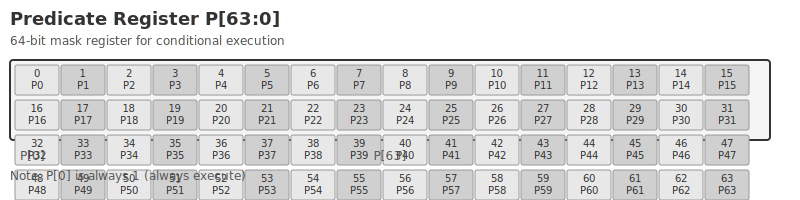

# PRED

## Description

The **P (Predicate Mask)** register is the lane mask register in the parallel block group, which is used to control whether the execution status of each lane in the group to which it belongs is valid. This register is 64 bits wide, so the implementation based on this instruction set requires each Group to contain up to 64 lanes.

Each bit mask of this register corresponds to Lane one-to-one, controlling the validity of the corresponding Lane calculation results. When the mask is 1, the calculation result of the lane is valid; when it is 0, it is invalid.

{ width="800" }

As shown in the figure above, assuming that `0~9 bit` in the P register is all 1 and the high bits are all 0, it means that `lane0 ~ lane9` in the current Group is a valid lane, and the remaining lanes are invalid and the calculation results will be masked.

## Access properties

This register is readable and writable (RW).