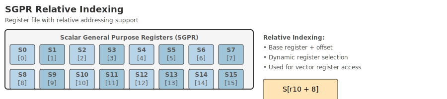

# SGPR

## Description

**SGPR (General Purpose Scalar Register)** is a common scalar register in the second layer architectural state. Each register is 64bit wide. This set of registers is specifically used for data transfer between body instructions, so these registers are invisible to the first layer of header instruction.

## <span id="relativeindex">**Relative index**</span>

Different from the traditional scalar register, the scalar register inside block instruction is defined in one to multiple fixed-depth circular queues. This method can effectively improve the utilization of register resources. Register hardware that exceeds the queue range can be released and reused on its own to avoid wasting register resources.

- When an instruction writes to a register of a queue, it is always written to the end of the queue. Therefore, the instruction only needs to specify the output queue type, and does not need to specify which register to write to.
- When an instruction reads content from a register in a certain queue, it needs to pass the **relative distance parameter** to indicate which register in the queue is read. For example: when reading the most recently written register in this queue, the relative distance is 1; when reading the most recently written register, the relative distance is 2; and so on...

The way to implement each register queue in hardware is to use a sliding window of registers, or a register file with wrap-around. As instructions are executed backward, the results of previous instructions are saved in a windowed manner. The schematic diagram is as follows:

{ width="900" }

As shown in the figure above, registers within the window are retained, and registers outside the window can be released and used again.

## Register type

This kind of register encoded using relative indexing is also called **relative index register**. In order to simultaneously ensure the rapid application and release of registers storing short-life cycle variables and the long-life cycle variables can be retained for a long time, the instruction set provides two register queues, called **T queue** and **U queue**, and the depth of each queue is **4**. The registers of the T queue are named **TR1-TR4** and are used to save the results of the four instructions output to the T register queue. The registers of the U queue are named **UR1-UR4**, which are used to save the results of 4 instructions output to the U register queue.

Two sets of relative index registers are defined as follows:

| Register name | Register alias | Explanation |
|---------|-----------|-----------------------|
| TR1 | t#1 | The result of the first instruction in the preorder of T result queue |
| TR2 | t#2 | The result of the second instruction in the preorder of T result queue |
| TR3 | t#3 | T result queue preorder third instruction result |
| TR4 | t#4 | The result of the fourth instruction in the preorder of T result queue |
| UR1 | u#1 | The first instruction result in the front of U result queue |
| UR2 | u#2 | U result queue preorder second instruction result |
| UR3 | u#3 | U result queue preorder third instruction result |
| UR4 | u#4 | The result of the fourth instruction in the preorder of U result queue |

- For instructions that output to relative index registers, each instruction can specify which register queue to output to, and subsequent instructions use reference parameters to index them.
- For the body instruction being executed, the results of the previous 1 to 4 instructions output to the T register or U register queue can be referenced.

Reference parameters are calculated from the relative distance between instructions output to the same queue. For example, for the following program order column:
```asm
    ldi [a0, 0],  ->t        # i0，输出到T寄存器队列
    ldi [a1, 0],  ->t        # i1，输出到T寄存器队列
    ldi [a0, 8],  ->u        # i2，输出到U寄存器队列
    add t#2, t#1, ->a2       # i3，输入分别引用i0和i1的结果。
    b.eq u#1, 0, 2f          # i4，输入引用i2的结果，无寄存器输出
    slli u#1, 4,  ->u        # i5，输入引用i2的结果，输出到U寄存器队列
    sd u#1, [a2, 8]          # i6，输入引用i5的结果，无寄存器输出
```

- When the input of an instruction indexes the result of a previous instruction, the reference distance skips instructions that are not output to the queue.
- There is no need to describe the reference parameters when the instruction is output. The register queue will automatically allocate a register to the corresponding instruction.## Access properties

This set of registers are both readable and writable (RW).