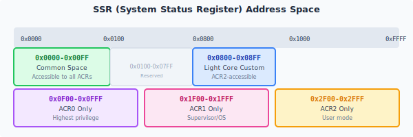

# system register

system register is collectively called **SSR-System Status Register**, which is a software interface used to read or write the configuration or architecture status of the Linx core.

The software needs to ensure the order of system register access, and the [ISB](../../inst/misa_s/ISB.md) command needs to be added in appropriate scenarios.

SSR can have marginal effects, triggering special behaviors within the Linx core, or it can be simply used for data reading and writing, used as parameters for specific functions of the Linx core, and can also be simply used as a supplement to GPR.

system register is accessed through instructions such as [SSRGET](../../inst/misa_g/SSRGET.md) and [SSRSET](../../inst/misa_g/SSRSET.md) and [HL.SSRGET](../../inst/misa_h/HL.SSRGET.md) and [HL.SSRSET](../../inst/misa_h/HL.SSRSET.md).

## Addressing space

system register is addressed through a 24-bit ID, and each address points to an 8 to 128-bit content. Unless otherwise specified, the default register width is **64 bits**. The current version only uses addressing in the **16-bit** range.

The 16-bit addressing space is allocated to different functions in sections of 256. The current allocation is as follows:

| Address range | Space allocation | Description |
| ------------- | -------------------------- | ------------------------------------ |
| 0x0000-0x00FF | Common space | system register space common to all ACRs |
| 0x0800-0x08FF | Light core custom space | system register space for light core subsystem customization |
| 0x0F00-0x0FFF | Root priority space | system register space used for ACR0 definition |
| 0x1F00-0x1FFF | Main system priority space | system register space used for ACR1 definition |
| 0x2F00-0x2FFF | Main system user priority space | system register space defined by ACR2 |
| 0xnF00-0xnFFF | Other priority spaces (n=3, 4, ..., F) | system register space defined for ACR3-ACRf |

{ width="600" }

## Access rules

Each SSR must be accessed as a whole. During access, each domain of the SSR is considered to have been accessed, regardless of whether its content has been modified.

The SSR itself or each domain within it can be defined as:

* Readable and writable (RW)
* Read only (RO)
* Write only (WO)
* Reserved (RSV)

Accessing an SSR without access rights may trigger illegal SSRexception and may also read unexpected data.

Writing invalid parameters to SSR may cause different behaviors. Please refer to the detailed instructions of the corresponding SSR.