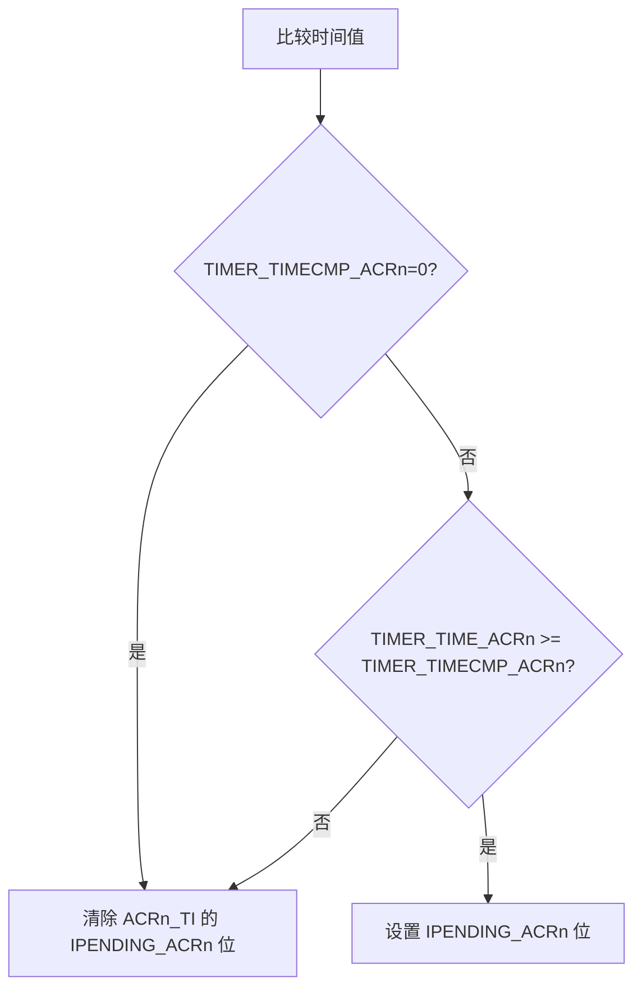

# General timer

The Linx core (LxLC) provides general timer functions on some ACRs. The general timer is implemented as a `Xproxy` for ACRn_TI, see the [ACRinterrupt](../isa/exception/interrupt.md) document for details.

Version Note: In the current version, the universal timer is only available in ACR1.

## Configuration register

For any ACR n supported, the universal timer is configured via the following system registerSSR:

- [TIMER_TIME_ACRn](./register/ssr/TIMER_TIME.md): Internally stores a 64-bit unsigned integer, which continues to increase at a fixed period after the Linx core (LxLC) is reset.
- [TIMER_TIMECMP_ACRn](./register/ssr/TIMER_TIMECMP.md): also stores a 64-bit unsigned integer, which is used to compare with `TIMER_TIME_ACRn` to determine whether to trigger.
  
`TIMER_TIME_ACRn` and `TIMER_TIMECMP_ACRn` are **initialized to 0** during LxLC hot and cold reset, and can be modified later by writing to SSR.

system register `TIMER_TIME_ACRn` Periodic increase, the frequency of increase is related to the counting unit implementation, but must be lower than 1ms. If the counter overflows its expression range, it will be recalculated from 0. If the SSR is overwritten, the next update is incremented based on the overwritten value.

## Timer trigger logic

When updating TIMER_TIME_ACRn or TIMER_TIMECMP_ACRn, the system compares the two values:

- If `TIMER_TIMECMP_ACRn` is 0, clear the `IPENDING_ACRn` bit of ACRn_TI.
- If `TIMER_TIMECMP_ACRn` is non-zero:
    - If `TIMER_TIME_ACRn` is greater than or equal to `TIMER_TIMECMP_ACRn`, set the `IPENDING_ACRn` bit of ACRn_TI.
    - On the contrary, if `TIMER_TIME_ACRn` is less than `TIMER_TIMECMP_ACRn`, clear the `IPENDING_ACRn` bit of ACRn_TI.

## Notes

This interface means that the general timer cannot be modified by entities outside the Linx core (LxLC). At the same time, after the timer is triggered, if you do not need to receive this timer again, you need to actively write zero to `TIMER_TIMECMP_ACRn`.