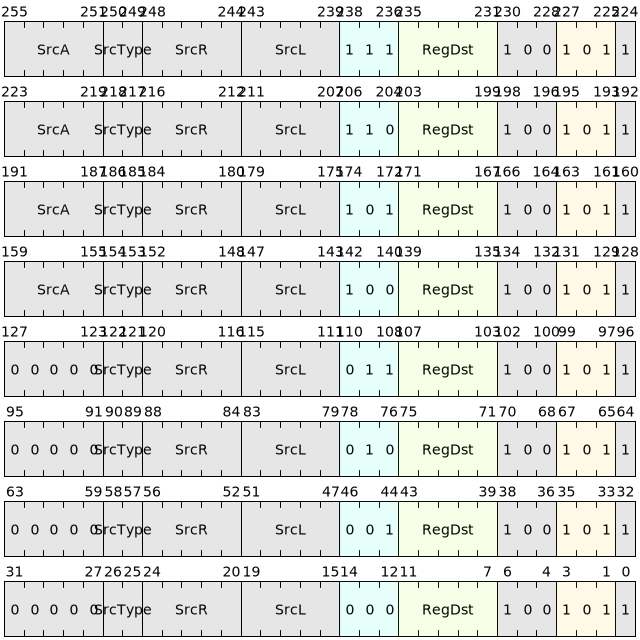

# 浮点运算

浮点运算类指令包括基础浮点加、减、乘、除运算以及更为复杂的浮点开方、倒数以及绝对值等运算。

## 指令列表

浮点基础运算指令列表如下：

|     微指令    |         汇编格式                          |     描述       |
|--------------|-------------------------------------------|----------------|
|  FADD   |  fadd.{T} SrcL, SrcR, ->{t,u,Rd}  |  浮点加      |
|  FSUB   |  fsub.{T} SrcL, SrcR, ->{t,u,Rd}  |  浮点减      |
|  FMUL   |  fmul.{T} SrcL, SrcR, ->{t,u,Rd}  |  浮点乘      |
|  FDIV   |  fdiv.{T} SrcL, SrcR, ->{t,u,Rd}  |  浮点除      |
|  FMADD  |  fmadd.{T} SrcL, SrcR, srcA, ->{t,u,Rd}   |  浮点乘加  |
|  FMSUB  |  fmsub.{T} SrcL, SrcR, srcA, ->{t,u,Rd}   |  浮点乘减  |
|  FNMADD  |  fnmadd.{T} SrcL, SrcR, srcA, ->{t,u,Rd}  |  浮点乘加取负  |
|  FNMSUB  |  fnmsub.{T} SrcL, SrcR, srcA, ->{t,u,Rd}  |  浮点乘减取负  |

浮点特殊运算指令列表如下：

|     微指令    |         汇编格式                          |     描述       |
|--------------|-------------------------------------------|----------------|
|  FABS   |  fabs.{T} SrcL, ->{t,u,Rd}   |  浮点绝对值   |
|  FSQRT  |  fsqrt.{T} SrcL, ->{t,u,Rd}  |  浮点平方根   |
|  FRECIP  |  frecip.{T} SrcL, ->{t,u,Rd} |  浮点取倒数  |
|  FCLASS  |  fclass.{T} SrcL, ->{t,u,Rd}  |  判断浮点数据的类型 |

## 舍入模式

当计算结果无法精确表达需要进行舍入时，计算结果的舍入模式由[CSTATE](../../register/ssr/CSTATE.md)寄存器的FRM域段决定。如果FRM字段是无效的，那么默认采用RNE(就近舍入)模式对结果进行舍入。
