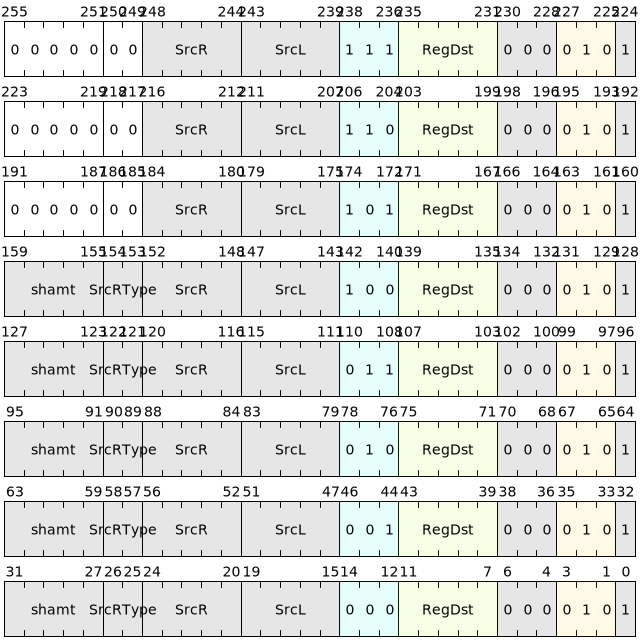

# 整数计算类指令

整数计算类指令包含了`64位`和`32位`的整型数据的算术运算操作和逻辑运算操作指令。

该部分指令使用了两种基本指令格式，分别是：用于寄存器-寄存器运算操作的 B 类型指令和用于寄存器-立即数运算操作的 F 类型指令。

## 一：64位整数计算类指令

该部分指令承担了两个64位操作数之间的算术运算和逻辑运算业务。

|     微指令    | 汇编格式      |     描述                            |
|---------------|--------------|-------------------------------------|
| ADD | add SrcL, SrcR< {.sw,.uw,.neg}><<< shamt>, ->{t,u,Rd} | 64位加法 |
| SUB | sub SrcL, SrcR<{.sw,.uw,.neg}><<< shamt>, ->{t,u,Rd} | 64位减法 |
| AND | and SrcL, SrcR<{.sw,.uw,.not}><<< shamt>, ->{t,u,Rd} | 64位逻辑与 |
| OR  | or SrcL, SrcR<{.sw,.uw,.not}><<< shamt>, ->{t,u,Rd}  | 64位逻辑或 |
| XOR | xor SrcL, SrcR<{.sw,.uw,.not}><<< shamt>, ->{t,u,Rd} | 64位逻辑异或 |
| SRL | srl SrcL, SrcR, ->{t,u,Rd} | 64位逻辑右移 |
| SRA | sra SrcL, SrcR, ->{t,u,Rd} | 64位算术右移 |
| SLL | sll SrcL, SrcR, ->{t,u,Rd} | 64位逻辑左移 |

编码格式如下：

## 二：64位操作数-立即数计算类指令

该部分指令承担了一个64位操作数和一个立即数之间的算术运算和逻辑运算业务。

|     微指令    | 汇编格式       |     描述                            |
|---------------|---------------|-------------------------------------|
| ADDI | addi SrcL, uimm, ->{t,u,Rd} | 64位无符号立即数加法 |
| SUBI | subi SrcL, uimm, ->{t,u,Rd} | 64位无符号立即数减法 |
| ANDI | andi SrcL, simm, ->{t,u,Rd} | 64位有符号立即数逻辑与 |
| ORI  | ori SrcL, simm, ->{t,u,Rd}  | 64位有符号立即数逻辑或 |
| XORI | xori SrcL, simm, ->{t,u,Rd} | 64位有符号立即数逻辑异或 |
| SRLI | srli SrcL, shamt, ->{t,u,Rd} | 64位无符号立即数逻辑右移 |
| SRAI | srai SrcL, shamt, ->{t,u,Rd} | 64位无符号立即数算术右移 |
| SLLI | slli SrcL, shamt, ->{t,u,Rd} | 64位无符号立即数逻辑左移 |

编码格式如下：

## 三：32位整数计算类指令

该部分指令承担了两个32位源操作数之间的算术运算和逻辑运算业务。

|     微指令    | 汇编格式                                              |     描述      |
|---------------|-----------------------------------------------------|---------------|
| ADDW | addw SrcL, SrcR<{.sw,.uw,.neg}><<< shamt>, ->{t,u,Rd} | 32位加法 |
| SUBW | subw SrcL, SrcR<{.sw,.uw,.neg}><<< shamt>, ->{t,u,Rd} | 32位减法 |
| ANDW | andw SrcL, SrcR<{.sw,.uw,.not}><<< shamt>, ->{t,u,Rd} | 32位逻辑与 |
| ORW  | orw SrcL, SrcR<{.sw,.uw,.not}>, ->{t,u,Rd}  | 32位逻辑或 |
| XORW | xorw SrcL, SrcR<{.sw,.uw,.not}>, ->{t,u,Rd} | 32位逻辑异或 |
| SRLW | srlw SrcL, SrcR, ->{t,u,Rd} | 32位逻辑右移 |
| SRAW | sraw SrcL, SrcR, ->{t,u,Rd} | 32位算术右移 |
| SLLW | sllw SrcL, SrcR, ->{t,u,Rd} | 32位逻辑左移 |

编码格式如下：

## 四：32位操作数-立即数计算类指令

该部分指令承担了一个32位源操作数和一个立即数之间的算术运算和逻辑运算业务。

|     微指令    | 汇编格式       |     描述                            |
|---------------|---------------|-------------------------------------|
| ADDIW | addiw SrcL, uimm, ->{t,u,Rd} | 32位无符号立即数加法 |
| SUBIW | subiw SrcL, uimm, ->{t,u,Rd} | 32位无符号立即数减法 |
| ANDIW | andiw SrcL, simm, ->{t,u,Rd} | 32位有符号立即数逻辑与 |
| ORIW  | oriw SrcL, simm, ->{t,u,Rd}  | 32位有符号立即数逻辑或 |
| XORIW | xoriw SrcL, simm, ->{t,u,Rd} | 32位有符号立即数逻辑异或 |
| SRLIW | srliw SrcL, shamt, ->{t,u,Rd} | 32位无符号立即数逻辑右移 |
| SRAIW | sraiw SrcL, shamt, ->{t,u,Rd} | 32位无符号立即数算术右移 |
| SLLIW | slliw SrcL, shamt, ->{t,u,Rd} | 32位无符号立即数逻辑左移 |

编码格式如下：

