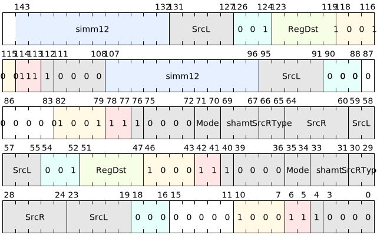

# 预取指令

预取指令用于从内存中预取一个Cache行的数据进入Cache中。其访存地址的计算方式有两种：其一是将寄存器SrcL的值与寄存器SrcR的值相加求和，允许相加前对SrcR的值进行
截取低32位扩展以及左移；其二是将12比特有符号立即数加到寄存器SrcL上。访存地址落在待预取的Cache行内。

prf和prf.a指令中的mode域提示硬件取回的数据填入哪一级Cache。mode从0-3有4个可选值，其中，mode=0 定义为预取至一级数据Cache，mode=1 定义为预取至二级数据Cache，mode=2 定义为预取至三级数据Cache，mode=3 的含义暂未定义，处理器执行时视为NOP指令处理。

如果预取指令的访问地址的Cache属性不是cached，那么该指令不能产生访存动作，视为NOP指令处理。

|     微指令    | 汇编格式       |     描述                            |
|---------------|---------------|-------------------------------------|
| PRF    | prf{.l1,.l2,.l3} \[SrcL, SrcR<{.sw,.uw}><<<shamt>\] | 以\[左操作数加右操作数\]为地址，将包含该地址的Cacheline预取到指定Cache中 |
| PRF.A  | prf.a{.l1,.l2,.l3} \[SrcL, SrcR<{.sw,.uw}><<<shamt>\], ->{t,u,Rd} | 以\[左操作数加右操作数\]为地址，将包含该地址的Cacheline预取到指定Cache中。地址写入RegDst |
| PRFI.U  | prfi.u.l1 \[SrcL, simm\], ->{t,u,Rd} | 以\[左操作数加右操作数\]为地址，将包含该地址的Cacheline预加载到L1 Cache中 |
| PRFI.UA  | prfi.ua.l1 \[SrcL, simm\], ->{t,u,Rd} | 以\[左操作数加右操作数\]为地址，将包含该地址的Cacheline预加载到L1 Cache中，地址写入RegDst |

