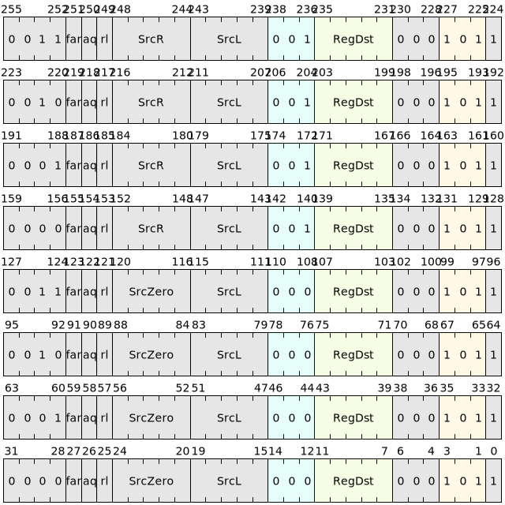

# 加载保留与条件存储指令

## 为何引入条件存储与加载保留指令

条件存储与加载保留也属于原子指令的一种，普通AMO原子指令要求整个读出、计算、写回必须是原子性质，就是读出和写回之间，该内存地址不能被其他进程访问，总线通常也就会被锁定，这样便可以支持多核系统。然而由于会将总线锁住，导致其它核无法访问总线，在核众多且频发抢锁的情况下，会造成总线长期被锁的情况，因此引入新的互斥类型的内存访问指令，即LR(load reserved)/SC(store conditional)指令。

LR/SC指令是一对配对使用的指令,它们通过在加载和存储操作中引入条件和保留机制，使得在读取和写回之间锁定内存地址，从而避免了总线长时间被锁定的情况，这样既确保操作的原子性，同时允许其他核在操作期间访问其他内存地址。

|  微指令  | 汇编格式                                               |     描述                                |
|----------|-------------------------------------------------------|-----------------------------------------|
|  LR.B  | lr.b<{.aq,.rl,.aqrl}> [SrcL], {->t, ->u, =>Rd\} | 加载字节并有符号扩展写到目的寄存器，内存做标记 |
|  LR.H  | lr.h<{.aq,.rl,.aqrl}> [SrcL], {->t, ->u, =>Rd\} | 加载半字并有符号扩展写到目的寄存器，内存做标记 |
|  LR.W  | lr.w<{.aq,.rl,.aqrl}> [SrcL], {->t, ->u, =>Rd\} | 加载字并有符号扩展写到目的寄存器，内存做标记 |
|  LR.D  | lr.d<{.aq,.rl,.aqrl}> [SrcL], {->t, ->u, =>Rd\} | 加载双字并有符号扩展写到目的寄存器，内存做标记 |
|  SC.B  | sc.b<{.aq,.rl,.aqrl}> SrcL, [SrcR], {->t, ->u, =>Rd\} | 将左源寄存器最低字节写到右源寄存器内地址对应内存，成功将0写到目的寄存器，否则写入非0 |
|  SC.H  | sc.h<{.aq,.rl,.aqrl}> SrcL, [SrcR], {->t, ->u, =>Rd\} | 将左源寄存器最低半字写到右源寄存器内地址对应内存，成功将0写到目的寄存器，否则写入非0 |
|  SC.W  | sc.w<{.aq,.rl,.aqrl}> SrcL, [SrcR], {->t, ->u, =>Rd\} | 将左源寄存器最低字写到右源寄存器内地址对应内存，成功将0写到目的寄存器，否则写入非0 |
|  SC.D  | sc.d<{.aq,.rl,.aqrl}> SrcL, [SrcR], {->t, ->u, =>Rd\} | 将左源寄存器双字写到右源寄存器内地址对应内存，成功将0写到目的寄存器，否则写入非0 |

LR/SC类型指令支持释放一致性内存模型，每条指令后面都带有一个".aq"和".rl"的可选后缀。"aq"是"acquire"的缩写，"rl"是"release"的缩写。
LR/SC指令通过这两个后缀来添加额外的内存顺序限制。具体定义如下：

|    Acquire    |    Release    |    含义                             |
|---------------|---------------|-------------------------------------|
|      0        |       0       |  没有顺序限制                        |
|      0        |       1       |  该指令所在块指令的前序所有访问存储的指令的结果必须在该指令执行之前被观察到  |
|      1        |       0       |  该指令所在块指令的后序所有访问存储的指令必须等该指令执行完成后才开始执行    |
|      1        |       1       |  该指令所在块指令的前序所有访问存储的指令的结果必须在该指令执行之前被观察到，该指令所在块指令的后序所有访问存储的指令必须等该指令执行完成后才开始执行    |
