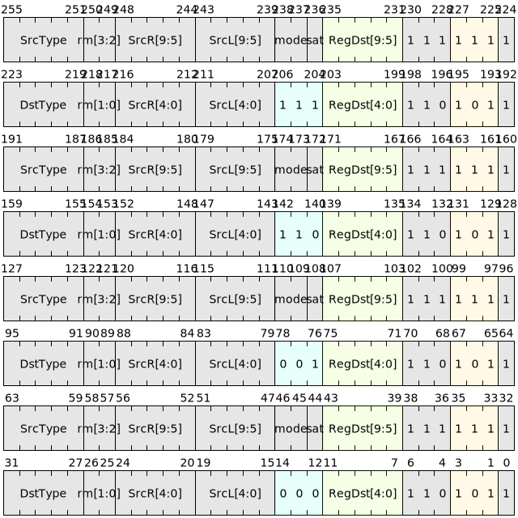

# 数据格式转换

数据格式转换指令用于承载浮点型和整型数据之间的互相的格式转换任务。

## 指令列表

|   微指令  |     汇编格式                      |      描述    |
|----------|-----------------------------------|--------------|
| V.FCVT  | `v.fcvt.{st2dt} SrcL.{T},  ->Dst.{W}`  |  浮点型之间相互转换 |
| V.FCVTI | `v.fcvti.{st2dt} SrcL.{T}, ->Dst.{W}`  |  浮点型转换为整型   |
| V.ICVT  | `v.icvt.{st2dt} SrcL.{T},  ->Dst.{W}`  |  整型之间相互转换   |
| V.ICVTF | `v.icvtf.{st2dt} SrcL.{T}, ->Dst.{W}`  |  整型转换为浮点型   |

- **st**表示源操作数数据类型，编码于SrcL域的高3位。
- **dt**表示目的操作数数据类型，编码于RegDst域的高3位。

## 指令编码

## 舍入模式

FCVTI指令的舍入模式默认为RTZ（向零舍入）

FCVT、ICVT和ICVTF的舍入模式由CSTATE寄存器中的FRM域段确定，其默认的舍入模式为RNE（就近舍入），若需要使用其他舍入模式，则可通过SSRSET指令对CSTATE寄存器进行修改，详情见[CSTATE](../../../isa/register/ssr/CSTATE.md)（公共状态寄存器）。

| 指令 | 说明 | 舍入模式 |
|------|--------|---------|
| V.FCVT  | 浮点数之间转换         | 受控于[CSTATE](../../../isa/register/ssr/CSTATE.md)（FRM），默认RNE |
| V.ICVTF | 有符号/无符号整型转浮点 | 受控于[CSTATE](../../../isa/register/ssr/CSTATE.md)（FRM），默认RNE |
| V.ICVT  | 整型之间相互转换       | 宽到窄截断，窄到宽扩展 |
| V.FCVTI | 浮点转有/无符号整型    | 默认RNE，向最近偶数舍入 |
